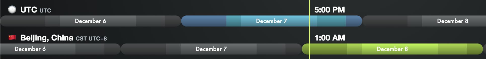

akash network 是一个去中心化的云计算平台。用户可以以极低成本部署服务而无需租服务器。目前正在举行社区活动。活动从 11 月 30 日太平洋标准时间上午 9 时开始，即北京时间 12 月 1 日凌晨 1 点。持续 12 天左右。

具体奖励可参考[《Akash 挑战赛第三阶段： 奖励概述》](https://akash.network/blog/akashian-%e6%8c%91%e6%88%98%e8%b5%9b%e7%ac%ac%e4%b8%89%e9%98%b6%e6%ae%b5%ef%bc%9a-%e5%a5%96%e5%8a%b1%e6%a6%82%e8%bf%b0/?lang=zh-hans)

第一周的任务已经结束无法参加，第二周的任务如下。每天会发布一个任务，共三天。

每个挑战持续 56 小时，奖励 150-250AKT 代币，约 ¥650-¥1100 左右。全部完成还有额外奖励。

和第一周一样的话，每天的提交北京时间 8 号凌晨 1 点开始，按 commit 的时间戳计算。任务会提前发布，可以晚上弄完，凌晨 1 点 commit 了就去睡觉。

第一个任务部署 API 节点（提供 http 查询）。是用 akash on akash 的 SDL 去部署，然后提交 json。

第二个任务部署 RPC 节点（提供链上查询和同步）。

第三个任务是部署验证者节点（参与共识）。

整个活动期间还有开放任务，部署自己的服务，部署 defi，写文章等。有写作能力的应积极参加。

前置条件：

1. 领奖时需要 KYC，亲测用护照/身份证+驾照可以顺利通过。
2. 需要熟练操作 Linux，部署节点时需要。操作钱包最好也在 VPS 上进行。
3. 需要熟练使用 Github，知道如何 fork，clone，commit，push 和 pull request。提交成果的方式是 pull request。

一开始需要从[官网](https://app.akash.network/signup?ref=c8xse9yeozxk71z)右上角注册，referral Code 邀请码可填写我的

**c8xse9yeozxk71z**

第一周挑战 1-3 的流程攻略如下：

[Akash 挑战 1 流程（已结束）]( "akash_challenge1")

[Akash 挑战 2 流程（已结束）]( "akash_challenge2")

[Akash 挑战 3 流程（已结束）]( "akash_challenge3")

开放任务 DeCloud for DeFi Rewards 的参考：

[Akash DeCloud 部署 Uniswap]( "Akash DeCloud 部署 Uniswap")

第二周任务提交方法和第一周一样，如果本机是 Mac，本地用 brew 安装钱包就行；如果不是，可先按照下面的节点部署流程练习部署，之后在节点上操作钱包：

节点部署流程攻略如下：
[Akash 节点部署流程]( "akash_node")

第二周挑战 1（挑战 4）的流程攻略如下：
[Akash 第二周挑战 1 流程（已结束）]( "akash_challenge4")

第二周挑战 2（挑战 5）的流程攻略如下：
[Akash 第二周挑战 2 流程（已结束）]( "akash_challenge5")

第二周挑战 3（挑战 6）的流程攻略如下：
[Akash 第二周挑战 3 流程（已结束）]( "akash_challenge6")

开放任务 DeCloud for no-DeFi Rewards 的参考：
[akash decloud 上部署 hugo 博客教程]( "akash decloud 上部署 hugo 博客教程")
