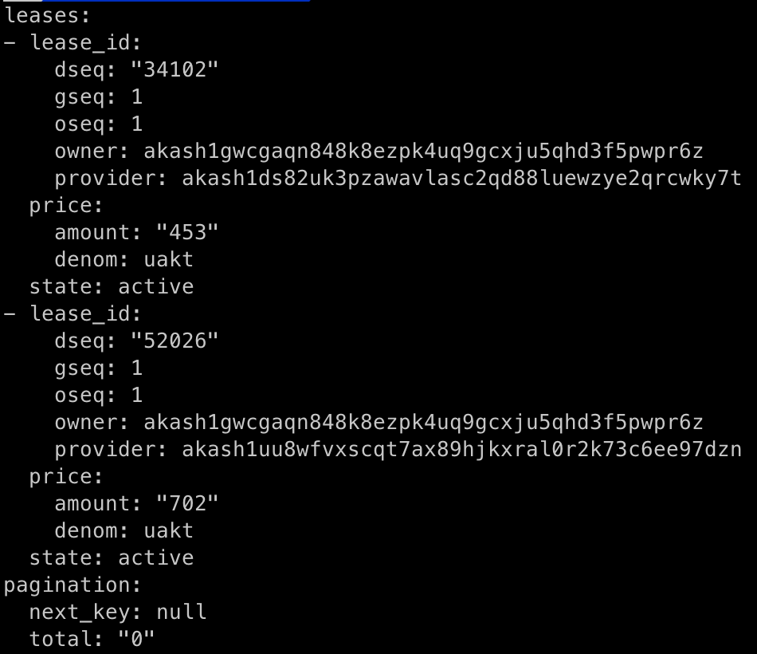
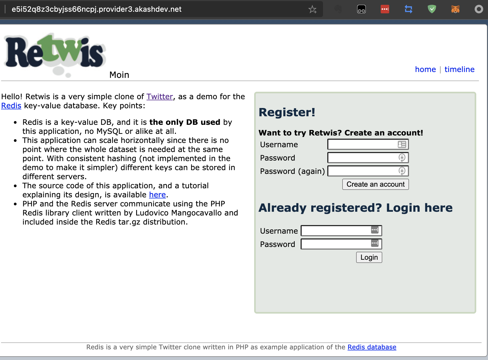
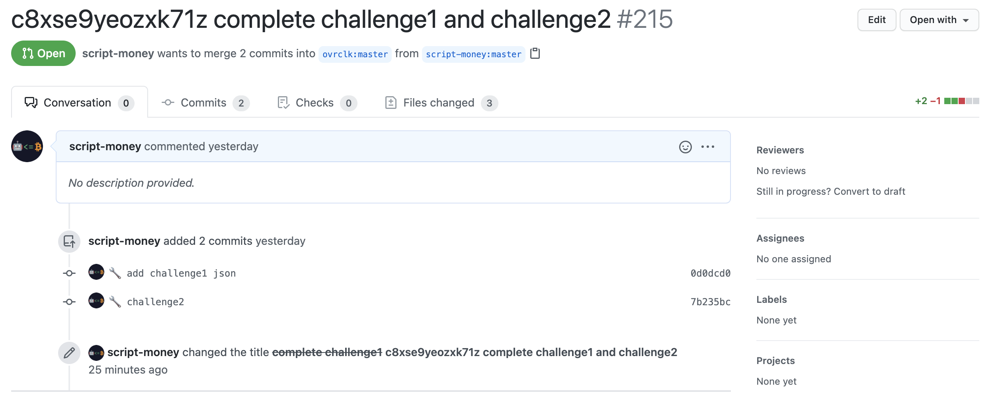

整体流程和[Akash 挑战 1 流程]( "akash_challenge1") 的一样。

不一样的是需更换[DSL 文件](https://github.com/ovrclk/docs/blob/335978772efddd76215adadcd6fa4d13464ddff7/testnet-challenges/deploy-1-2.yaml)，官方已经提供。

lease 的输出结果应该如下，会有不同的 dseq，provider 可能不同，需要重新赋值：

部署完后去浏览器检查下是否能访问

在原来的本地 Git 库进行 commit 然后 push。注意生成的 json 放到 ecosystem/akashian/phase3/challenge2 下，和挑战 1 的不在同一个文件夹。

push 完成后原来的 pull request 会有更新，如下图。点右上角的 Edit 对标题进行修改即可。

有问题可以直接在该博客下面留言，或者去官方 discord 查看历史记录是否有类似错误

挑战 3 的流程攻略如下：
[Akash 挑战 3 流程]( "akash_challenge3")
