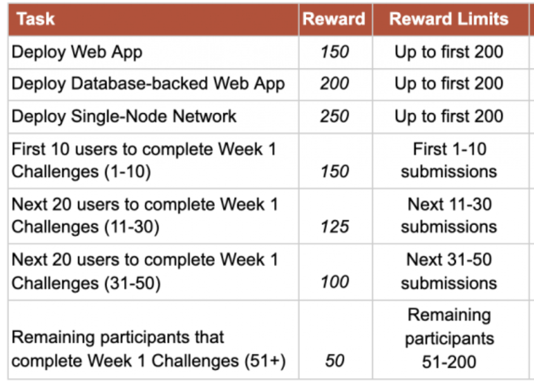

注意，这个akash单节点是部署在akash decloud的，和第二周需要部署在VPS不一样。

流程和之前一样，我整理了指令和注释，说明会比较清楚。需要的可以直接复制使用。VSCode是可以通过remote-ssh插件连到服务器直接编辑的，比用vim方便。或者像我用Mac本地钱包。

```bash
#!/bin/bash
AKASH_NET="https://raw.githubusercontent.com/ovrclk/net/master/edgenet"
AKASH_NODE="tcp://rpc-edgenet.akashdev.net:26657"
AKASH_CHAIN_ID="akash-edgenet-1"
ACCOUNT_ADDRESS="填你自己的"
KEY_NAME="填你自己的"
KEYRING_BACKEND="os"
PROVIDER=填你自己的
DSEQ=填你自己的
GSEQ=1
OSEQ=1
CODE=填你自己的

# 1. 发起部署交易，注意改yml文件
# akash tx deployment create deploy1-3.yml --from $KEY_NAME --node $AKASH_NODE --chain-id $AKASH_CHAIN_ID -y

# 2. 查询部署的镜像列表，需要等会儿，输出的PROVIDER和DSEQ后修改上方的变量
# akash query market lease list --owner $ACCOUNT_ADDRESS --node $AKASH_NODE --state active

# 3. 上传部署许可，无输出，注意改yml文件
# akash provider send-manifest deploy1-3.yml --node $AKASH_NODE --dseq $DSEQ \
# --oseq $OSEQ --gseq $GSEQ --owner $ACCOUNT_ADDRESS --provider $PROVIDER

# 4. 查询单个部署许可的状态，可获得服务web地址
# akash provider lease-status --node $AKASH_NODE --dseq $DSEQ --oseq $OSEQ \
# --gseq $GSEQ --provider $PROVIDER --owner $ACCOUNT_ADDRESS

# 5. 获取要提交的json
# akash query market lease get --dseq $DSEQ --gseq $GSEQ --oseq $OSEQ \
#  --provider $PROVIDER --owner $ACCOUNT_ADDRESS --node $AKASH_NODE -o json > $CODE.json

# 查询账户余额
#akash query bank balances --node $AKASH_NODE $ACCOUNT_ADDRESS

# 取消部署
#akash tx deployment close --node $AKASH_NODE --chain-id $AKASH_CHAIN_ID \
# --dseq $DSEQ --owner $ACCOUNT_ADDRESS --from $KEY_NAME -y
```

DSL文件可去 GitHub 的 ovrclk/docs 库获取 https://github.com/ovrclk/docs/blob/master/testnet-challenges/deploy-1-3.yaml

部署完成是个akash节点，如图刚弄好同步了8个块


记得凌晨1点commit，是按commit的时间戳来计算的，越快奖励越高

