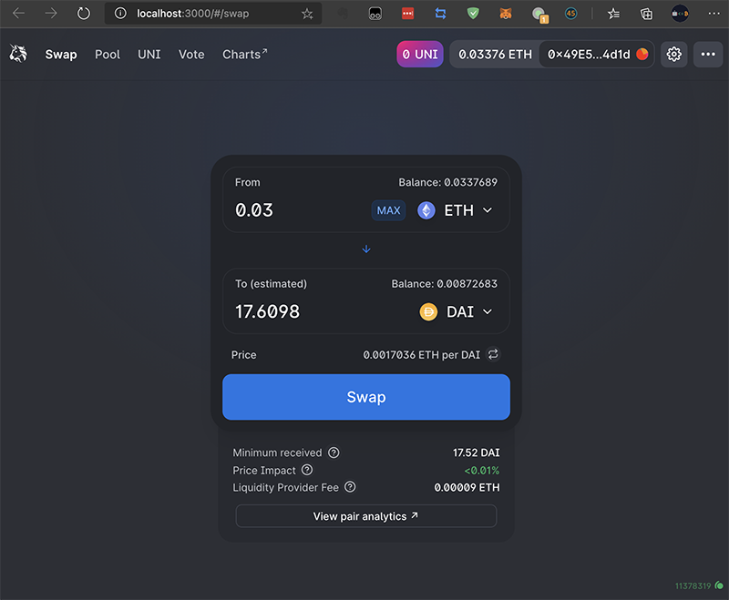
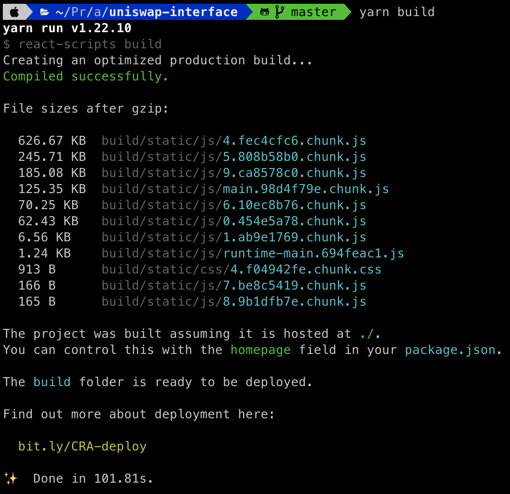
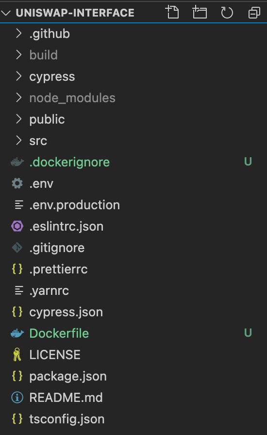
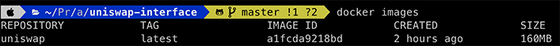
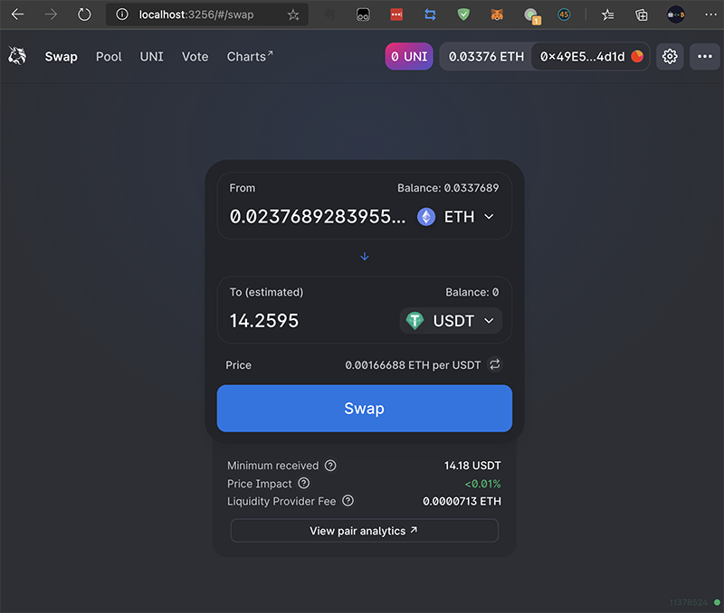
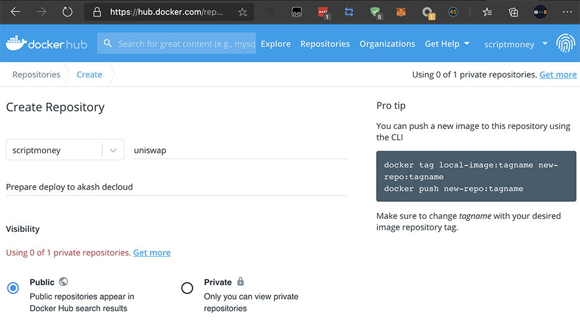
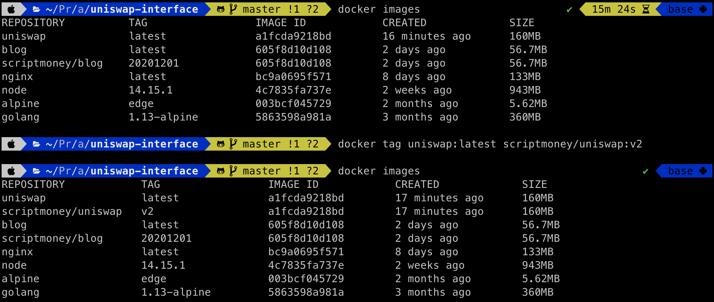
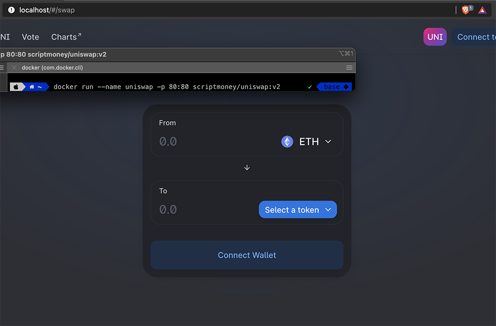
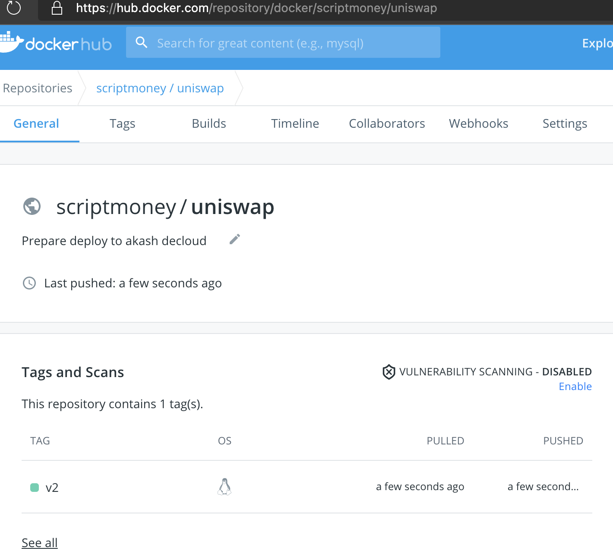
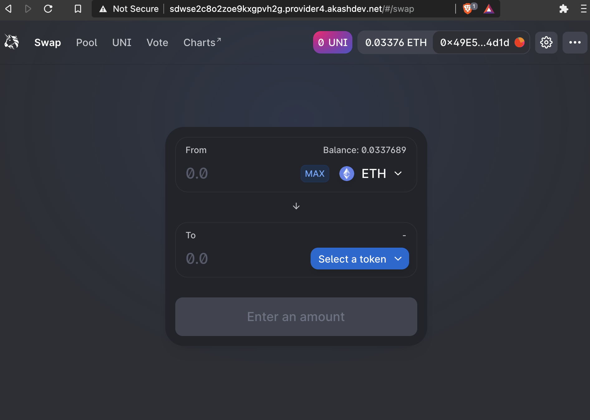

# Akash DeCloud 部署 Uniswap

## 流程

部署部分的流程和挑战 1-3 没有区别，除了要改下 SDL 文件。Uniswap 本质上是个 Web App，和挑战 1 的基本相同。

关键在于制作 Docker 镜像 上传到 dockerhub 上。

## 关于 Docker

docker 不熟悉的话，强烈建议先看看[《30 分钟快速入门 Docker 教程》](https://juejin.cn/post/6844903815729119245)，本地安装后跑一跑。

下面会说到的术语有镜像（image）和容器（container）

**镜像** 你可以理解为预装了程序的 Linux 发行版，正如你租 VPS 时，要选择用 Ubuntu 还是 Centos，不同的系统有不同的程序在里面。你可以在 dockerhub 上下载各种镜像，也可以自己制作镜像上传。

**容器** 是指镜像运行后的实例，和使用一台 Linux 服务器一样，你可以进行切换目录、修改文件、运行脚本等操作。

和真正的虚拟机不同的是，docker 的底层是互通的，更轻量。最小的镜像 alpine 6MB 不到。

## 打包 Uniswap

访问 https://github.com/Uniswap/uniswap-interface

查看 README 就两步 `yarn` 和 `yarn start`。

先 git clone 该库到本地，使用 `--depth=1` 可以加快下载速度。`--config http.proxy=localhost:8123`是我本机设置的代理，请忽略。


输入`yarn`会下载依赖，需要等待一段时间。中间可能会出现一些错误，自己按照提示 Google 搜索解决。

输入`yarn start`就可以在 localhost:3000 访问 Uniswap 页面。



通常部署 WebApp 都是要打包后用 Nginx 去运行，输入`yarn build`打包，打包后的文件如图会放在 build 文件夹下。


## 制作本地镜像

制作镜像也有多种方式，如果使用自动化部署，通常是在镜像 A 中去编译，再拷贝到镜像 B 中运行。如下面 Dockerfile 中注释了的内容。

```Dockerfile
# # 编译镜像
# FROM node:14.15.1 as build

# # 只要package.json,yarn.lock内容不变,依赖会使用缓存
# # 否则会全部重新下载
# WORKDIR /node/release
# COPY package.json yarn.lock ./
# RUN yarn config set registry https://registry.npm.taobao.org/
# RUN yarn
# COPY . ./
# RUN yarn build

# 运行镜像
# FROM nginx
# COPY --from=build /node/release/build /usr/share/nginx/html
# EXPOSE 80
# CMD ["nginx", "-g", "daemon off;"]

FROM nginx
COPY build /usr/share/nginx/html
EXPOSE 80
CMD ["nginx", "-g", "daemon off;"]
```

注释内的流程大致是：

1. 运行一个 14.15.1 的 node 镜像作为编译镜像
2. 设置镜像内的工作目录为 /node/release
3. 拷贝 Uniswap 目录下的 package.json yarn.lock 到镜像内
4. 修改 yarn 到国内镜像源以加快下载速度
5. 运行 yarn 下载依赖
6. 复制 Uniswap 目录下的代码到镜像内
7. 运行 yarn build 打包
8. 新下载运行一个 nginx 镜像
9. 把编译镜像的/node/release/build 复制到/usr/share/nginx/html
10. 标记内部运行的是 80 端口
11. 用 nginx -g daemon off; 运行 nginx

也可以使用本地 build 好的文件复制到 nginx 里直接运行（上面 Dockerfile 中没注释的部分）。下文采取此方式。

在 Uniswap 文件夹下新建一个名为 Dockerfile 的文件。（走流程 1 还需要新建一个.dockerignore 添加 node_modules/ 和 build/ 防止 COPY 这两个文件夹进编译镜像）



Dockerfile 编辑保存后，输入 `docker build . -t uniswap:latest`，等待打包，完成后输入 `docker images` 就能看到打包好的镜像。



## 运行本地镜像

输入 `docker run --name uniswap -p 3256:80 uniswap:latest` 以 uniswap:latest 镜像，启动一个名为 uniswap 的容器，把内部 80 端口暴露到主机的 3256 端口。

访问`localhost:3256`或者`127.0.0.1:3256`使用 Uniswap 界面



## 上传镜像

需要注册 docker 账号，网页上创建库，本地重新 tag，然后 push，网上教程也很多了，可以先看看[《Docker - 将制作好的镜像上传到 Docker Hub 仓库（附操作步骤）》](https://www.hangge.com/blog/cache/detail_2409.html)

如图我在 dockerhub 创建了一个 uniswap 的公开库。


重新 tag，把 uniswap:latest 改为 scriptmoney/uniswap:v2


在本机 80 端口运行，看看会不会有问题。一切正常。


本机输入指令 `docker push scriptmoney/uniswap:v2` 上传镜像（这儿需要注册账号，请按前面链接去操作）。等待一段时间，去网页查看上传完成。



这时候任何人都可以用 `docker pull scriptmoney/uniswap:v2` 来下载该镜像了。包括 akash DeCloud 上的 privider。

## 部署至 akash Decloud

因为挑战 1 的网页钱包也是个 WebApp，用它的 SDL 来修改。

把 deploy1-1.yml 的 6-9 行的

```yml
image: ovrclk/lunie-light
expose:
  - port: 3000
    as: 80
```

改为

```yml
image: scriptmoney/uniswap:v2 # dockerhub上的镜像
expose:
  - port: 80 # 内部运行端口
    as: 80 # 暴露出的端口
```

另存为 deploy_uniswap.yml

剩下的流程都一样了。参考[Akash 挑战 1 流程]( "akash_challenge1")

下图是运行在 akash DeCloud 的截图。



我部署的时候有的 provider 可能负荷过重，一部署就 Nginx 503 然后 404，遇到这种情况多试几次，重新部署下，换个 provider 可能就好了。
