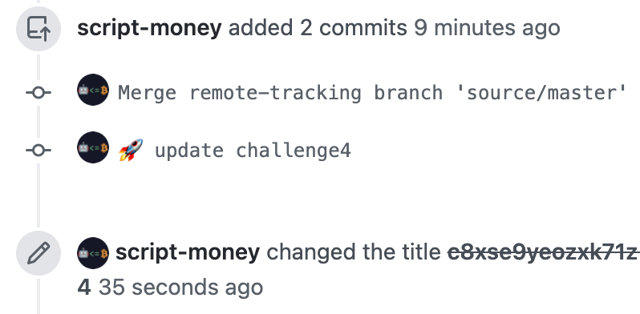

# Akash 第二周挑战 1 流程

流程还是和上周一样，提交部署，提交 json。使用 [deploy-2-1.yaml](https://raw.githubusercontent.com/ovrclk/docs/master/testnet-challenges/deploy-2-1.yaml) 来在 akash 上部署 akash。

要注意版本已经从 r11 更新到了 r13，先输入 `akash version` 看看，是老版本就先更新一下。

更新方式两种，一是切到 akash 源码文件夹，pull 新代码重新 make

```
cd $GOPATH/src/github.com/ovrclk/akash
git pull origin v0.9.0-rc13
make deps-install
make install
```

另一种是直接下载官方编译好的

```
wget https://github.com/ovrclk/akash/releases/download/v0.9.0-rc13/akash_0.9.0-rc13_linux_amd64.zip
sudo apt install unzip
unzip akash_0.9.0-rc13_linux_amd64.zip
mv akash_0.9.0-rc13_linux_amd64/akash go/bin/akash
```

Mac 的更新方式是 `brew upgrade akash-edge`

更新完成后用 `akash version` 确认下

剩下步骤其他和第一周一样。生成 json 提交到 ecosystem 库，提 pull request 就行了。 参考 [Akash 挑战 1 流程（已结束）]( "akash_challenge1")

在 ecosystem 库，push 时可能需要先 merge 源远程分支，可以用以下命令：添加源主分支，拉到本地的 master，然后合并该 master

```
git remote add source https://github.com/ovrclk/ecosystem.git
git fetch source master
git merge source/master
```


