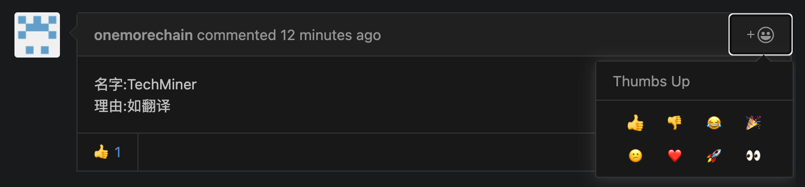

# 社区征名活动

【1月1日更新】

使用票数最高的 Crypto Chaser，作为社区名。和原作者讨论后加了复数s写法。

[投票结果](https://github.com/script-money/blog-comment/issues/3#issuecomment-751265540)

欢迎加入 Crypto Chasers 的 discord 频道。 https://discord.gg/KVVj6AGgDZ

---

【12月26日更新】

如图所示，请大家用 👍 对喜欢的名字投票，用 👎 表示反对。

在原贴 https://github.com/script-money/blog-comment/issues/3 进行投票操作

时间截止到 2020年12月28日 10:00。

---

计划打造一个DAO（去中心化自治组织），目的是打造一个区块链建设交流社区，积聚国内人才一起讨论参加项目方的活动。

目前微信群消息混乱，且没法和区块链玩法结合，需要迁移到 Discord 上。

所以用该名字会先建一个 Discord 和 GitHub组织。

Discord 的目的是把消息分流方便交流和查询，并通过 discord bot  和 NFT 设计激励制度奖励提供价值的社区成员。

GitHub 目的是组队活动、提案讨论、社区建设等，让贡献更透明。Code is law。

参与社区活动未来都是早期贡献者，你懂的。
