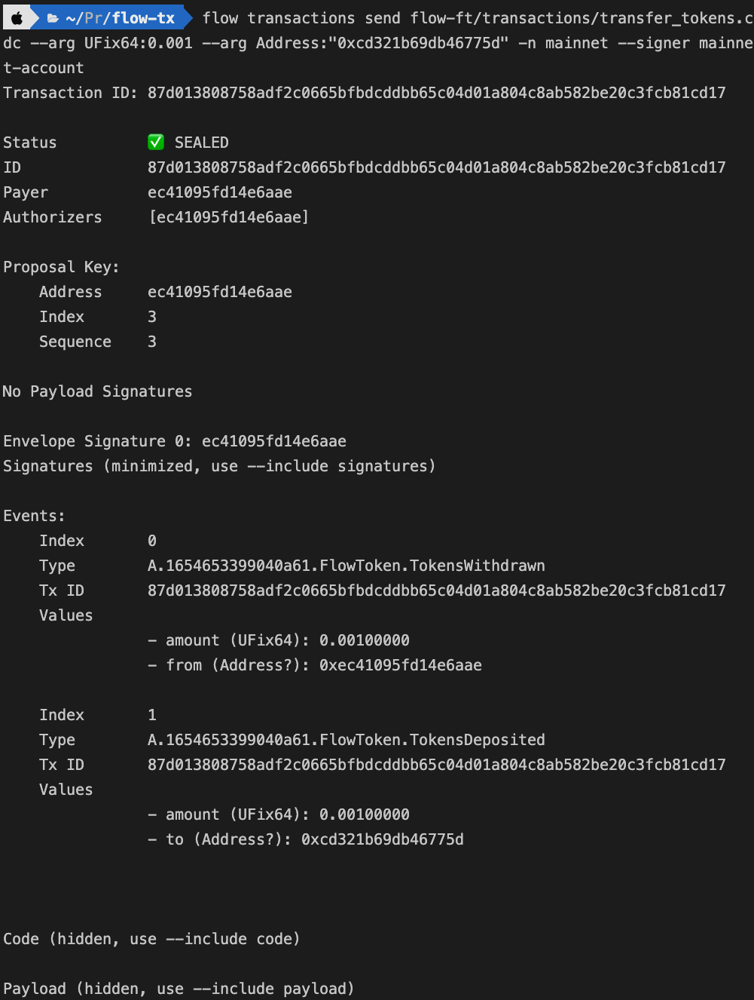

> flow-cli 使用版本 v0.28.2

众所周知，flow 主网目前由 blocto 和 dapper 托管着钱包，自己生成的 keys 又不能生成账户，所以介绍下如何从 blocto 转出私钥并用 cli 转账。

1. 打开 blocto 的移动端钱包，设定——安全性——自管私钥模式，设定备援密码然后导出。
2. 会收到一封 Blocto Account Recovery Kit 的邮件，里面的附件是 keystore 的 json。复制保存为 keystore.json 文件。
3. 参考以下 js 代码算出私钥，需`yarn add ethereum-keystore`

   ```javascript
   const { recoverKeystore } = require('ethereum-keystore');
   const keystoreJson = require('./keystore.json');

   const main = async () => {
     const privateKey = await recoverKeystore(keystoreJson, '你的备援密码');
     console.log(privateKey);
   };

   main();
   ```

4. 回到 blocto 找到 flow 账号，类似`0xec41095fd14e6aae`，然后浏览器访问`https://flow-view-source.com/mainnet/account/[地址换成你自己的]/keys`，找到 _Weight: 1000/1000_ 且**没有**`REVOKED`的公钥。记住 KeyId(应该是 3)、Curve(应该是 ECDSA_secp256k1)和 Hash(应该是 SHA3_256)。
5. 创建一个`.env`，之前获取的私钥和账号一起填入`.env`文件，类似这样
   ```bash
   MAINNET_ADDRESS=0xec41095fd14e6aae
   MAINNET_PRIVATE_KEY=[换成第三步的privateKey]
   ```
6. 安装了 flow-cli 工具后，用`flow init`生成 flow.json 文件，填入以下内容。
   ```
   {
       "emulators": {
           "default": {
               "port": 9000,
               "serviceAccount": "mainnet-account"
           }
       },
       "contracts": {},
       "networks": {
           "emulator": "127.0.0.1:3569",
           "mainnet": "access.mainnet.nodes.onflow.org:9000",
           "testnet": "access.devnet.nodes.onflow.org:9000"
       },
       "accounts": {
           "emulator-account": {
               "address": "f8d6e0586b0a20c7",
               "keys": "1e457adfd9fe97232df5d30b286f63e661e5e023b4bb110c092ac0626be3096e"
           },
           "mainnet-account": {
               "address": "${MAINNET_ADDRESS}",
               "key": {
                   "type": "hex",
                   "index": 3,
                   "signatureAlgorithm": "ECDSA_secp256k1",
                   "hashAlgorithm": "SHA3_256",
                   "privateKey": "${MAINNET_PRIVATE_KEY}"
               }
           }
       },
       "deployments": {}
   }
   ```
7. 参考`flow transactions send flow-ft/transactions/transfer_tokens.cdc --arg UFix64:0.001 --arg Address:"0xcd321b69db46775d" -n mainnet --signer mainnet-account`进行转账。（除了用 cli，当然也可以用 fcl 去构造 transaction 进行转账。）
   `flow-ft/transactions/transfer_tokens.cdc`内容是

   ```
    // This transaction is a template for a transaction that
    // could be used by anyone to send tokens to another account
    // that has been set up to receive tokens.
    //
    // The withdraw amount and the account from getAccount
    // would be the parameters to the transaction

    import FungibleToken from 0xf233dcee88fe0abe
    import FlowToken from 0x1654653399040a61

    transaction(amount: UFix64, to: Address) {

        // The Vault resource that holds the tokens that are being transferred
        let sentVault: @FungibleToken.Vault

        prepare(signer: AuthAccount) {

            // Get a reference to the signer's stored vault
            let vaultRef = signer.borrow<&FlowToken.Vault>(from: /storage/flowTokenVault)
                ?? panic("Could not borrow reference to the owner's Vault!")

            // Withdraw tokens from the signer's stored vault
            self.sentVault <- vaultRef.withdraw(amount: amount)
        }

        execute {

            // Get the recipient's public account object
            let recipient = getAccount(to)

            // Get a reference to the recipient's Receiver
            let receiverRef = recipient.getCapability(/public/flowTokenReceiver)
                .borrow<&{FungibleToken.Receiver}>()
                ?? panic("Could not borrow receiver reference to the recipient's Vault")

            // Deposit the withdrawn tokens in the recipient's receiver
            receiverRef.deposit(from: <-self.sentVault)
        }
    }
   ```

> 成功截图



8. 批量转账可参考 https://github.com/script-money/flowTokenBatchSend ，使用 python-sdk 开发
