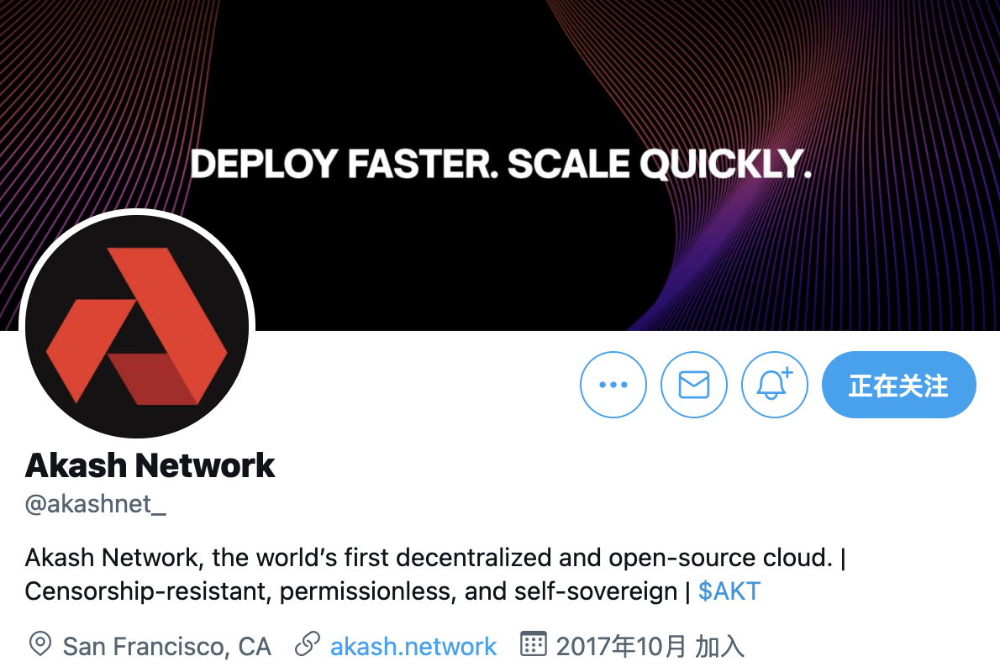
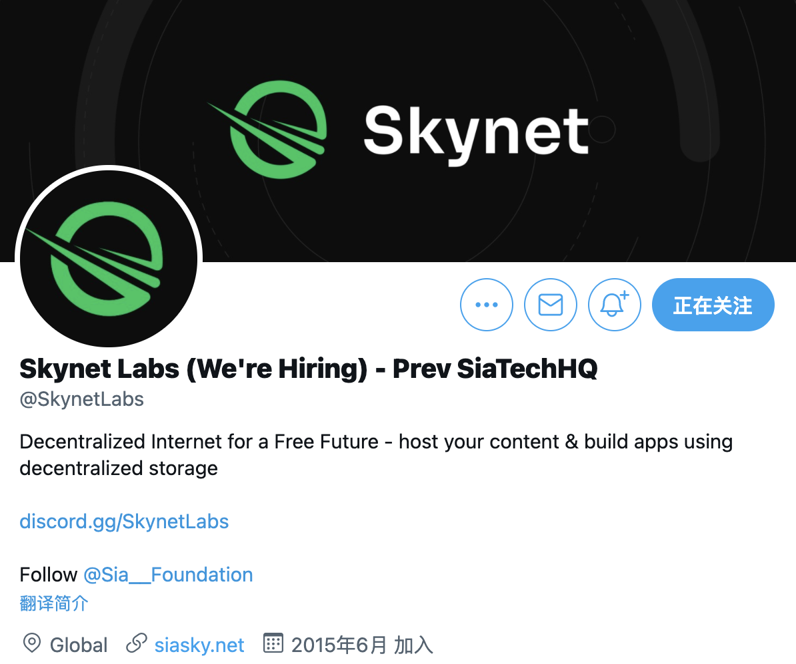
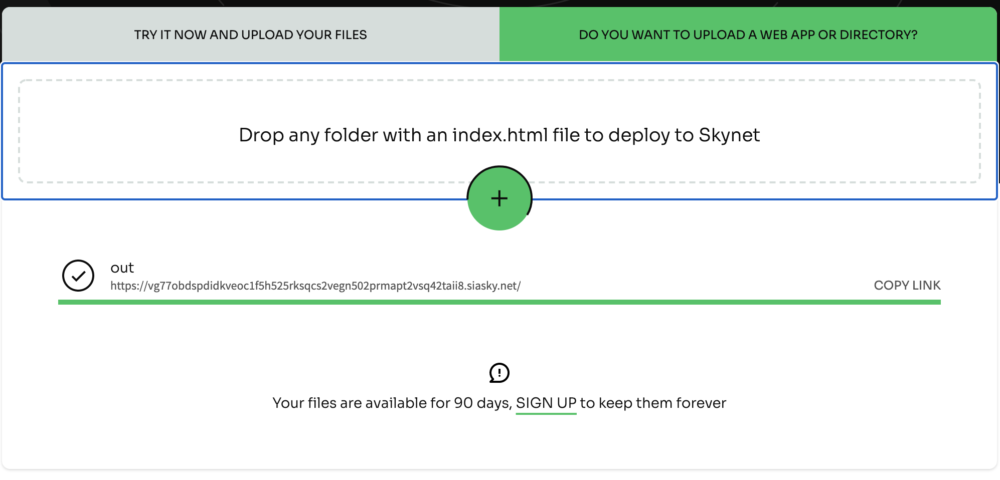
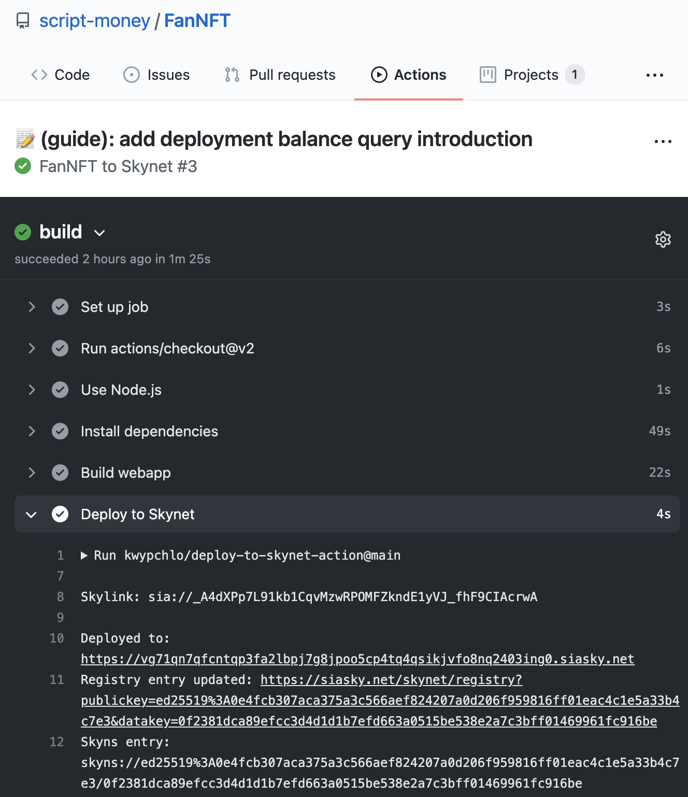
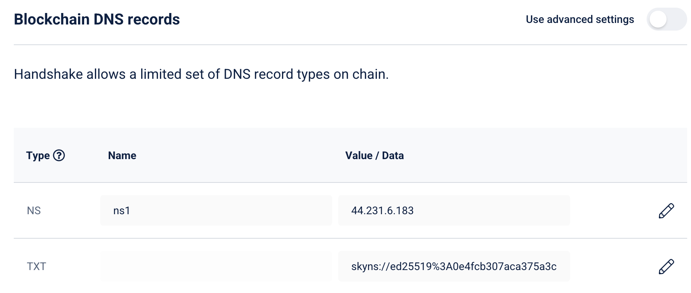

## Part1: 部署应用到 Akash 流程

Akash 是一个去中心化容器化应用部署的平台。我所搭建的 FanNFT 应用有一个自动定时运行的程序，需要使用 Akash 独特的服务器端容器运行能力进行部署，来代替租用传统云平台。本文介绍我的 Akash 服务部署流程。



### 准备工作

_Akash CLI_：[安装方式](https://docs.akash.network/guides/install)
完成安装后，输入以下命令，能输出版本号说明安装完成

```shell
$ akash version
v0.12.2-rc5
```

_6 $AKT_：
$AKT 是 Akash 平台的流通代币，部署需要抵押 5AKT，多准备 1AKT 当 gas 费，一共约 $20。可以从[osmosis](https://app.osmosis.zone/)使用其他 cosmos 资产兑换，也可以去 AscendEX,Gate.io,Bittrex 购买

_Docker_：[安装方式](https://docs.docker.com/engine/install/)
完成安装后，输入以下命令，能输出版本号说明安装完成

```shell
$ docker version
Client:
 Version:           20.10.2
```

### 分析

完成服务的代码编写，准备部署时，需要考虑以下问题：

1. 服务的运行环境
2. 占用资源（CPU、内存、硬盘）
3. 服务间依赖关系
4. 暴露端口

以 FanNFT 为例，核心的运行代码如下：

```python
# source code: https://github.com/script-money/FanNFT/blob/main/api/main.py

def periodic(period):
    def scheduler(fcn):
        async def wrapper(*args, **kwargs):
            while True:
                asyncio.create_task(fcn(*args, **kwargs))
                await asyncio.sleep(period)
        return wrapper
    return scheduler


@periodic(300)  # 5分钟运行一次
async def main():
    # 此次省略了具体的运行代码

if __name__ == "__main__":
    asyncio.run(main())
```

我使用 Python 编写了一个异步定时程序，实现每 5 分钟获取 TwitterAPI 数据，并向合约发送交易。

1. 服务的运行环境：服务的运行环境是 Python3.9，运行命令是`python main.py`，需要载入 `.env`的环境变量
2. 占用资源（CPU、内存、硬盘）：只是一个定时和合约交互的脚本，基本不占计算和存储资源
3. 服务间依赖关系：没有其他依赖服务
4. 暴露端口：无需暴露端口

### 编写 Dockerfile

根据实际运行要求编写 Dockerfile。如果不清楚建议先学习下 Dockerfile 编写，网上有很多教程

```docker
FROM python:3.9-buster

# Prepare environment
RUN mkdir -p /FanNFT/api

# Setup ENV
ENV TZ Asia/Shanghai

# Install dependencies
COPY . /FanNFT/api
RUN cp -r /FanNFT/api/cadence /FanNFT
WORKDIR /FanNFT/api
RUN  pip install --user --no-cache-dir -r requirements.txt

# Run code
CMD ["python","main.py"]
```

### 推送镜像

Dockerfile 完成后，使用**docker build**进行镜像构建。
因为打包时要依赖项目文件夹外的 cadence 文件夹，因为我注册 dockerhub 的用户名是 scriptmoney，版本号 0.2.1，我使用的指令是

```shell
# source code: https://github.com/script-money/FanNFT/blob/main/api/build.sh
cp -r ../cadence .
docker build -t scriptmoney/fannft:0.2.1 \
--no-cache .
rm -rf cadence
```

构建完成后用`docker push [镜像名:tag]` 上传。我使用的是`docker build -t scriptmoney/fannft:0.2.1 --no-cache .`

### 编写 SDL

SDL 填写部署需要的资源，从官方文档 [multi-tier-app](https://docs.akash.network/deploy/multi-tier-app) 来修改是个不错的选择。

```yaml
---
version: '2.0'

services:
  redis:
    image: bitnami/redis:6.2
    env:
      - REDIS_AOF_ENABLED=no
      - ALLOW_EMPTY_PASSWORD=yes
    expose:
      - port: 6379
        to:
          - service: goosebin
  goosebin:
    image: hydrogen18/goosebin:latest
    env:
      - REDIS_HOST=redis
      - REDIS_PORT=6379
      - PASTE_SIZE_LIMIT=100000
      - HTTP_PORT=8000
    depends_on:
      - redis
    expose:
      - port: 8000
        as: 80
        to:
          - global: true

profiles:
  compute:
    redis:
      resources:
        cpu:
          units: 1
        memory:
          size: 128Mi
        storage:
          size: 16Mi
    goosebin:
      resources:
        cpu:
          units: 1
        memory:
          size: 64Mi
        storage:
          size: 16Mi
  placement:
    dc1:
      pricing:
        redis:
          denom: uakt
          amount: 9999
        goosebin:
          denom: uakt
          amount: 9999

deployment:
  redis:
    dc1:
      profile: redis
      count: 1
  goosebin:
    dc1:
      profile: goosebin
      count: 1
```

首先是修改 service，样例中是 2 个服务，redis 运行在 6379 端口，暴露给 goosebin。goosebin 依赖 redis，全局暴露内部端口 8000 到 80 提供服务。同时还有些环境变量的设置。

我的程序根据前面的分析，没有其他依赖服务，也无需暴露端口，所以

```diff
services:
-  redis:
-    image: bitnami/redis:6.2
-    env:
-      - REDIS_AOF_ENABLED=no
-      - ALLOW_EMPTY_PASSWORD=yes
-    expose:
-      - port: 6379
-        to:
-          - service: goosebin
-  goosebin:
+  fannft
-    image: hydrogen18/goosebin:latest
+    image: scriptmoney/fannft:0.2.1
    env:
-      - REDIS_HOST=redis
-      - REDIS_PORT=6379
-      - PASTE_SIZE_LIMIT=100000
-      - HTTP_PORT=8000
+      - TESTNET_ADDRESS=[fill your env]
+      - TESTNET_PRIVATE_KEY=[fill your env]
+      - CONSUMER_KEY=[fill your env]
+      - CONSUMER_SECRET=[fill your env]
+      - ACCESS_TOKEN_KEY=[fill your env]
+      - ACCESS_TOKEN_SECRET=[fill your env]
-    depends_on:
-      - redis
    expose:
      - port: 8000
        as: 80
        to:
          - global: true
```

service 的名字可以自定义，我的是*fannft*。
image 改为 dockerhub 的镜像。
env 根据服务的具体情况填写。我的是用于填写公私钥和 TwitterAPI 的密钥。
expose 我没有修改是因为我的服务无需暴露端口，所以随便填一个。

然后修改 compute，根据服务占用资源来选择，可以参考[akashlytics](https://www.akashlytics.com/price-compare)来设置，该网址提供了 4 种规模的配置以及价格，我的服务几乎不占用资源，所以使用的是最低的 1uakt 的配置。（实际还用不了那么多资源 🤣）

```diff
profiles:
  compute:
-    redis:
-      resources:
-        cpu:
-          units: 1
-        memory:
-          size: 128Mi
-        storage:
-          size: 16Mi
-    goosebin:
+    fannft:
      resources:
        cpu:
          units: 0.1
        memory:
-          size: 64Mi
+          size: 512Mi
        storage:
-          size: 16Mi
+          size: 512Mi
```

修改 placement，设置服务商的信息和支付的价格。placement 名字可以任意设置，我使用的是 equinix。服务商的 attributes 和 signedBy 可以通过命令行查询，后面会说，但设置成 _host: akash_ 就行，signedBy 可以不设置。支付的价格根据 akashlytics 的建议设置为 1uakt，等于一个区块支付 0.000001 AKT，一个月花费还不到 0.5 AKT

```diff
  placement:
-    dc1:
+    equinix:
+      attributes:
+        host: akash
+      signedBy:
+       anyOf:
+        - "akash1365yvmc4s7awdyj3n2sav7xfx76adc6dnmlx63"
      pricing:
-        redis:
-          denom: uakt
-          amount: 9999
-        goosebin:
+        fannft
          denom: uakt
-          amount: 9999
+          amount: 1
```

最后设置 deployment，名字建议和 service 的名字相同，加上 placement 的名字，profile 填写 service 的名字，部署的实例数设置 1 个。如果需要高可用或者负载均衡，可以设置多个实例。

```diff
deployment:
-  redis:
-    dc1:
-      profile: redis
-      count: 1
-  goosebin:
+  fannft:
-    dc1:
+    equinix:
-      profile: goosebin
+      profile: fannft
      count: 1
```

修改后完整的 yaml 见 [deploy.example.yaml](https://github.com/script-money/FanNFT/blob/main/api/deploy.example.yaml)

更多参考资料：[Akash sdl 官方文档](https://docs.akash.network/sdl)

## 部署到 Akash

目前还没有可用的 UI 可用代替 cli，只能用 cli 打指令的方式进行部署，我一般是写一个 .sh 文件，指令都放进去，用到哪条就取消注释哪条，重复用`sh deploy.sh`去运行。

新建一个*deploy.sh*，填入以下内容

```shell
#!/bin/zsh
AKASH_NODE="http://135.181.181.120:28957"
AKASH_CHAIN_ID="akashnet-2"
ACCOUNT_ADDRESS="replace with your akash address"
KEY_NAME="test"
KEYRING_BACKEND="os"
DEPLOY_YML=deploy.yaml
FEES=500uakt

TX="write tx want to query"
PROVIDER=
DSEQ=
GSEQ=1
OSEQ=1
```

上面的参数如果不可用，参考[官方文档](https://docs.akash.network/guides/deployment)填写最新的。

如果没有账户需要先创建，在 _deploy.sh_ 中，添加创建账户的指令

```diff
OSEQ=1
+
+ # 生成账户
+ akash --keyring-backend "$KEYRING_BACKEND" keys add "$KEY_NAME"
```

然后`sh deploy.sh`，会出现如下所示的输出

```shell
- name: test
  type: local
  address: akash1z4y4rdgr5f2hzp0aaq304jj5wy4qgwazrw25qx
  pubkey: akashpub1addwnpepqt3hvwt0dd3gsq5crljdm2xmpjs8rrrtxg4e4xgt4l2h72wcze3kzczz6ll
  mnemonic: ""
  threshold: 0
  pubkeys: []


**Important** write this mnemonic phrase in a safe place.
It is the only way to recover your account if you ever forget your password.

hello frog crisp glide quote good sugar model ridge genuine nothing spider seed unlock spike favorite focus saddle stamp detail trash enemy wheat lumber
```

最后两行是助记词，需要存好。然后把第三行地址填入 _deploy.sh_。

```diff
AKASH_CHAIN_ID="akashnet-2"
- ACCOUNT_ADDRESS="replace with your akash address"
+ ACCOUNT_ADDRESS="akash1z4y4rdgr5f2hzp0aaq304jj5wy4qgwazrw25qx"
KEY_NAME="test"
```

然后你需要转入 6 AKT 到该地址，然后填入账户查询的指令。

```diff
- akash --keyring-backend "$KEYRING_BACKEND" keys add "$KEY_NAME"
+ # akash --keyring-backend "$KEYRING_BACKEND" keys add "$KEY_NAME"
+
+ # 查询账户余额
+ akash query bank balances --node $AKASH_NODE $ACCOUNT_ADDRESS
```

运行`sh deploy.sh`如果出现以下信息，说明转账成功。

```shell
balances:
- amount: "6000000"
  denom: uakt
pagination:
  next_key: null
  total: "0"
```

接下来是创建认证，填入以下指令

```diff
- akash query bank balances --node $AKASH_NODE $ACCOUNT_ADDRESS
+ # akash query bank balances --node $AKASH_NODE $ACCOUNT_ADDRESS
+
+ # 创建认证
+ akash tx cert create client --chain-id $AKASH_CHAIN_ID --keyring-backend $KEYRING_BACKEND --from $KEY_NAME --node=$AKASH_NODE --fees $FEES
```

运行`sh deploy.sh`，中间会提示*confirm transaction*（Mac 还会弹出 KeyChain 设置），输入 _y_ 然后输入 _Enter_。会出现以下输出。单个地址只需要创建一次认证就能使用平台，后面部署都无需再认证。

```shell
no certificate found for address akash1z4y4rdgr5f2hzp0aaq304jj5wy4qgwazrw25qx. generating new...
{"body":{"messages":[{"@type":"/akash.cert.v1beta1.MsgCreateCertificate...

confirm transaction before signing and broadcasting [y/N]: y
{"height":"1747075","txhash":"12EA80B302F687454C6FD9BA5F389B51009801B621FC7475BE8074244DBD7...
```

可以用以下指令查询认证状态，出现 _state: valid_ 说明成功认证了

```diff
- akash tx cert create client --chain-id $AKASH_CHAIN_ID --keyring-backend $KEYRING_BACKEND --from $KEY_NAME --node=$AKASH_NODE --fees $FEES
+ # akash tx cert create client --chain-id $AKASH_CHAIN_ID --keyring-backend $KEYRING_BACKEND --from $KEY_NAME --node=$AKASH_NODE --fees $FEES
+
+ # 查询认证状态
+ akash query cert list --owner $ACCOUNT_ADDRESS --node=$AKASH_NODE
```

创建部署，需要抵押 5AKT

```diff
- akash query cert list --owner $ACCOUNT_ADDRESS --node=$AKASH_NODE
+ # akash query cert list --owner $ACCOUNT_ADDRESS --node=$AKASH_NODE
+
+ # 发起部署创建的交易
+ akash tx deployment create $DEPLOY_YML --from $KEY_NAME --node $AKASH_NODE --chain-id $AKASH_CHAIN_ID --fees $FEES -y
```

然后查询当前用户的全部可用的竞价

```diff
- akash tx deployment create $DEPLOY_YML --from $KEY_NAME --node $AKASH_NODE --chain-id $AKASH_CHAIN_ID --fees $FEES -y
+ # akash tx deployment create $DEPLOY_YML --from $KEY_NAME --node $AKASH_NODE --chain-id $AKASH_CHAIN_ID --fees $FEES -y
+
+ # 查询竞价
+ akash query market bid list --owner $ACCOUNT_ADDRESS --node $AKASH_NODE --state open
```

会出现以下输出，

```shell
bids:
- bid:
    bid_id:
      dseq: "1747223"
      gseq: 1
      oseq: 1
      owner: akash1z4y4rdgr5f2hzp0aaq304jj5wy4qgwazrw25qx
      provider: akash10cl5rm0cqnpj45knzakpa4cnvn5amzwp4lhcal
    created_at: "1747226"
    price:
      amount: "1"
      denom: uakt
    state: open
  escrow_account:
    balance:
      amount: "50000000"
      denom: uakt
    id:
      scope: bid
      xid: akash1z4y4rdgr5f2hzp0aaq304jj5wy4qgwazrw25qx/1747223/1/1/akash10cl5rm0cqnpj45knzakpa4cnvn5amzwp4lhcal
    owner: akash10cl5rm0cqnpj45knzakpa4cnvn5amzwp4lhcal
    settled_at: "1747226"
    state: open
    transferred:
      amount: "0"
      denom: uakt
pagination:
  next_key: null
  total: "0"
```

_deploy.sh_ 开头填入 _bid_id_ 中的 _PROVIDER_ 和 _DSEQ_

```diff
TX="write tx want to query"
- PROVIDER=
- DSEQ=
+ PROVIDER=akash10cl5rm0cqnpj45knzakpa4cnvn5amzwp4lhcal
+ DSEQ=1747223
```

查看部署是否已经运行，结尾有 state: open 说明开启了。该指令还可以查看部署的其他状态，比如余额（余额不够需要充值）。

```diff
- akash query market bid list --owner $ACCOUNT_ADDRESS --node $AKASH_NODE --state open
+ # akash query market bid list --owner $ACCOUNT_ADDRESS --node $AKASH_NODE --state open
+
+ # 验证部署是否开启
+ akash query deployment get --owner $ACCOUNT_ADDRESS --node $AKASH_NODE --dseq $DSEQ
```

发送指令创建租约

```diff
- akash query deployment get --owner $ACCOUNT_ADDRESS --node $AKASH_NODE --dseq $DSEQ
+ # akash query deployment get --owner $ACCOUNT_ADDRESS --node $AKASH_NODE --dseq $DSEQ
+
+ # 创建租约
+ akash tx market lease create --provider $PROVIDER --dseq $DSEQ --gseq $GSEQ --oseq $OSEQ --node $AKASH_NODE --owner $ACCOUNT_ADDRESS --from $KEY_NAME --chain-id $AKASH_CHAIN_ID --fees $FEES -y
```

如果出现`failed to execute message; message index: 0: bid not open`，可能是操作太慢了，需要关闭部署重新创建。关闭部署的指令是：

```shell
# 关闭部署
akash tx deployment close --node $AKASH_NODE --chain-id $AKASH_CHAIN_ID --gas 500000 --dseq $DSEQ --owner $ACCOUNT_ADDRESS --from $KEY_NAME --fees $FEES -y
```

然后是发送清单文件，输出 status: PASS 说明成功

```diff
- akash tx market lease create --provider $PROVIDER --dseq $DSEQ --gseq $GSEQ --oseq $OSEQ --node $AKASH_NODE --owner $ACCOUNT_ADDRESS --from $KEY_NAME --chain-id $AKASH_CHAIN_ID --fees $FEES -y
+ # akash tx market lease create --provider $PROVIDER --dseq $DSEQ --gseq $GSEQ --oseq $OSEQ --node $AKASH_NODE --owner $ACCOUNT_ADDRESS --from $KEY_NAME --chain-id $AKASH_CHAIN_ID --fees $FEES -y
+
+ # 发送清单文件
+ akash provider send-manifest $DEPLOY_YML --from $KEY_NAME --home ~/.akash --node $AKASH_NODE --dseq $DSEQ --provider $PROVIDER
```

到此服务应该成功启动了。如果是 web 应用，可以用以下指令查询 web 地址

```shell
# 查询服务的信息
akash provider lease-status --node $AKASH_NODE --from $KEY_NAME --dseq $DSEQ --home ~/.akash --provider $PROVIDER
```

如果服务不能正常工作，可以用以下指令查看具体部署信息和容器运行日志

```shell
# 查询容器创建的日志，用于定位问题
akash provider lease-events --node $AKASH_NODE --from $KEY_NAME --dseq $DSEQ --home ~/.akash --provider $PROVIDER

# 查询容器运行的日志，查看程序状态，类似 docker logs
akash provider lease-logs --node $AKASH_NODE --from $KEY_NAME --dseq $DSEQ --home ~/.akash --provider $PROVIDER
```

如果 SDL 的 service 有修改，比如更新了镜像，可以用以下指令更新部署而不用更换地址。但 profiles 和 deployment 有更改必须重新部署。

```shell
akash tx deployment update $DEPLOY_YML --dseq $DSEQ --from $KEY_NAME --owner $ACCOUNT_ADDRESS  --node $AKASH_NODE --chain-id $AKASH_CHAIN_ID --fees $FEES -y
```

有时发送交易会不能及时打包导致失败，可以在指令中加入`--broadcast-mode sync`，会立刻广播输出 tx，然后用
`akash query tx $TX --node "$AKASH_NODE" --chain-id $AKASH_CHAIN_ID`去查询交易状态

其他指令不常用，就不列入其中，具体可以通过 `akash --help` 和官方文档去查询。

完整的命令如下 [deploy.example.sh](https://github.com/script-money/FanNFT/blob/main/api/deploy.example.sh)

```shell
#!/bin/zsh
AKASH_NODE="http://135.181.181.120:28957"
AKASH_CHAIN_ID="akashnet-2"
ACCOUNT_ADDRESS="replace with your akash address"
KEY_NAME="test"
KEYRING_BACKEND="os"
DEPLOY_YML=deploy.yaml
FEES=500uakt

TX="write tx want to query"
PROVIDER=akash10cl5rm0cqnpj45knzakpa4cnvn5amzwp4lhcal
DSEQ=1747444
GSEQ=1
OSEQ=1

# 生成账户
# akash --keyring-backend "$KEYRING_BACKEND" keys add "$KEY_NAME"

# 查询账户余额
# akash query bank balances --node $AKASH_NODE $ACCOUNT_ADDRESS

# 创建认证
# akash tx cert create client --chain-id $AKASH_CHAIN_ID --keyring-backend $KEYRING_BACKEND --from $KEY_NAME --node=$AKASH_NODE --fees $FEES

# 查询认证状态
# akash query cert list --owner $ACCOUNT_ADDRESS --node=$AKASH_NODE

# 发起部署创建的交易
# akash tx deployment create $DEPLOY_YML --from $KEY_NAME --node $AKASH_NODE --chain-id $AKASH_CHAIN_ID --fees $FEES -y

# 查询竞价
# akash query market bid list --owner $ACCOUNT_ADDRESS --node $AKASH_NODE --state open

# 验证部署是否开启
# akash query deployment get --owner $ACCOUNT_ADDRESS --node $AKASH_NODE --dseq $DSEQ

# 创建租约
# akash tx market lease create --broadcast-mode async --provider $PROVIDER --dseq $DSEQ --gseq $GSEQ --oseq $OSEQ --node $AKASH_NODE --owner $ACCOUNT_ADDRESS --from $KEY_NAME --chain-id $AKASH_CHAIN_ID --fees $FEES -y

# 发送清单文件
# akash provider send-manifest $DEPLOY_YML --from $KEY_NAME --home ~/.akash --node $AKASH_NODE --dseq $DSEQ --provider $PROVIDER

# 查看交易状态
# akash query tx $TX --node "$AKASH_NODE" --chain-id $AKASH_CHAIN_ID

# 关闭部署
# akash tx deployment close --node $AKASH_NODE --chain-id $AKASH_CHAIN_ID --gas 500000 \
# --broadcast-mode sync --dseq $DSEQ --owner $ACCOUNT_ADDRESS --from $KEY_NAME \
# --fees $FEES -y

# 查询服务的信息，可获得服务web地址
# akash provider lease-status --node $AKASH_NODE --from $KEY_NAME --dseq $DSEQ --home ~/.akash --provider $PROVIDER

# 查询容器运行的日志，查看程序状态，类似 docker logs
# akash provider lease-logs --node $AKASH_NODE --from $KEY_NAME --dseq $DSEQ --home ~/.akash --provider $PROVIDER

# 查询容器创建的日志，用于定位问题
# akash provider lease-events --node $AKASH_NODE --from $KEY_NAME --dseq $DSEQ --home ~/.akash --provider $PROVIDER

```

## Part2: Skynet 在应用开发中的作用

Skynet 是一个去中心化的存储托管平台，你可以把各种类型的文件存放到上面。 本文介绍 Skynet 的其中两个用法：1.如何用 Skynet SDK 来存放 NFT 资源 2. 如何通过 Github Action 自动部署网站并用 handshake 链接。



### 如何用 Skynet SDK 来存放 NFT 资源

我的应用有一个功能：让用户能上传图片，随后生成 NFT，NFT 的 URL 指向图片的存放路径。

这儿有 2 种解决方案，一是转化成 base64 直接存放到合约中，优点是容易实现，资源不易丢失。缺点是链上存储昂贵，且每次请求都会获取完整数据，客户端无法使用缓存导致加载慢。

二是采用去中心化存储，常见的有 IPFS 和 Arweave，Skynet 也有同样的功能。

我的应用存储 NFT 采取第二种方式来做。

全部的代码在 [app/src/common/createpackage/index.jsx](https://github.com/script-money/FanNFT/blob/develop/app/src/common/createpackage/index.jsx)，Skynet 的核心部分如下。

这是一个 js 的 react 组件，有一个按钮，点击后上传文件存放到 Skynet，并返回 Skylink（访问文件的 URL）。

DOM 部分代码：

```jsx
<div className="input">
  <Upload
    listType="picture"
    maxCount={1}
    beforeUpload={this.beforeUpload}
    onChange={this.handleChange}
  >
    <Button icon={<UploadOutlined />}>
      <FormattedMessage id="UploadPng" defaultMessage="Upload png only" />
    </Button>
  </Upload>
</div>
```

[Upload](https://ant.design/components/upload/) 是 antd 的上传文件的组件，beforeUpload 是上传前的钩子函数，进行了简单的文件格式检查。

onChange 是上传后的回调函数。主要的 Skynet 相关代码编写在 onChange 中。

```js
import { SkynetClient } from "Skynet-js";
const client = new SkynetClient("https://siasky.net")

/* 省略部分 */

   async handleChange(file) {
    console.log(file.file)
    try {
      // upload
      const fileString = file.file
      const { skylink } = await client.uploadFile(fileString);
      const portalUrl = await client.getSkylinkUrl(skylink);
      await this.props.handleChangeNFT(portalUrl)
    } catch (error) {
      console.log(error)
    }
  }
```

最重要的代码只有 4 行，很方便就能获取到文件上传到 Skynet 后的 Url。

```js
impo
rt { SkynetClient } from "Skynet-js";
const client = new SkynetClient("https://siasky.net")

const { skylink } = await client.uploadFile(fileString);
const portalUrl = await client.getSkylinkUrl(skylink);
```

拿到 Url 后发送到构建 NFT 的函数即可。在中国大陆的速度是 3 秒左右就能读到图片。

### 如何通过 Github Action 自动部署网站并用 handshake 链接

Web 应用根据不同的框架，有不同的 build 指令，运行后会生成一个有静态资源的文件夹。部署静态资源可以托管在 vercel、GitHub Page、Fleek 等平台。也可以用 Akash 启动一个 nginx 容器来运行。Skynet 也有类似的功能，下面介绍具体流程。

本网站是由 [Next](https://nextjs.org/) 编写的，通过 `next build && next export` 指令可以生成一个 out 文件夹，包含网页的所有静态文件。

访问[https://siasky.net/](https://siasky.net/)，首页有个 _Do you want to upload a web app or directory?_，把 _out_ 文件夹上传，就可以直接通过生成的 skylink 链接[https://vg77obdspdidkveoc1f5h525rksqcs2vegn502prmapt2vsq42taii8.siasky.net/](https://vg77obdspdidkveoc1f5h525rksqcs2vegn502prmapt2vsq42taii8.siasky.net/) 访问页面了。



当然也可以把该过程自动化，使用 GitHub Action，代码上传后自动 build 并上传到 Skynet。

参考 [kwypchlo/deploy-to-Skynet-action](https://github.com/kwypchlo/deploy-to-Skynet-action) 进行设置。

1. 在项目根目录创建 .github/workflow 的文件夹，在该文件下新建一个.yaml 文件
2. 打开 GitHub 的代码库页面，选择 Settings/Secrets，新建一个名为 REGISTRY_SEED 的密码。
3. 填写以下代码到 yaml 中

```yaml
name: FanNFT to Skynet
on:
  pull_request:
  push:
    branches: [main]

jobs:
  build:
    runs-on: ubuntu-latest

    steps:
      - uses: actions/checkout@v2
      - name: Use Node.js
        uses: actions/setup-node@v1
        with:
          node-version: 14.x

      - name: Install dependencies
        run: yarn
        working-directory: guide

      - name: Build webapp
        run: yarn build
        working-directory: guide

      - name: Deploy to Skynet
        uses: kwypchlo/deploy-to-Skynet-action@main
        with:
          upload-dir: guide/out
          github-token: ${{ secrets.GITHUB_TOKEN }}
          registry-seed: ${{ github.event_name == 'push' && github.ref == 'refs/heads/main' && secrets.REGISTRY_SEED || '' }}
```

其中 _name, branches, working-directory, upload-dir_ 根据你的实际情况进行设置。

完成后 commit 并 push 代码，在网页的 Action 界面就能看到 Build 的情况，并获取 skylink 和 skyns entry。



因为 Skylink 是根据文件内容生成的，类似 md5，如果你改动了文件，链接就会变。如果绑定了域名，需要修改域名指向的地址才能正常访问。

但 skyns 是不会变的，所以需要把 hns 域名绑到 Skyns，每次更新才能用同样链接访问。具体介绍见[handshake-names](https://support.siasky.net/key-concepts/handshake-names)



我的 hns 域名是*scriptmoney*，绑定完成后就能通过 [https://scriptmoney.hns.siasky.net/](https://scriptmoney.hns.siasky.net/) 访问。

Skynet 还有一个 [skydb](https://siasky.net/docs/#skydb)功能，你可以看做是一个去中心化的键值存储数据库，value 指向各 Skylink。另外还有个叫[FileBase](https://filebase.com/)的生态项目，底层使用了 Skynet，可以当高可用的云数据库用。都是传统应用开发可能会用到的功能，有了类似 Skynet 这样的项目，能很容易迁移到 dWeb 上。
