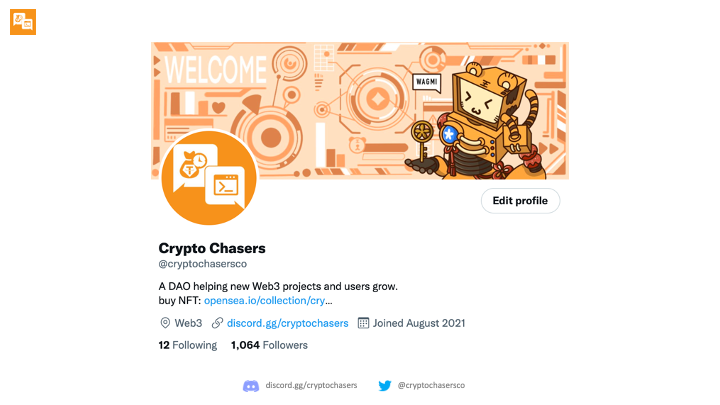

> 作者：meji script-money

本次会议的主要是有社区公会介绍之前关于Season0启动的草案，并邀请另外两位报名子公会leader的成员讲述后面的计划。

## Season0介绍

发言人： 治理-社区公会leader script-money

上一个提案已经通过，确认了社区DAO的愿景、价值观和目标

社区的Twitter Profile已经展示了新的愿景

[未完成的Season0草案](https://docs.google.com/document/d/1kNm_3bcBfmNqReeTtnPMEXlFRefld8hwR011f9DrHnc/edit#heading=h.b6jmgltg6ngy)

Season0的组织架构，是在社区里招募leader后确定的三个子公会

* 信息公会leader: Tina
* 建设者公会leader: CybertLab
* 治理-社区公会leader: script-money

leader需要投入精力在DAO启动时期，进行成员招募、规则制定、设定目标、贡献分配的工作

治理-社区公会的Season0计划

贡献记录的方式4有四种，建议采取NFT+Discord身份的方式。
mirrorDAO 发 1 mirror Token和udao记录积分的方式操作起来有些复杂，暂时不使用

介绍子公会的利益分配流程

推荐使用之前测试的Coordinape工具

关于社区DAO进行项目孵化的想法

## 其他Leader发言和讨论

Tina（信息公会Leader）:目前类似于目前群内撸毛或讨论新项目信息的方式。

问题：目前成员使用微信意愿比discord大，大家对于便捷的方式吸引更大。

script-money提议：找贡献者发布每日新项目日报，使用爬虫工具对新项目进行记录。

Tina：先人工搬。

script-money：有没有可能针对某个大类的方式找新项目。

Tina：按链为大类去找可能会更好。

script-money：那也得找到早期，有价值的项目。依然是要确定标准，以及建立奖励机制。

Tina：如果按着投资机构会不会前面有收益，后面没了话，大家的心态可能会有变化。

如果针对medium和推特来找，目的性与针对性比较强，从机构角度，可能会没那么简单。

script-money：对于群友的信息搜集能力信任，只是在建立一个平台。

Tina：还是要对于项目的评级要有个指标。

script-money：对于没有机构的新项目，使用黑客松可能会是一个比较好的方法。

同学：目前的问题是建立组织架构与规则，首先社区第一要服务于社区，贡献者也肯定是为了获取贡献的收益，也有人来买NFT获取贡献者贡献的信息。目前的问题是怎么整合这个流程，把贡献者获得奖励（重点）与买NFT的用户获得信息二者的流程能够落到实地。

---

CybertLab（建设者公会Leader）：自己是开发者，刚从美国回来，有一些开发资源，最近刚新加入社区。听了会议感觉和之前的想法有些出入，个人比较想做一些有价值产品。

script-money：可以看看之前的提案，再思考一下后面的计划。

Tina想法：使用自己的开发项目为一个实例，看看项目孵化机制能不能运作起来。

## 自由问答

Chris：没有特殊技能的成员，能够做出什么贡献？

script-money：帮助产品进行测试，后面会有编程的基础教学。

---

Gary：我们的社区有没有什么主攻方向以打出名气？（像8848以撸毛出名）

Tina：其实一直在做类似的事情，群友们也是看到了可以有持续利益才留在社区里。

script-money：不局限在撸空投，后面会根据DAO的愿景目标来发展社区。

---

同学：如何给社区NFT和金库赋能？（重点）认为太理想化。

Tina：以前买NFT的群友，可以看着之前信息来搞。而后买NFT进群的人，看着前人的信息来进行自己的活动。

Chris：其实重点还是看社区里面的贡献者愿意奉献什么，而不是局限于买NFT。

同学：需要更多方式来给贡献者进行奖励分配，给社区赋能，让群友作为社区的一份子感到骄傲。也可以不设置leader，但是一定要建设规则。规则起来了，一切都有了。

Chris：以上市公司的方向来运作，股份分红机制啥的，但是目前处于初创阶段，实现不太可能。

script-money：还是先建立机制与流程，先做核心业务。
