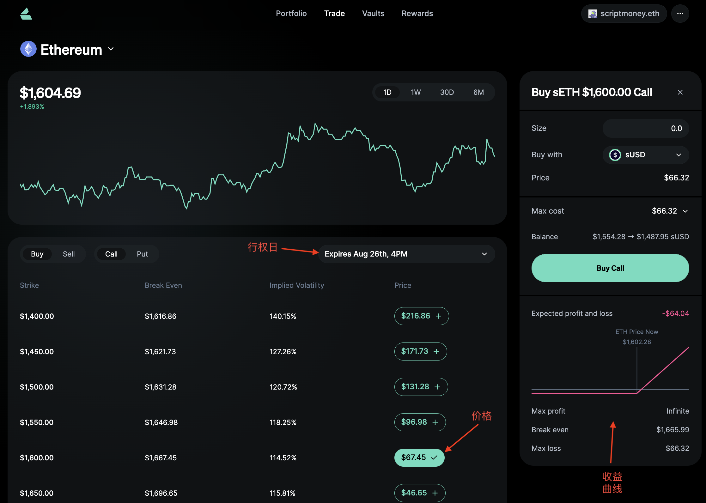
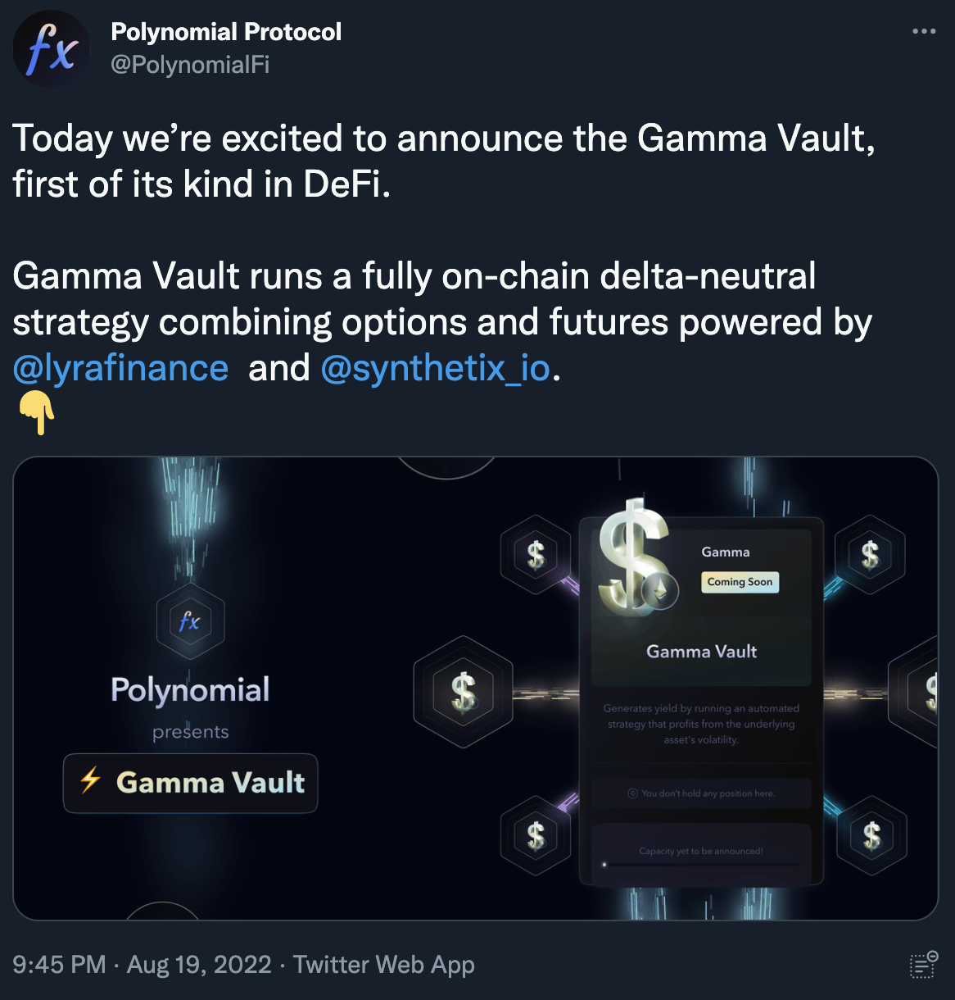

Polynomial 是 Optimism 生态的一个期权机枪池(DeFi Options Vaults，DOV)项目。介绍 Polynomial 之前，首先要介绍下什么是期权。

## 期权简介

以下图期权DeFi平台 [lyra](https://app.lyra.finance/) 的 ETH 期权为例，假如你看多，花了 67.45U，买入1手 1600U 行权价 8月26日4PM 到期的看涨期权（Buy Call）。撰文当天是8月23日，还有3天行权。

如果到了行权日时，ETH 低于 1600U，你不会获得任何收益，净亏损购买时的 67.45U 权利金。相对的，你的对手盘，卖出看涨期权（Sell Call）的人就会赚取这 67.45U 权利金。

如果到期时 ETH 价格为 1700U ，你可以赚 100-67.45=32.55U。以此类推，到 1800U 就是 132.55U。对手盘卖方就会亏损对应金额。

图中右下角可以看到收益曲线，只要到期时ETH过了 1667.45U 的冲击价格，这笔交易就是赚钱的。

买方损失有限，收益可能无限。卖方的亏损可能无限，所以卖方需要抵押权利金数倍金额的保证金防止爆仓。

俗话说得好，买期权像是买彩票，花点钱买个中大奖的可能。卖期权像是做生意，稳赚现金流。

虽然期权卖方收益有限，风险无限，但胜率高很多，而且可以通过策略对冲风险。后文会介绍机枪池采用的一些策略。

> 更多期权入门建议阅读 [全聚德期权小白书](https://twisty-sign-c8b.notion.site/af443219baa74d2b9c0471f608b269a3)

## DeFi 期权机枪池（DOV）简介

DeFi 期权机枪池（DOV）是指把资金存入合约后，会自动根据策略去期权平台上交易期权获利。

传统金融市场里，由于期权卖方需要占用大量资金，所以卖方通常由专业做市商和机构从事。而 DOV 的存在，让金额不多的散户也可以当卖方赚现金流。

期权价格和波动率正相关，由于加密货币波动率很大，卖期权的收益相对其他市场较高。波动最小的 BTC 年化也大于 20%，这个收益是排除掉代币激励的真实收益。

## Polynomial的期权策略

结合现货和合约，期权策略有很多种，以对应不同的市场行情，理解各自的原理很重要。

Call Selling 是卖出看涨期权为主的策略。只要不遇到极端暴涨超过行权价，可以稳收权利金，币本位的数量是会一直增加的。Polynomial 的UI上做了明显提示，指出该策略 This strategy is good for: Bearish, Moderately Bullish，Not ideal for: Extremely Bullish Market。适合熊市和小牛，不适合大牛市。

界面上还能看到该Vault里有72个sETH（synthetix合成的ETH），执行了2个日期的操作，卖出了54份8月26日1800U的Call，和卖出6份9月2日的2000U的Call。操作会到期权平台 lyra 上完成。

和其他 DOV 不同，Polynomial还推出了 U本位 的 Call Selling 池子。相比E本位，如果遇到暴跌，对U计价也不会有亏损。

对应的，Put Selling 池是不断卖出看跌期权赚取权利金，最不想看到的是暴跌行情。图中执行的是卖出了42手 8月26日到期 1400U 看跌期权，保证金质押了 58800 sUSD。

另外 Polynomial 即将推出的新池子Gamma Vault，[degenscore](https://degenscore.com/cafe?opportunity=polynomial) 超过450分可以加入白名单。是通过买入看涨期权并做空期货，实现暴涨暴跌都能赚钱的策略，但横盘会亏损。具体可见[Introducing the Gamma Vault](https://mirror.xyz/0xf3897707d8Fa5dC27b2A6575319e409a464eB8D8/QttnsvjS3JM__pJzT602iwOF0mZZ8PCeSiM3OQvYlj8)。

## 相似产品对比

几个 DOV 产品，Polynomial、Opyn的Crab、StakeDAO、Thetanuts、Ribbon，我多少都存有一些资金。说一下各自特点：

Polynomial 是其中界面做得最好的，手续费最低，即将出的gamma池很期待。没发币。

Opyn 的 Crab 名气最大，放开上限会很快抢完。Crab 策略是做空波动率的策略，横盘赚钱，其他平台没有该策略。没发币。

StakeDAO 目前是锁仓状态，而且收益较低，有特色的是提供了一个黑天鹅保护的ETH策略。已发币。

Thetanuts 有很多山寨币，收益会更高。并且提供了存 USDC 购买一篮子的 Put Selling 以降低单币黑天鹅的风险。未发币。

Ribbon 是最早代币治理的老项目，经常能在 layer3 上看到，部分山寨币收益高。已发币。

另外还有一些 Solana 和 Polygon 上的 DOV 没有尝试过就不介绍了。

总之，没发币的上述平台都建议试一下，但是为了防范风险，不要存太多币进去。目前最看好的是 Polynomial。
