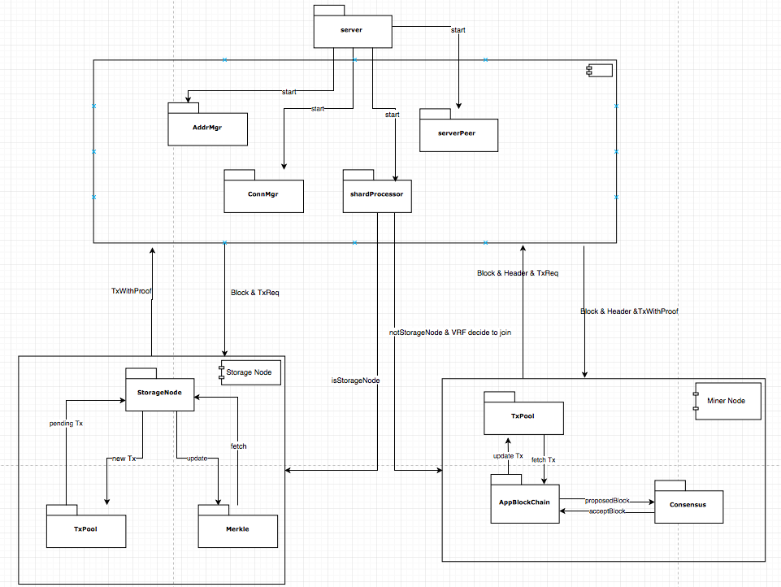
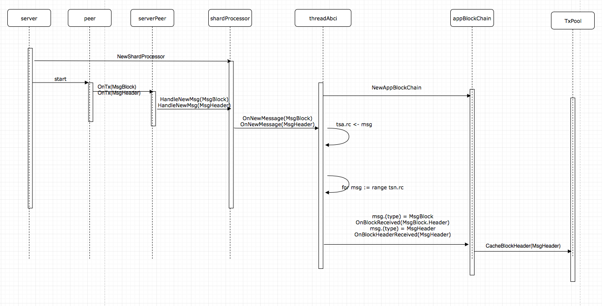

> 原文链接 [MultiVAC Open Source Code Overview](https://multivac-global.medium.com/multivac-open-source-code-overview-7977ae18905c)

## 部分

根据区块链的特性和实现，传统的区块链代码可以分为四个功能部分：

Ⅰ. 存储

区块链可以看做是一个分布式数据库，所以首先需要实现的是存储功能（只有一次写入的只读数据库）

Ⅱ. 点对点通信

作为一个去中心化的网络，区块链与传统架构不同。网络中的节点不仅可以作为服务提供数据，还可以作为客户端请求数据。因此，该网络需要解决三个问题：

①where：节点的查找和连接（入站节点和出站节点）

②when：连接到一个新的节点（例如如所需节点数不足...）

③what：广播、接收、处理、反馈节点消息

Ⅲ. 同步

区块链是一个分布式数据库，需要保证数据的一致性。分布式网络中的节点可能会出现宕机，从而导致数据丢失。因此，区块链需要实现同步功能，保证节点数据的一致性。

Ⅳ. 共识

区块链也可以看作是一个时序数据库，它记录了整个区块链在各时间的状态。同步是让网络中的节点达到当前状态，共识是解决所有节点如何从当前状态到下一个状态。在区块链世界里，不仅有失败节点，还有作恶节点。为了持续平稳运行的安全，需要达成共识。

MultiVAC 在传统区块链的基础上增加了分片的概念，能根据以上部分进行扩展。

## 模块

MultiVAC 的实现以比特币代码为参考。连接管理器、地址管理器等模块与比特币类似。同时，我们根据自己的业务需求，增加了一些逻辑和新的方法。一般来说，代码分为很多模块，负责不同的功能。在阅读代码的时候，如果直接从主函数入手，会有点难懂。建议先看几个模块，搞清楚方法和功能。

**Connmgr**：处理节点间的TCP连接，如新建、连接、断开、移除、监控等。

**Addrmgr**：更新和维护其他能连接的节点的地址。它有两个Buckets(类似于关系数据库中的database):NewBuckets和TriedBuckets。主要的流程是：当我们需要节点地址时，我们可以从bucket中获取并维护这些地址的状态。

**Wire**：定义传输消息的结构、封装和解析。主要目的是为各种消息提供一个统一的接口，使传输、写入、读取更加方便一致。

**Peer**：提供了较为具体的节点信息传输方式，使用了消息传输的基本方法，提供了对节点具体方式的设置配置。节点之间的消息基于connmgr和addrmgr服务。

**VRF**：具有生成公钥和私钥、生成签名、验证签名、生成随机哈希、证明的功能。该模块主要利用可验证随机函数算法计算随机哈希，把矿工分到不同的分片。

**Storagenode**：提供与存储节点相关的方法。例如：onBlockReceived()、onTransactionReceived()、onRequestingTx()、getTxWithProof()、getOutState()。主要实现的功能与存储节点更新账本中的 merkle 树和 TxPool，以及向矿工提供交易证明有关。

**Appblockchain**：提供与矿工节点相关的方法。例如：onBlockReceived()、onBlockHeaderReceived()、addTransaction()。主要用于更新矿工节点的TxPool，缓存其他新区块的区块头，和生成和验证新区块的功能。

**Consensus**：共识算法的实现，包括投票逻辑控制、预投票、预提交投票记录。另外还有共识中消息的分发和广播功能。

**rpcserver/rpcclient**：rpcserver主要提供了一些RPC调用方法，如：handleGetTxOut()、handleQueryShardInfo()、handleUpTime()。rpcclient提供了连接和调用rpcserver的方法，方便与rpcserver交互。

## 逻辑

下面是一些图片，可以更清楚地描述整体逻辑中各个模块的功能及其依赖关系。

我们从服务器模块开始。ConnMgr、AddrMgr和serverPeer负责实现节点之间的信息传输。

然后我们启动一些shardProcessor。每个shardProcessor相当于我自己这个shard中节点的一个调度器。同时，矿工根据VRF参与不同的shard。

例如，如果我是矿工节点，我会启动AppBlockChain和Consensus模块，完成矿工节点的区块生成和投票功能。如果我是一个存储节点，我会启动storageNode，并维护TxPool和Merkle。
存储节点和矿工节点都使用shardProcessor和serverPeer来传输各种需要的消息，如TxWithProof、Block、Header等。

存储节点维护一个TxPool，用于记录交易、更新交易和广播交易。同时，记录一个账本（Merkle Tree），用于记录和更新交易区块，并提供交易证明（txWithProof）。

矿工节点维护一个TxPool，用于记录未完成的交易，并在产生区块时获取交易。同时，矿工节点将广播生成的区块并更新账本的状态。

## 交易和区块处理

存储节点和矿工节点之间有不同的处理程序，用于接收新的交易、区块和区块头信息。

从服务启动一个 shardProcessor 开始，如果这是一个存储节点，我们将启动 threadStorageNode。此时，threadStorageNode 中的tsn.rc通道将等待需要处理的信息。

服务会在同一时间启动 peer。当有新的交易进入时，peer 的Inhandler() 会监听信息，最后传递给 threadStorageNode tsn.rc通道。

当接收到新的交易的信息时，storageNode 会更新自己的 TxPool 和 Merkle 树。这样就完成了 storageNode 中的交易存储。

对于区块的基本处理与我们接收到的交易类似，不同的是，我们需要根据区块中的所有交易信息更新 TxPool 和账本的 Merkle 树。

同时，要注意区块是否由这个分片产生的，对于当前分片的区块和其他分片的区块的处理是不同的。

以下是矿工节点的交易处理流程。

下面是矿工节点区块处理的流程。

注意，我们这里只保存区块头。这个流程与共识无关，只是对收到的区块头和区块进行处理。

## 总结

这是项目的整体逻辑和处理顺序的介绍。希望能对大家阅读代码有所帮助，对整体架构有更好的了解。

## 关于 MultiVAC

MultiVAC是全球首个基于可信分片的弹性公链，也是专为大规模去中心化应用设计的下一代高性能区块链平台。MultiVAC正在开发世界上第一个快速、高效、全维度分片的解决方案，能够有效实现计算、存储和传输三个层面的扩容，在保证去中心化和不牺牲安全性的基础上使吞吐量最大化。

官网: https://www.mtv.ac

技术白皮书: https://www.mtv.ac/assets/file/MultiVAC_Tech_Whitepaper_CN.pdf

技术黄皮书：https://www.mtv.ac/assets/file/MultiVAC_Sharding_Yellowpaper_CN.pdf

技术紫皮书：https://www.mtv.ac/assets/file/MultiVAC_Programming_Purplepaper_CN.pdf

电报群2020：https://t.me/MultiVAC2020

电报频道: https://t.me/MultiVACMTV

推特: https://twitter.com/MultiVAC_Global