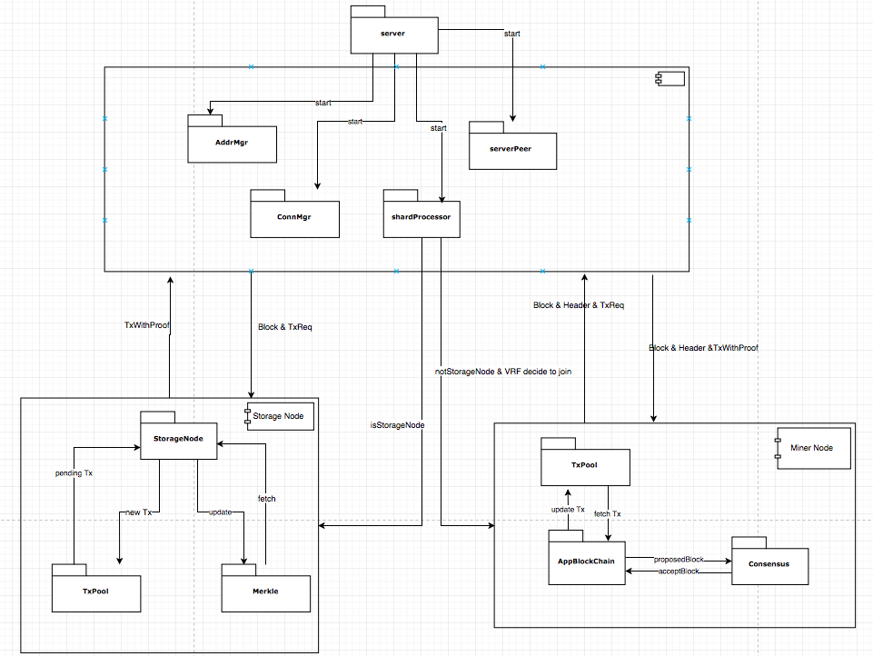
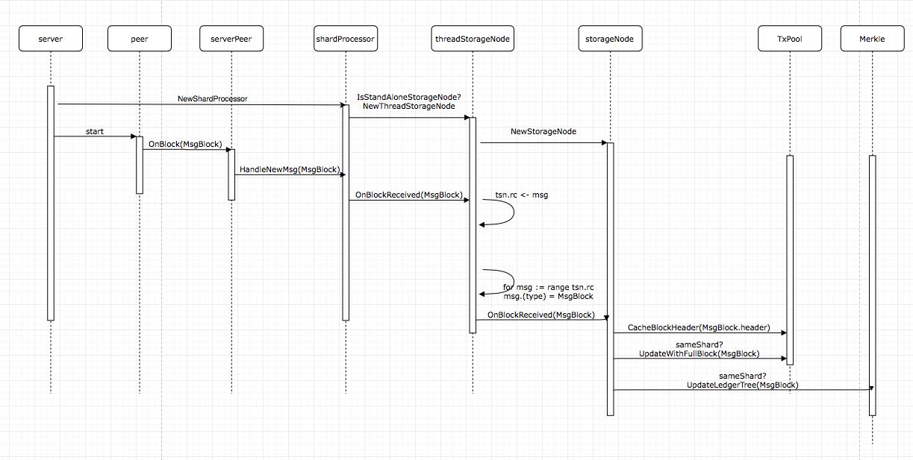
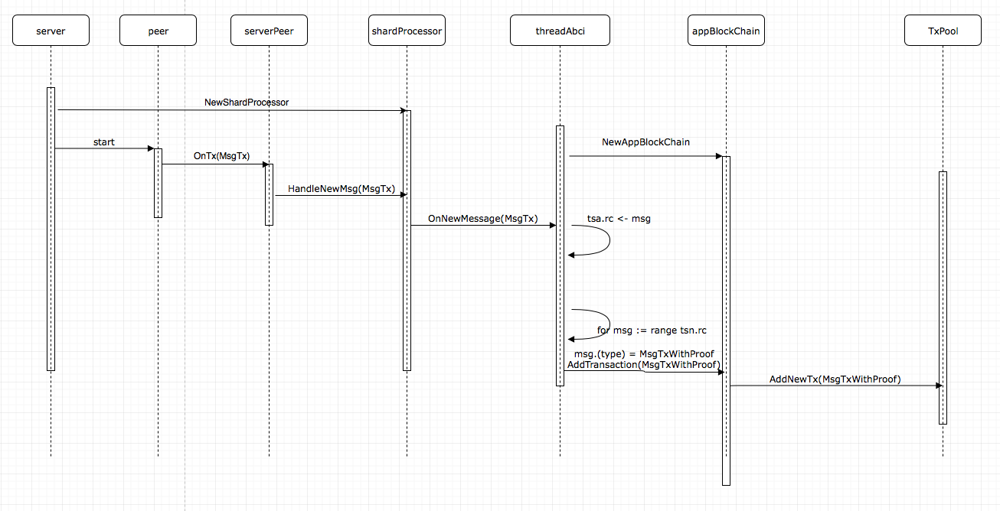
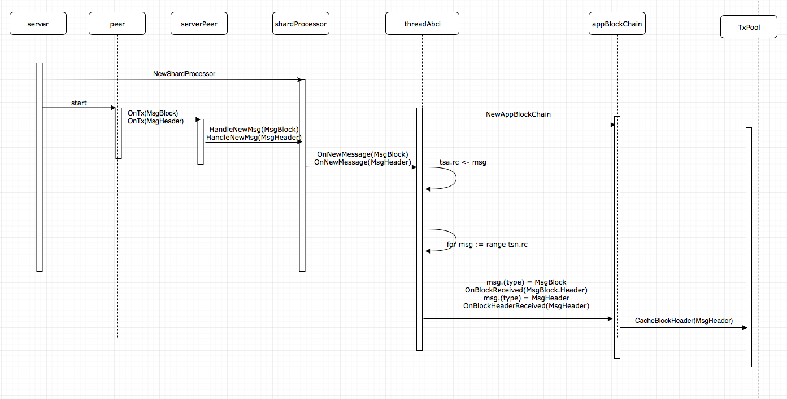

# MultiVAC Open Source Code Overview

This is an overview of the code open-sourced: https://github.com/multivactech/MultiVAC

## Parts

According to the characteristics and implementation of the blockchain, the traditional blockchain code can be divided into four functional parts:

Ⅰ. Storage
Blockchain can be regarded as a distributed database, so the first thing that needs to be realized is the storage function (write once to a read-only database)

Ⅱ. Peer to peer
As a decentralized network, blockchain is different from traditional architecture. The peer in the network can not only serve as a server to provide data but also as a client to request data. Therefore, the network needs to solve three problems:
① where: Node discovery and connection (inbound peer and outbound peer)
② when: Connect to a new peer (such as the number of required nodes is insufficient…)
③ what: Broadcast, receive, process, and feedback of the node message

Ⅲ. Synchronization
Blockchain is a distributed database, and the consistency of data needs to be guaranteed: Nodes in a distributed network may be down, which may cause data loss. Therefore, the blockchain needs to implement synchronization functions to ensure the consistency of the peer’s data.

Ⅳ. Consensus
The blockchain can also be regarded as a time database, which records the state of the entire blockchain at the current time. Synchronization is to make the nodes in the network to reach the current state, consensus is to solve how all nodes go from the current state to the next. There are not only failure nodes in the blockchain world, but also evil nodes. For the security of continuously and smoothly running, a consensus is needed.

MultiVAC adds the concept of sharding on the basis of traditional blockchain, which can be expanded according to the above parts.

## Modules

The implementation of MultiVAC takes the bitcoin code as a reference. The connection manager, address manager, and other modules are similar to bitcoin. At the same time, we add some logic and new methods according to our business needs. In general, the code is divided into many modules responsible for different functions. When you read the code, if you start directly from the main function, it will be a little bit difficult to understand. It is recommended to read a few modules first to figure out the methods and functions.

Connmgr: The function of processing TCP connections between nodes, such as new, connect, disconnect, remove, and monitor.

Addrmgr: Update and maintain the address of other peers that your node can connect to. It has two 
buckets: NewBuckets and TriedBuckets. The main progress is: when we need the peer address, we can get it from the bucket and maintain the state of these addresses.

Wire: Define the structure of transmission message, package encapsulation, and analysis. The main purpose is to provide a unified interface for various messages to make transmission, writing, and reading more convenient and consistent.

Peer: Provides a more specific method of node information transmission, using the basic method of message transmission, and provides configuration for setting specific methods of nodes. The message between peers based on the basic services of connmgr and addrmgr.

VRF: The function of generating public and private keys, generating signatures, verifying signatures, generating random hashes, and proofs. This module mainly uses the VRF algorithm to calculate a random hash and realize miner sharding into different sharding.

Storagenode: Provides methods related to storage nodes. For example: onBlockReceived(), onTransactionReceived(), onRequestingTx(), getTxWithProof(), getOutState(). The main functions implemented are related to storage nodes updating the merkle tree and TxPool in ledger, and providing transaction proofs to miners.

Appblockchain: Provides methods related to miner nodes. For example: onBlockReceived(), onBlockHeaderReceived(), addTransaction(). It is mainly used to update the TxPool of the miner node, cache the block headers of other new blocks, and it has the function of generating and verifying new blocks.

Consensus: The realization of the consensus algorithm, including voting logic control, preVote, preCommit voting record. There is also the function of distributing and broadcasting messages in fragments.

rpcserver/rpcclient: rpcserver mainly provides some RPC call methods, such as: handleGetTxOut(), handleQueryShardInfo(), handleUpTime(). rpcclient provides methods for connecting and calling rpcserver for easier interaction with rpcserver.

## Logic

Here are some pictures to more clearly describe the functions of each module in the overall logic and their dependencies:

We start from the server module. ConnMgr, AddrMgr, and serverPeer are responsible for the realization of information transfer between nodes.

Then we start some shardProcessors. Each shardProcessor is equivalent to a scheduler for my own node in this shard. At the same time, the miners participate in different shards according to the VRF.

For example, if I am a miner node, I will start the AppBlockChain and Consensus modules to complete the block generation and voting functions of the miner node. If I am a storage node, I will start the storageNode and maintain the TxPool and Merkle.
Both storage nodes and miner nodes use shardProcessor and serverPeer to transmit various required messages, such as TxWithProof, Block, Header, etc.

The storage node maintains a TxPool, which is used to record transactions, update transactions, and broadcast transactions. At the same time, a ledger (Merkle Tree) is recorded, which is used to record and update transaction blocks and provide transaction proof (txWithProof).

The miner node maintains a TxPool, which is used to record unfinished transactions and obtain transactions when a block is generated. At the same time, the miner node will broadcast the generated block and update the state of the ledger.

### Transaction and block processing

There are different processing procedures between the storage node and the miner node for receiving a new transaction, block, block header information.

The server starts a shardProcessor, and this is a storageNode, we will start threadStorageNode. At this time, the channel tsn.rc in threadStorageNode will wait for the information that needs to be processed.

The server will start the peer at the same time. When a new transaction enters, the Inhandler() of the peer will listen to the message and finally pass it to the channel tsn.rc in threadStorageNode.

When we receive information about new transactions, storageNode will update its own TxPool and Merkle tree. This completes the transaction storage in the storageNode.

The basic situation for a block is similar to the transaction we received, the difference is that we need to update the Merkle tree of TxPool and ledger based on all transaction information of the block. 

At the same time, pay attention to whether the block is generated by this block, the processing for this block and other blocks is different.

The following is the processing flow of a transaction on the miner node:

The following is the processing flow of a block on the miner node:

Note that we only save the block header here. This flow has nothing to do with consensus, just the processing of the block header and block received.

## Summary

This is a general overview, the overall logic, and the processing sequence of the project. We hope it can help to read the code and have a better understanding of the overall structure.

## ABOUT MULTIVAC

MultiVAC is a high-throughput flexible blockchain platform based all-dimensional sharding. It’s a next-generation public blockchain platform built for integration with large-scale decentralized applications (dApps). MultiVAC is developing the first solution in the world characterized by speediness, efficiency, and all-dimensional sharding to expand its capacity in computation, transmission, and storage. It realizes the maximum throughput while maintaining decentralization and without sacrificing security.

Website: https://www.mtv.ac

Onepager: https://www.mtv.ac/assets/file/MultiVAC_OnePager.pdf

Technical Whitepaper: https://www.mtv.ac/assets/file/MultiVAC_Tech_Whitepaper.pdf

Technical Yellowpaper: https://www.mtv.ac/assets/file/MultiVAC_Sharding_Yellowpaper.pdf

Technical Purplepaper: https://www.mtv.ac/assets/file/MultiVAC_Programming_Purplepaper.pdf

Telegram Group 2020: https://t.me/MultiVAC2020

Telegram Channel: https://t.me/MultiVACMTV
Twitter: https://twitter.com/MultiVAC_Global