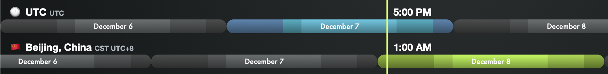
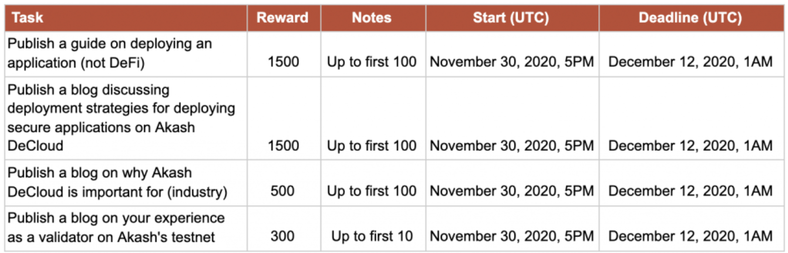

akash network是一个去中心化的云计算平台。用户可以以极低成本部署服务而无需租服务器。目前正在举行社区活动。活动从11月30日太平洋标准时间上午 9 时开始，即北京时间12月1日凌晨1点。持续12天左右。

具体奖励可参考[《Akash 挑战赛第三阶段： 奖励概述》](https://akash.network/blog/akashian-%e6%8c%91%e6%88%98%e8%b5%9b%e7%ac%ac%e4%b8%89%e9%98%b6%e6%ae%b5%ef%bc%9a-%e5%a5%96%e5%8a%b1%e6%a6%82%e8%bf%b0/?lang=zh-hans)

第一周的任务已经结束无法参加，第二周的任务如下。每天会发布一个任务，共三天。

每个挑战持续56小时，奖励150-250AKT代币，约¥650-¥1100左右。全部完成还有额外奖励。

每天的提交北京时间8号凌晨1点开始，按commit的时间戳计算。任务会提前发布，可以晚上弄完，凌晨1点commit了就去睡觉。

第一个任务部署API节点（提供http查询）。

第二个任务部署RPC节点（提供链上查询和同步）。

第三个任务是部署验证者节点（参与共识）。

整个活动期间还有开放任务，部署自己的服务，部署defi，写文章等。有写作能力的应积极参加。

前置条件：

1. 领奖时需要KYC，亲测用护照/身份证+驾照可以顺利通过。
2. 需要熟练操作Linux，部署节点时需要。操作钱包最好也在VPS上进行。
3. 需要熟练使用Github，知道如何fork，clone，commit，push和pull request。提交成果的方式是pull request。

一开始需要从[官网](https://app.akash.network/signup?ref=c8xse9yeozxk71z)右上角注册，referral Code 邀请码可填写我的

**c8xse9yeozxk71z**

第一周挑战1-3的流程攻略如下：

[Akash挑战1流程（已结束）]( "akash_challenge1") 

[Akash挑战2流程（已结束）]( "akash_challenge2") 

[Akash挑战3流程（已结束）]( "akash_challenge3") 

开放任务 DeCloud for DeFi Rewards 的参考：

[Akash DeCloud部署Uniswap]( "Akash DeCloud部署Uniswap") 

第二周任务提交方法还未知，可先按照下面的节点部署流程练习部署：

节点部署流程攻略如下：
[Akash节点部署流程]( "akash_node") 

