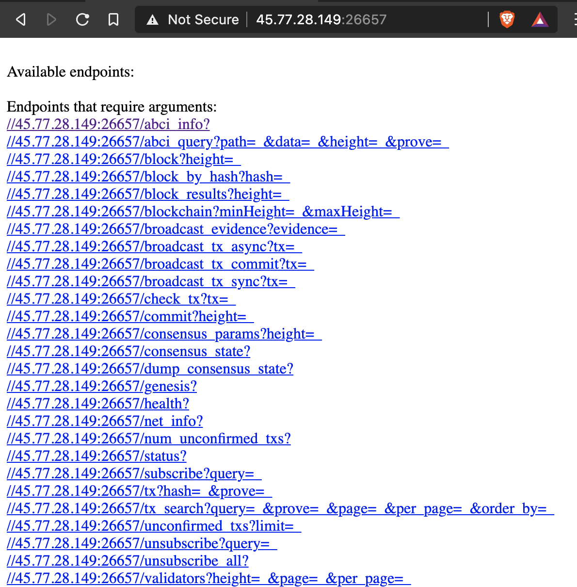
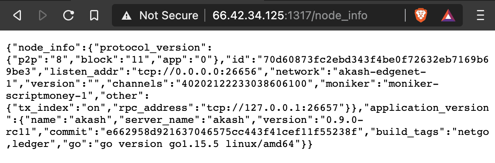

# Akash节点部署流程

介绍节点部署流程，让大家避免一些坑，简化一些操作。建议配合[官方文档](https://docs.akash.network/guides/node)阅读。

b站视频教程 [「akash节点部署视频流程」](https://www.bilibili.com/video/BV1Zz4y1k7FF/)，大佬可无视。新手建议看一遍视频。

## 整体流程

租服务器——设置变量——安装Go——编译源码——配置节点——启动节点——配置验证人


## 租服务器

租 Linux 的服务器。操作系统版本都可以。

RPC和API节点，配置用 1核CPU/1GB RAM/25GB SSD，公网IP。

验证人节点用上面的也可以，但 [参考tendermint文档](https://github.com/tendermint/tendermint/blob/master/docs/tendermint-core/running-in-production.md#hardware) 建议2核CPU/2GB RAM/100GB SSD。

## 设置变量
建议先看看 [官方文档](https://docs.akash.network/guides/version) 的设置。

文档里的指令大多是以 **$VARIABLE** 表示，要事先设置变量。

建议把以下内容添加到 `~/.bashrc` 中，然后运行`source ~/.bashrc`，变量就会全程起效。

```bash
AKASH_NET="https://raw.githubusercontent.com/ovrclk/net/master/edgenet"
AKASH_VERSION="v0.9.0-rc13"
AKASH_CHAIN_ID="akash-edgenet-1"
AKASH_NODE="tcp://rpc-edgenet.akashdev.net:26657"
```
或者运行以下命令
```bash
echo 'AKASH_NET="https://raw.githubusercontent.com/ovrclk/net/master/edgenet"
AKASH_VERSION="v0.9.0-rc13"
AKASH_CHAIN_ID="akash-edgenet-1"
AKASH_NODE="tcp://rpc-edgenet.akashdev.net:26657"' >> ~/.bashrc
source ~/.bashrc
```

所有变量名到GitHub库里查看更方便（相比curl）：https://github.com/ovrclk/net/tree/master/edgenet

## 安装Go

官方文档介绍了三种方式，第二种有坑，只能采取第三种源码编译的方式。

先更新系统，并安装make工具
```bash
sudo apt-get update # Centos用yum update && yum install gcc
sudo apt-get -y upgrade
sudo apt install build-essential -y
```

下载golang1.15.5
```bash
wget https://dl.google.com/go/go1.15.5.linux-amd64.tar.gz # 下载包，国内服务器可能无法下载，可以手动下载后上传
tar -xvf go1.15.5.linux-amd64.tar.gz  # 解压包
sudo mv go /usr/local
```

输入命令添加以下环境变量进 `~/.bashrc`
```bash
echo 'export GOROOT=/usr/local/go
export GOPATH=$HOME/go
export PATH=$GOPATH/bin:$GOROOT/bin:$PATH' >> ~/.bashrc
source ~/.bashrc
```
最后运行 `go version` 查看结果，正常显示版本安装成功。

## 编译源码
```bash
go get -d github.com/ovrclk/akash # 会报一个constrain的警告，不用管。可能需要安装git
cd $GOPATH/src/github.com/ovrclk/akash # 前面GOPATH必须设置好
git checkout "$AKASH_VERSION" # 前面AKASH_VERSION变量必须设置好
make deps-install # 可能需要apt install build-essential或yum instal gcc
make install # 等最多5分钟
```
编译完成后输入 `akash` 有输出，说明节点程序可使用。

> 注意：第二周任务已经更新，如果只是参加挑战任务部署SDL，后面都可以跳过了。接着参考 [Akash挑战1流程（已结束）]( "akash_challenge1") 去生成钱包，发送SDL文件。

## 配置文件

参考官方文档 [Run an Akash Node](https://docs.akash.network/guides/node)

1. 修改AKASH_MONIKER的名字为你的节点名（把下面指令里的“输入你的节点名”改为你想要的名字）

```bash
echo AKASH_MONIKER="输入你的节点名" >> ~/.bashrc
source ~/.bashrc
akash init "$AKASH_MONIKER"
```

2. 修改 `~/.akash/config/app.toml` 中的11行 min-gas-prices = "0.025uakt"

```bash
sed -i '11cmin-gas-prices = "0.025uakt"' ~/.akash/config/app.toml
```

3. 下载创世配置文件。运行完输入`cat $HOME/.akash/config/genesis.json`看一下是否有结果。如果没结果，很可能是国内服务器可能访问不到，手动下载到对应文件夹 https://raw.githubusercontent.com/ovrclk/net/master/edgenet/genesis.json

```bash
curl -s "$AKASH_NET/genesis.json" > $HOME/.akash/config/genesis.json
```

4. 添加seed。~/.akash/config/config.toml 的184行添加节点信息。

```bash
sed -i '184cseeds = "d540f54a920e3d58c13a5908c5f6ea2160bcf7b2@edgenet-01.akashtest.net:26686,3f843ee34582c4181f00c02643b4b53bb830c3a8@edgenet-02.akashtest.net:26686,22f70903b004a56a650c9478989230b4a771ee5a@edgenet-03.akashtest.net:26686,6390b433ff3036e7fa6fd9188c9679026fe2bbcc@edgenet-04.akashtest.net:26686,f097db8b1be940dbcba0970fcbe96085308b3803@95.216.20.181:26656,447766779a8b5b594b1e38cb51bf5c2e6e121e78@62.171.162.251:29956,2bea671ce7de988b137384c8e29c337d10cc4c37@173.212.203.238:46656"' ~/.akash/config/config.toml
```

5. 修改 `~/.akash/config/config.toml` 中的23行为fast_sync = true

```bash
sed -i '23cfast_sync = true' ~/.akash/config/config.toml
```

6. 修改 `~/.akash/config/config.toml` 中的308行为 v0 改为 v2

```bash
sed -i '308s/v0/v2/g' ~/.akash/config/config.toml
```

7. 配置systemd

创建启动守护配置文件，注意8-10行的User、WorkingDirectory、ExecStart的路径改成你对应的路径
```shell
echo '
[Unit]
Description=Cosmos akash Node
After=network.target

[Service]
Type=simple
User=root
WorkingDirectory=/root
ExecStart=/root/go/bin/akash start
Restart=on-failure
RestartSec=3
LimitNOFILE=4096

[Install]
WantedBy=multi-user.target
' > /etc/systemd/system/akash.service
```

重新加载systemd

```bash
sudo systemctl daemon-reload
```

配置journald

```bash
sed -i 's/#Storage=auto/Storage=persistent/g' /etc/systemd/journald.conf
```

重新加载journald配置

```bash
systemctl restart systemd-journald
```


## 配置不同种类的节点

### RPC
如果是配置RPC节点:
修改`~/.akash/config/config.toml`中的91行的laddr的值laddr = "tcp://0.0.0.0:26657"

```bash
sed -i '91claddr = "tcp://0.0.0.0:26657"' ~/.akash/config/config.toml
```

### API

如果是配置API节点，`~/.akash/config/app.toml`中的104行api的enable false 改为 true

```bash
sed -i '104s/false/true/g' ~/.akash/config/app.toml
```

### Validator

如果是配置验证者节点，先按下方步骤启动节点，等待同步完成。

用 `curl localhost:26657/abci_info?` 查看目前同步进度 

区块链浏览器查看最新区块 http://testnet.akash.aneka.io/

## 启动节点

`systemctl start akash` 或 `akash start` 启动节点，等待同步。

`journalctl -u akash -f` 或 `akash status` 查看状态。

如果RPC节点，打开浏览器输入 [IP]:26657，应该能看到如下类似内容



如果是API节点，启动节点后，打开浏览器输入 [IP]:1317/node_info 应该能如下类似内容


## 配置验证人

同步时，先配置一个钱包，参考 [Akash挑战1流程（已结束）]( "akash_challenge1") 和 [Akash挑战3流程（已结束）]( "akash_challenge3") 

配置完成后，你的 .bashrc 中应该有 KEY_NAME 和 ACCOUNT_ADDRESS 变量。且输入
`akash --node "$AKASH_NODE" query bank balances "$ACCOUNT_ADDRESS"` 有100000000左右的uakt。

输入`akash tendermint show-validator`，会在 `~/.akash/config/priv_validator_key.json` 生成验证人私钥。

输入以下内容创建验证人

```bash
akash tx staking create-validator \
  --amount=1000000uakt \
  --pubkey="$(akash tendermint show-validator)" \
  --moniker="$AKASH_MONIKER" \
  --chain-id="$AKASH_CHAIN_ID" \
  --commission-rate="0.10" \
  --commission-max-rate="0.20" \
  --commission-max-change-rate="0.01" \
  --min-self-delegation="1" \
  --gas-prices="0.025uakt" \
  --gas-adjustment="1.2" \
  --from="$KEY_NAME"
```

[官方文档](https://docs.akash.network/guides/node/validator)中有编辑验证者信息、查看描述、查看状态的其他指令，自己去尝试修改。

输入`akash status`，如果voting power为1，说明已经成功了。或者去区块链浏览器中查看是否在列表里。

注意：目前测试网状态已经跑满了100名验证者，新创建的验证者暂时加入不了网络！第二周的活动很可能会重启测试网。该文档会根据活动要求进行更新。


