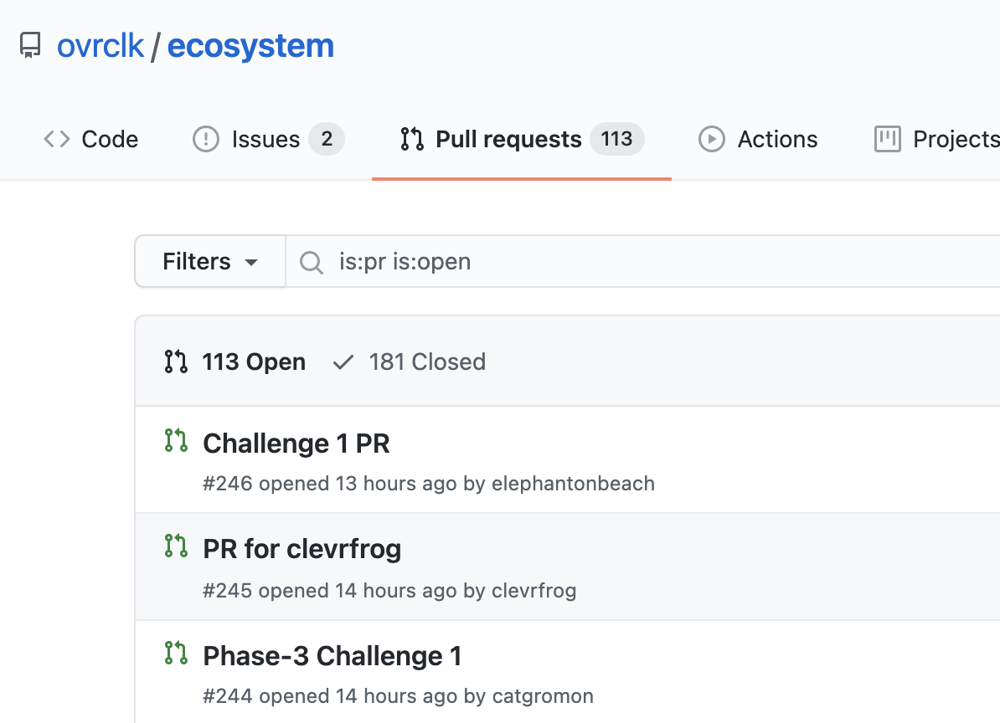
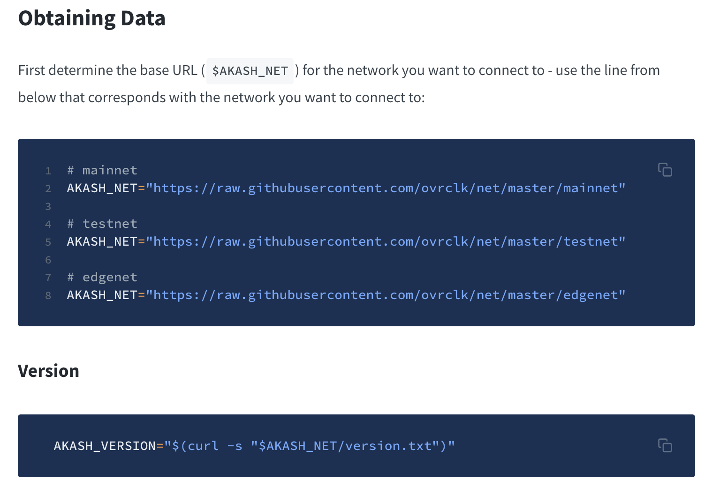
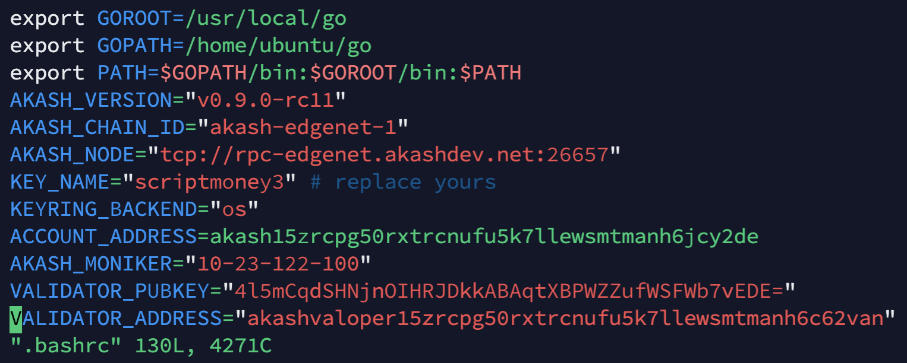
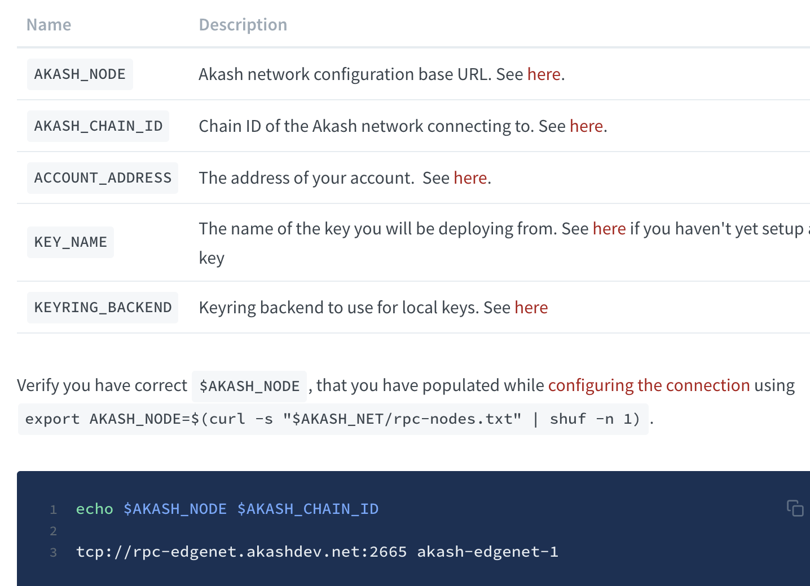
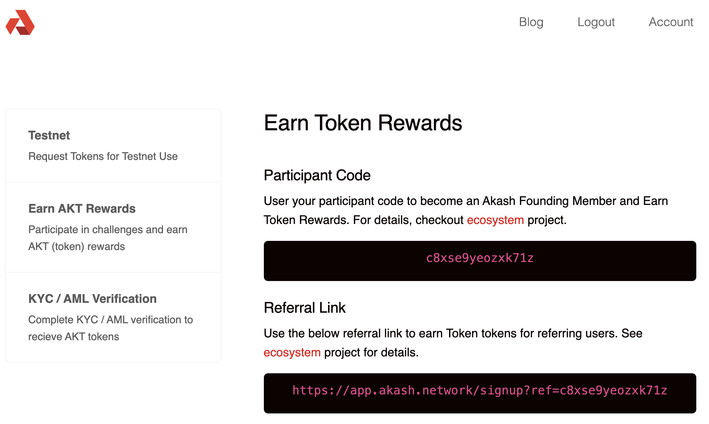
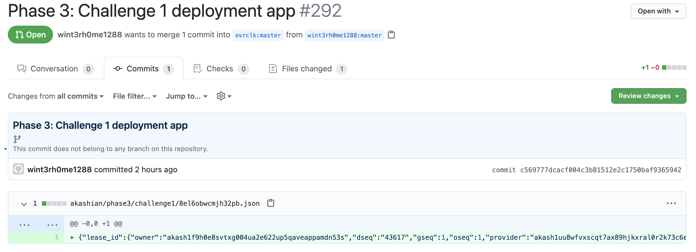

> 建议官方文档为主，本文为辅。

## 查看活动进度
进行前可先看看该[页面](https://github.com/ovrclk/ecosystem/pulls?page=3&q=is%3Apr+is%3Aopen)，~~如果 **没有超过200** 提交都还有机会~~，超过200也可以试试，因为有人是3个任务都单独提pr，有人1个pr里有3次提交。如图目前有113人提交了成果。


12月4日已经开始结算了，应该来不及了，准备第二周的节点活动吧。做节点也需要安装akash节点，下面的内容依然有用。

## 设置变量
[点此进入官方文档](https://docs.akash.network/guides/version)

文档的指令大多是以 **$VARIABLE** 表示，如下图要事先设置变量。注意活动用的是edgenet。


建议把以下内容添加到 `~/.bashrc` 中，然后运行`source ~/.bashrc`，变量就会全程起效。

```
AKASH_VERSION="v0.9.0-rc11"
AKASH_CHAIN_ID="akash-edgenet-1"
AKASH_NODE="tcp://rpc-edgenet.akashdev.net:26657"
```

其他变量自己根据情况设置，如下图


另外所有变量名到页面查看更方便（相比curl）：https://github.com/ovrclk/net/tree/master/edgenet

## 安装akash
官方文档介绍了三种方式，第二种有坑，只能采取第三种源码编译的方式。

### 安装golang-1.15
```
sudo apt-get update # Centos用yum update
sudo apt-get -y upgrade
wget https://dl.google.com/go/go1.15.5.linux-amd64.tar.gz # 下载包，国内服务器可能无法下载，可以手动下载后上传
sudo tar -xvf go1.15.5.linux-amd64.tar.gz  # 解压包
sudo mv go /usr/local
```

然后添加以下环境变量进 `~/.bashrc`，然后运行`source ~/.bashrc`
```
export GOROOT=/usr/local/go
export GOPATH=$HOME/go
export PATH=$GOPATH/bin:$GOROOT/bin:$PATH
```
最后运行 `go version` 查看结果，正常显示版本安装成功。

## 编译源码
```
go get -d github.com/ovrclk/akash # 会报一个constrain的警告，不用管。需要安装git
cd $GOPATH/src/github.com/ovrclk/akash # 前面GOPATH必须设置好
git checkout "$AKASH_VERSION" # 前面AKASH_VERSION变量必须设置好
make deps-install # 可能需要apt install build-essential或yum instal gcc
make install # 大概等2分钟
```
编译完成后输入 `akash` 就会有输出，钱包程序即可使用。

## 钱包设置

先设置 `KEY_NAME` 和 `KEYRING_BACKEND` 变量，可参考上面的图。KEY_NAME设置你方便记忆输入的名字即可。KEYRING_BACKEND默认用os。

输入 `akash --keyring-backend "$KEYRING_BACKEND" keys add "$KEY_NAME"` 生成钱包，把文件复制存好。

输入 `akash --keyring-backend "$KEYRING_BACKEND" keys show "$KEY_NAME" -a` 打印钱包地址，以ACCOUNT_ADDRESS为变量名填入.bashrc，可参考上面的图片。

## 领测试币

访问 https://akash.vitwit.com/faucet
过人机检验，复制ACCOUNT_ADDRESS到表单提交，会给100个测试币。

用 `akash --node "$AKASH_NODE" query bank balances "$ACCOUNT_ADDRESS"` 查看是否有收到。

## 变量检查

部署的是akash网页钱包——Lunie Light。

根据教程，用 echo 命令检查变量是否有输出。有的变量输出为空就填入.bashrc


> [Akash挑战3流程]( "akash_challenge3") 有完整的shell指令可以直接复制
## 创建部署配置文件
创建复制网页上的 deploy.yml 到本地，一行都不用改。也可以用`curl -s https://raw.githubusercontent.com/ovrclk/docs/master/guides/deploy/deploy.yml > deploy.yml`直接下载。
> 如果是部署自己的web应用就需要做修改，类似docker镜像的部署，属于其中一个开放挑战的任务的要求。

## 创建部署
根据文档 `akash tx deployment create deploy.yml --from $KEY_NAME --node $AKASH_NODE --chain-id $AKASH_CHAIN_ID -y` 发起部署交易。

## 等待租凭
根据文档 `akash query market lease list --owner $ACCOUNT_ADDRESS --node $AKASH_NODE --state active` 查看是否成功。有结果的话，记录PROVIDER/DSEQ/OSEQ/GSEQ的值。不想设置bashrc的话，可以直接输入`GSEQ=1`设置临时变量。

## 上传Manifest

上传：

`akash provider send-manifest deploy.yml --node $AKASH_NODE --dseq $DSEQ --oseq $OSEQ --gseq $GSEQ --owner $ACCOUNT_ADDRESS --provider $PROVIDER`

检查状态：

`akash provider lease-status --node $AKASH_NODE --dseq $DSEQ --oseq $OSEQ --gseq $GSEQ --provider $PROVIDER --owner $ACCOUNT_ADDRESS`


会出现一个类似*6veev7chcfmnclgqklegcc.provider4.akashdev.net*的url，就是该webapp的访问地址。在浏览器中打开即可使用。

## 生成凭证

> 该部分内容在[Guided Deployments](https://docs.akash.network/testnet-challenges/testnet-challenges/guided-deployments#challenge-1-week-1)

用以下指令输出json凭证。json保存在当前执行命令路径。

`akash query market lease get --dseq $DSEQ --gseq $GSEQ --oseq $OSEQ --provider $PROVIDER --owner $ACCOUNT_ADDRESS --node $AKASH_NODE -o json > $CODE.json`

其中$CODE变量需要设置。是注册后网页上显示的Participant Code


## 提交成果

> 需要熟悉Git的 pull request流程，不熟悉的话，参考[该文章](https://chinese.freecodecamp.org/news/how-to-make-your-first-pull-request-on-github/)

根据官方教程进行，fork [ecosystem](https://github.com/ovrclk/ecosystem)库。克隆到本地。删除原来的json，添加上面生成的json凭证。commit结果。push到Github上。去网页上点击pull request，添加描述。你的pull request应该和其他人的类似。


## 疑难解答
有问题可以直接在该博客下面留言，或者去官方discord查看历史记录是否有类似错误

## 挑战2
挑战2的流程攻略如下：
[Akash挑战2流程]( "akash_challenge2") 