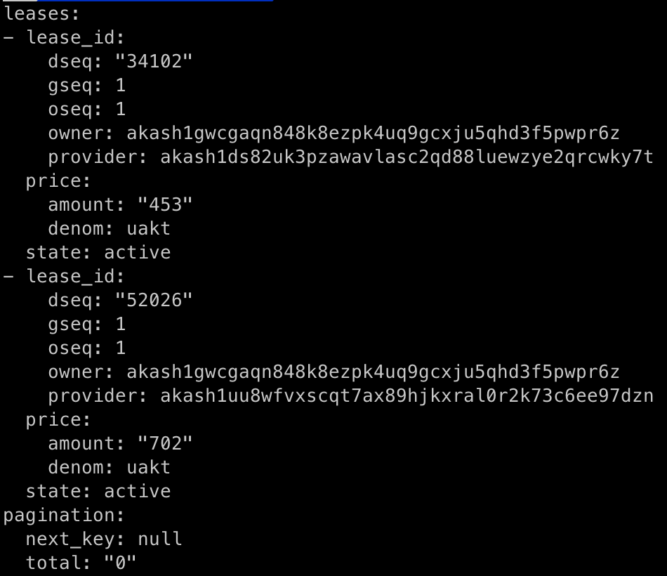
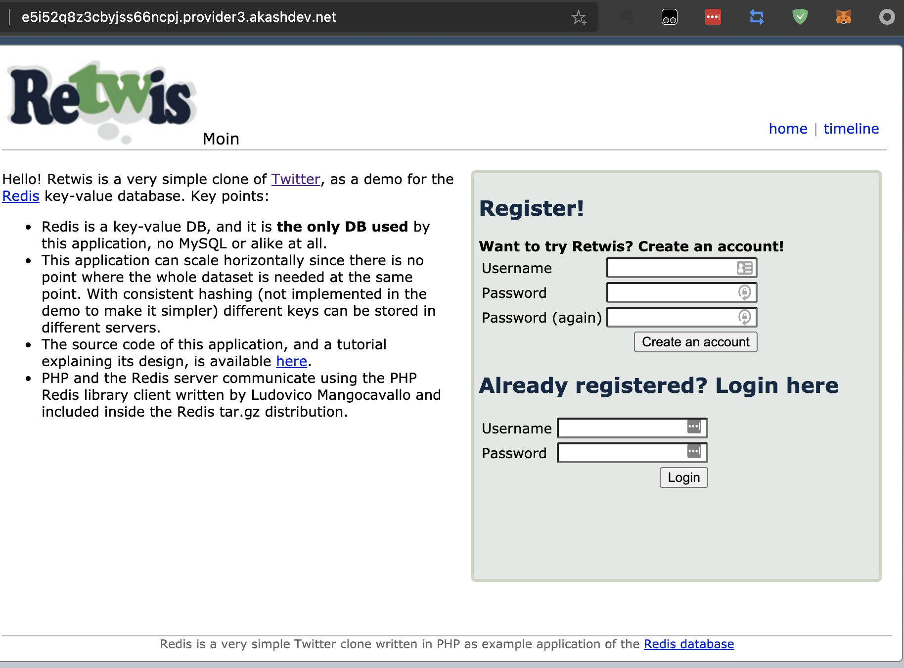
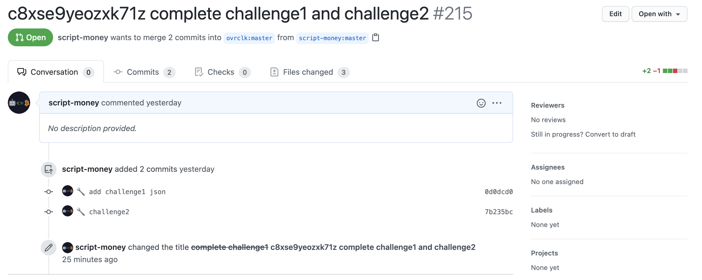

整体流程和[Akash挑战1流程]( "akash_challenge1") 的一样。

不一样的是需更换[DSL文件](https://github.com/ovrclk/docs/blob/335978772efddd76215adadcd6fa4d13464ddff7/testnet-challenges/deploy-1-2.yaml)，官方已经提供。

lease的输出结果应该如下，会有不同的dseq，provider可能不同，需要重新赋值：

部署完后去浏览器检查下是否能访问

在原来的本地Git库进行commit然后push。注意生成的json放到ecosystem/akashian/phase3/challenge2下，和挑战1的不在同一个文件夹。

push完成后原来的pull request会有更新，如下图。点右上角的Edit对标题进行修改即可。

有问题可以直接在该博客下面留言，或者去官方discord查看历史记录是否有类似错误

挑战3的流程攻略如下：
[Akash挑战3流程]( "akash_challenge3") 