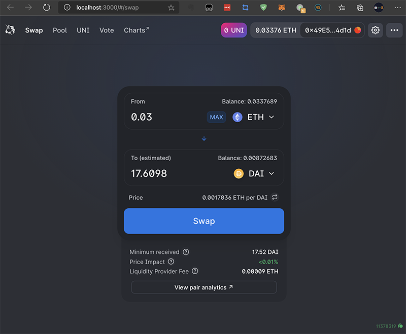
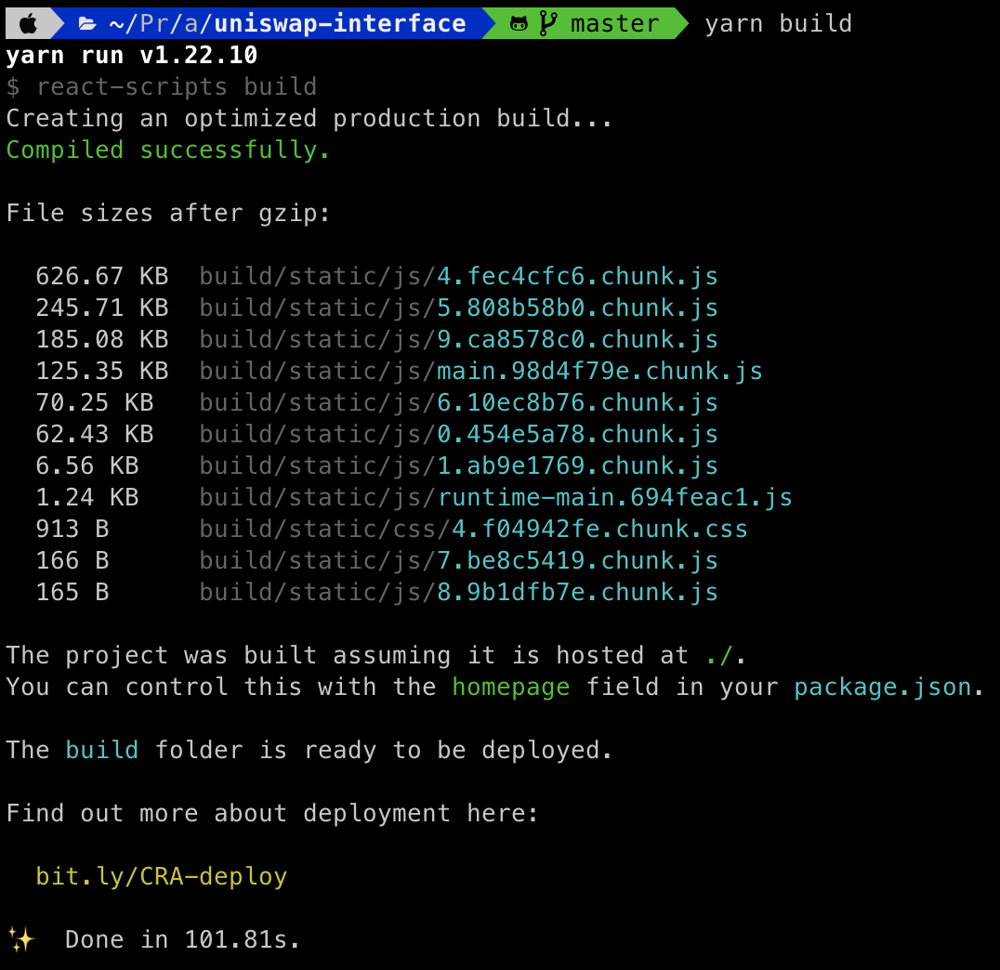
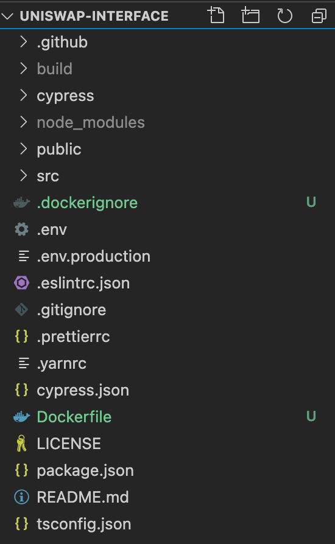
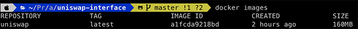
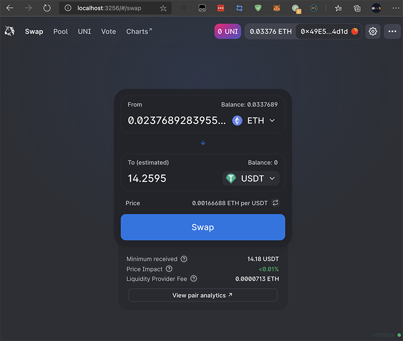
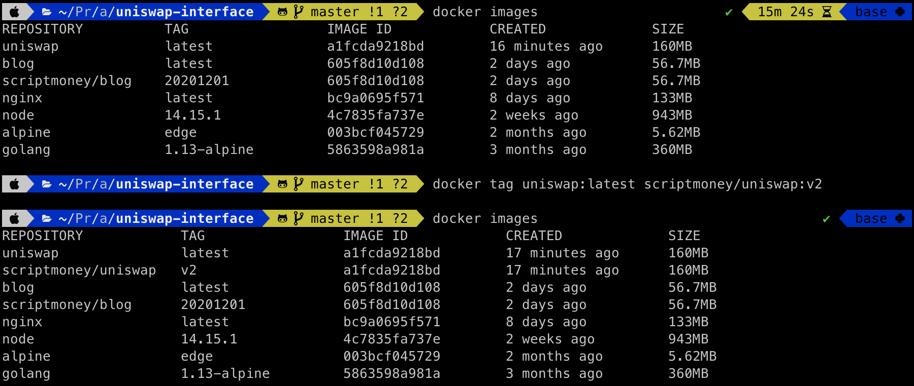
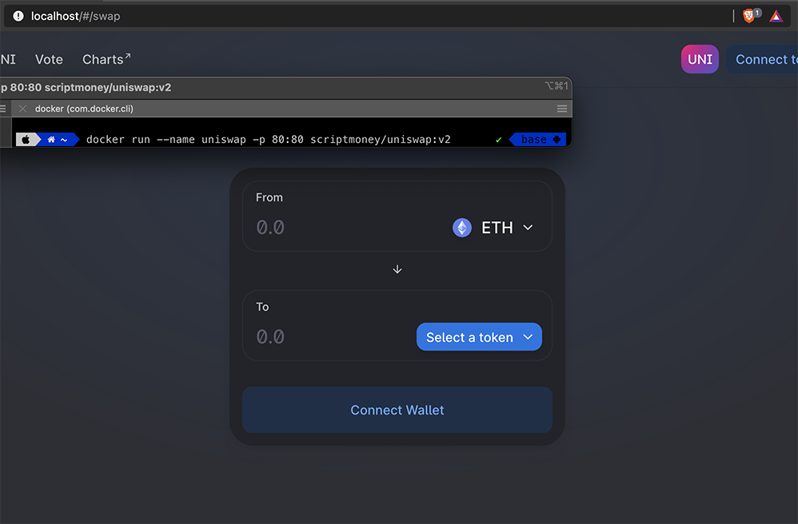
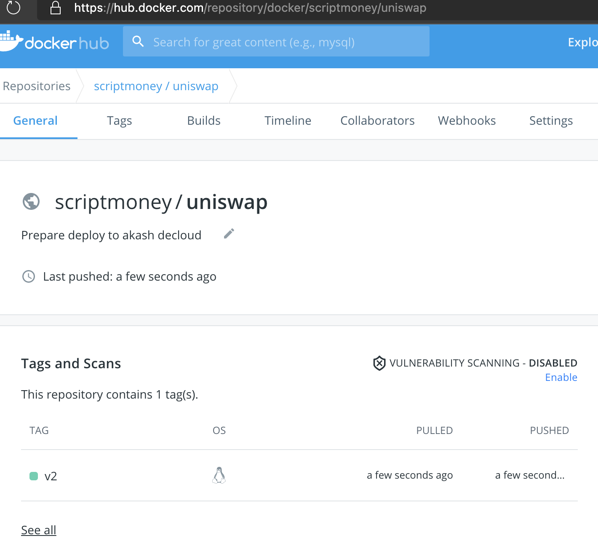
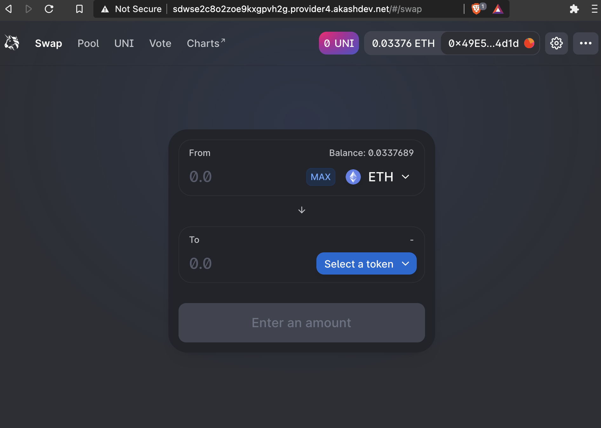

# Akash DeCloud部署Uniswap

## 流程

部署部分的流程和挑战1-3没有区别，除了要改下SDL文件。Uniswap 本质上是个 Web App，和挑战1的基本相同。

关键在于制作 Docker镜像 上传到 dockerhub 上。

## 关于Docker

docker不熟悉的话，强烈建议先看看[《30 分钟快速入门 Docker 教程》](https://juejin.cn/post/6844903815729119245)，本地安装后跑一跑。

下面会说到的术语有镜像（image）和容器（container）

**镜像** 你可以理解为预装了程序的Linux发行版，正如你租VPS时，要选择用 Ubuntu 还是 Centos，不同的系统有不同的程序在里面。你可以在dockerhub上下载各种镜像，也可以自己制作镜像上传。

**容器** 是指镜像运行后的实例，和使用一台Linux服务器一样，你可以进行切换目录、修改文件、运行脚本等操作。

和真正的虚拟机不同的是，docker的底层是互通的，更轻量。最小的镜像alpine 6MB不到。

## 打包Uniswap

访问 https://github.com/Uniswap/uniswap-interface 

查看README就两步 `yarn` 和 `yarn start`。

先 git clone 该库到本地，使用 `--depth=1` 可以加快下载速度。`--config http.proxy=localhost:8123`是我本机设置的代理，请忽略。


输入`yarn`会下载依赖，需要等待一段时间。中间可能会出现一些错误，自己按照提示Google搜索解决。

输入`yarn start`就可以在 localhost:3000 访问Uniswap页面。



通常部署 WebApp 都是要打包后用 Nginx 去运行，输入`yarn build`打包，打包后的文件如图会放在 build 文件夹下。


## 制作本地镜像


制作镜像也有多种方式，如果使用自动化部署，通常是在镜像A中去编译，再拷贝到镜像B中运行。如下面Dockerfile中注释了的内容。

```Dockerfile
# # 编译镜像
# FROM node:14.15.1 as build

# # 只要package.json,yarn.lock内容不变,依赖会使用缓存
# # 否则会全部重新下载
# WORKDIR /node/release
# COPY package.json yarn.lock ./
# RUN yarn config set registry https://registry.npm.taobao.org/
# RUN yarn
# COPY . ./
# RUN yarn build

# 运行镜像
# FROM nginx
# COPY --from=build /node/release/build /usr/share/nginx/html
# EXPOSE 80
# CMD ["nginx", "-g", "daemon off;"]

FROM nginx
COPY build /usr/share/nginx/html
EXPOSE 80
CMD ["nginx", "-g", "daemon off;"]
```

注释内的流程大致是：

1. 运行一个14.15.1的node镜像作为编译镜像
2. 设置镜像内的工作目录为 /node/release
3. 拷贝Uniswap目录下的package.json yarn.lock到镜像内
4. 修改yarn到国内镜像源以加快下载速度
5. 运行yarn下载依赖
6. 复制Uniswap目录下的代码到镜像内
7. 运行yarn build打包
8. 新下载运行一个nginx镜像
9. 把编译镜像的/node/release/build复制到/usr/share/nginx/html
10. 标记内部运行的是80端口
11. 用 nginx -g daemon off; 运行nginx
    
也可以使用本地build好的文件复制到nginx里直接运行（上面Dockerfile中没注释的部分）。下文采取此方式。

在Uniswap文件夹下新建一个名为 Dockerfile 的文件。（走流程1还需要新建一个.dockerignore添加 node_modules/ 和 build/ 防止COPY这两个文件夹进编译镜像）




Dockerfile编辑保存后，输入 `docker build . -t uniswap:latest`，等待打包，完成后输入 `docker images` 就能看到打包好的镜像。



## 运行本地镜像

输入 `docker run --name uniswap -p 3256:80 uniswap:latest` 以uniswap:latest镜像，启动一个名为uniswap的容器，把内部80端口暴露到主机的3256端口。

访问`localhost:3256`或者`127.0.0.1:3256`使用Uniswap界面



## 上传镜像

需要注册docker账号，网页上创建库，本地重新tag，然后push，网上教程也很多了，可以先看看[《Docker - 将制作好的镜像上传到Docker Hub仓库（附操作步骤）》](https://www.hangge.com/blog/cache/detail_2409.html)

如图我在 dockerhub 创建了一个uniswap的公开库。


重新tag，把 uniswap:latest 改为 scriptmoney/uniswap:v2


在本机80端口运行，看看会不会有问题。一切正常。


本机输入指令 `docker push scriptmoney/uniswap:v2` 上传镜像（这儿需要注册账号，请按前面链接去操作）。等待一段时间，去网页查看上传完成。



这时候任何人都可以用 `docker pull scriptmoney/uniswap:v2` 来下载该镜像了。包括 akash DeCloud 上的 privider。

## 部署至akash Decloud

因为挑战1的网页钱包也是个WebApp，用它的 SDL 来修改。

把 deploy1-1.yml 的 6-9行的
```yml
    image: ovrclk/lunie-light
    expose:
      - port: 3000
        as: 80
```
改为
```yml
    image: scriptmoney/uniswap:v2 # dockerhub上的镜像
    expose:
      - port: 80 # 内部运行端口
        as: 80 # 暴露出的端口
```
另存为 deploy_uniswap.yml

剩下的流程都一样了。参考[Akash挑战1流程]( "akash_challenge1") 

下图是运行在akash DeCloud 的截图。



我部署的时候有的provider可能负荷过重，一部署就 Nginx 503 然后 404，遇到这种情况多试几次，重新部署下，换个provider可能就好了。