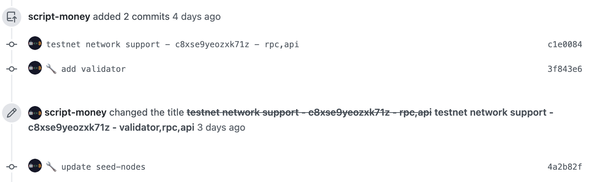
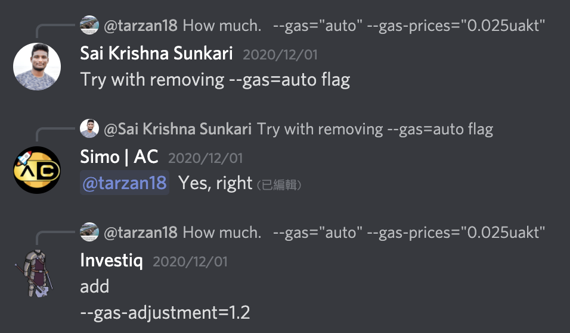
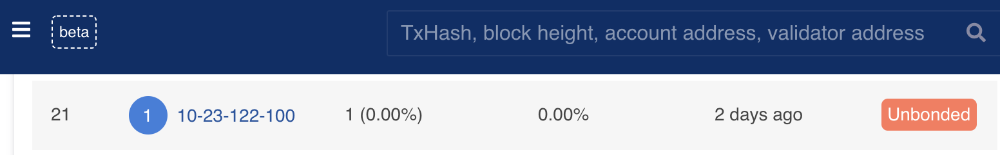

# I am confused as a validator on Akash's Testnet

To complete "Network Support Challenges" at first day, I quickly deployed two akash nodes and completed the RPC and API pull requests follow by documentations.😃

When I set validator node, stuck at first step —— "create-validator".

I tried to ask a related question on discord, but I didn't get an answer.☹️

Finally, I found that the blockchain need to be fully synchronized, create validator transactions can be successfully sent.

Then I encountered another problem which the voting power was always 0. I tried to reboot node according to the documentation, but that didn't help.😩

After a while, according to the hint in the discord, modified some config, then successfully become a validator. Voting power changed to 1.

The documentation should include more detailed explanations about these parameters.

At first I could see my validator information in the  blockchain explore list top 100.

But after a day I noticed that it was not in the list.

Searching in the discord, there are some people in the same situation as me.

My validator status has changed to "unbound" and will not be restored until December 23rd. There is no more information why it became this state. Looks like I'm definitely going to miss the network support challenge.😭

I wish week2 challenge will be more clearly documents and introduction, the current is too confusing.

These are my experience as a validator. Thank you reading. Akash is a good project, it could be better.👍🏻