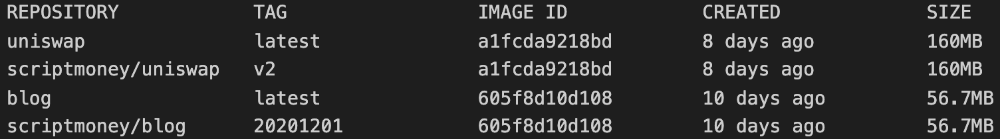
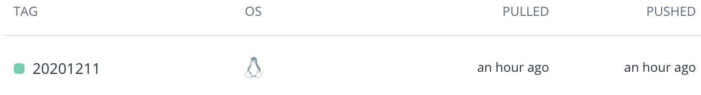
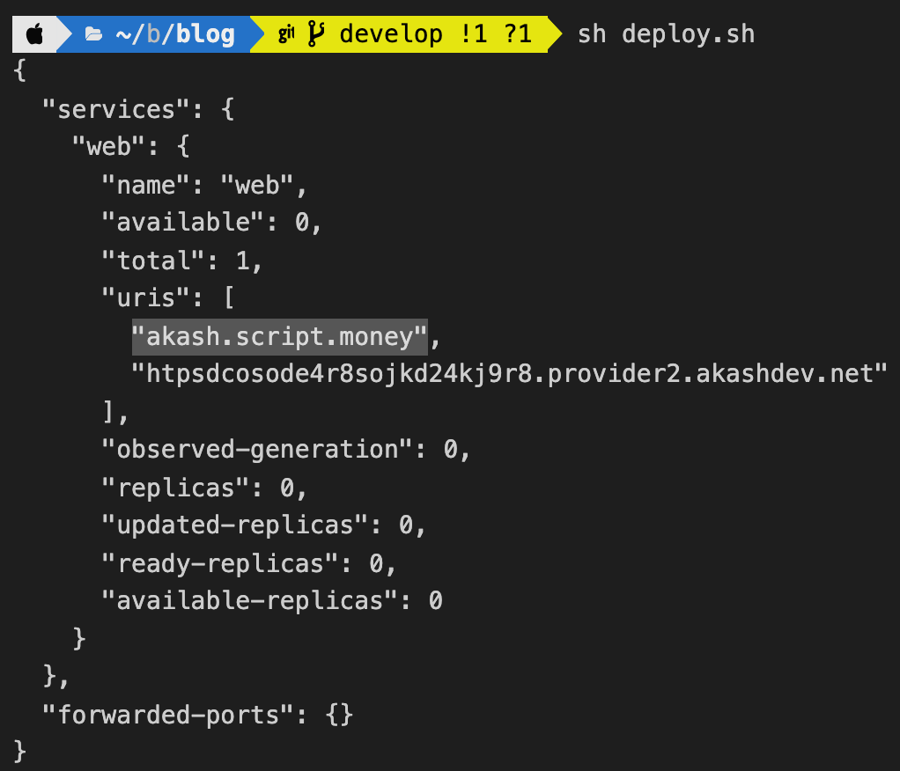
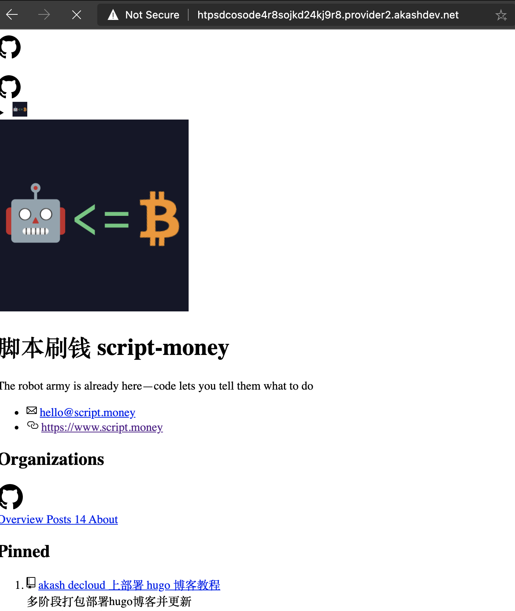
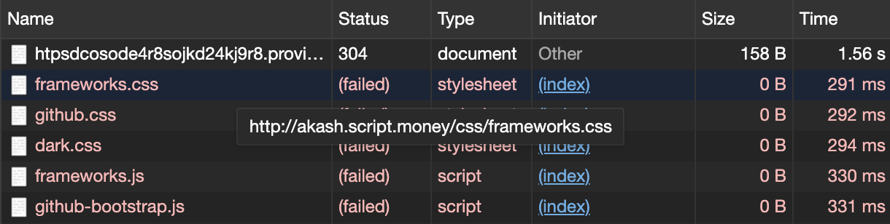
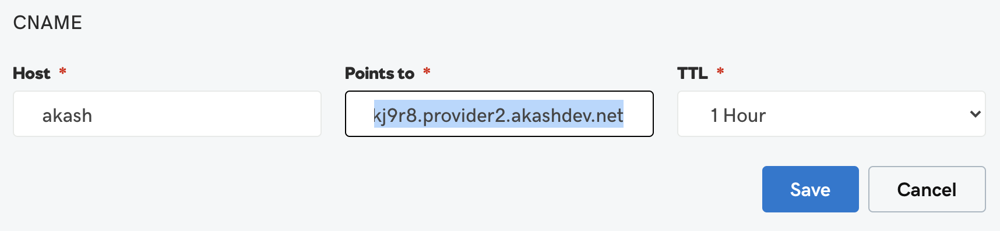
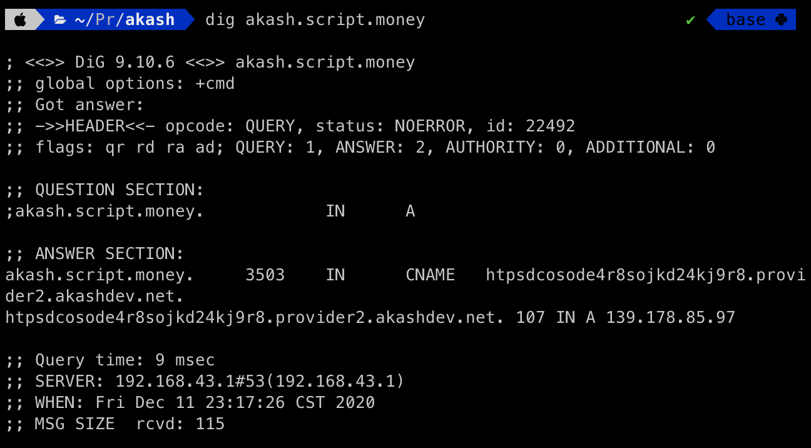
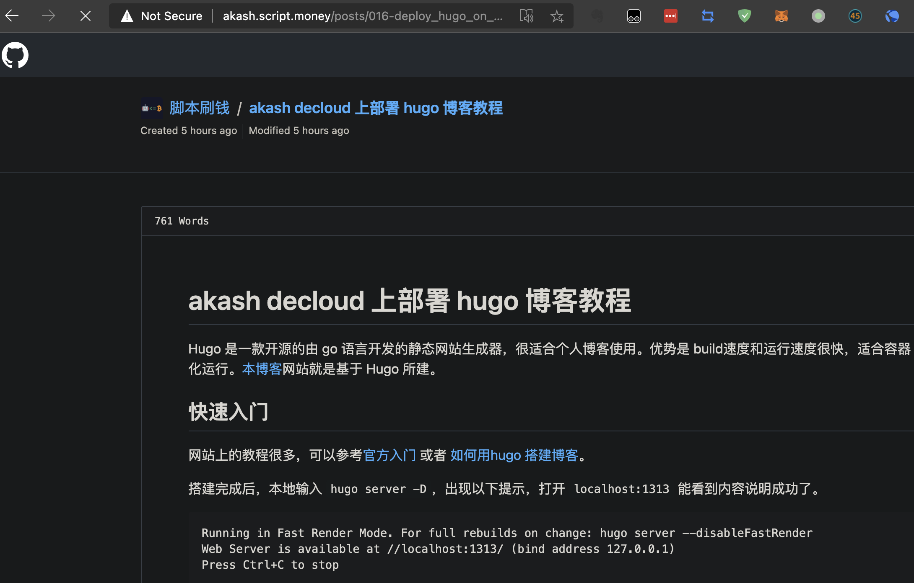

# akash decloud 上部署 hugo 博客教程

Hugo 是一款开源的由 Go 语言开发的静态网站生成器，很适合个人博客使用。优势是构建速度和运行速度很快，适合容器化运行。[本博客](https://github.com/script-money/blog)网站就是基于 Hugo 所建。

## 快速入门

网站上的教程很多，可以参考[官方入门](https://gohugo.io/getting-started/quick-start/) 或者 [如何用hugo 搭建博客](https://zhuanlan.zhihu.com/p/126298572)。

搭建完成后，本地输入 `hugo server -D`，出现以下提示，打开 `localhost:1313` 能看到内容说明成功了。

```
Running in Fast Render Mode. For full rebuilds on change: hugo server --disableFastRender
Web Server is available at //localhost:1313/ (bind address 127.0.0.1)
```
## 制作镜像

整个文件来源于 [hugo的gitlab页面](https://gitlab.com/pages/hugo/-/blob/0.78.2/Dockerfile)，除了最后几行根据自己的需求进行了修改。

> 省略部分见 https://github.com/script-money/blog/blob/main/Dockerfile

```
# ……
# 上面省略了很多代码

ENV PORT=80
ENV BASEURL=
WORKDIR /src
COPY . .
CMD hugo --renderToDisk=true --baseUrl=${BASEURL} --watch=true --bind="0.0.0.0" --port ${PORT} server /src
```
`ENV` 是为了做一些自定义启动命令而设置。

`COPY . .` 是把本地的文章和主题拷贝进容器，但要排除`public/` 中打包后的静态文件，所以需要新建一个 `.dockerignore` 内容如下，记录的文件和文件夹就不会拷贝进容器中。

```
public/
.DS_Store
Dockerfile
```

相比用 Nginx 运行的Uniswap，体积减少了2/3。


然后根据之前的教程 [Akash DeCloud部署Uniswap]( "Akash DeCloud部署Uniswap") ，根据更新的日期来打tag，并把镜像push到dockerhub。



## 编写 SDL

参考之前的web应用的 SDL 编写。如果需要设置域名，需要添加`accept`到特定的域名。用户就可以通过域名访问到服务。



SDL中有特别改到的地方：

```
services:
  web:
    image: scriptmoney/blog:20201211
    env:
      - BASEURL=akash.script.money
    expose:
      - port: 80
        as: 80
        accept:
          - akash.script.money
        to:
          - global: true
```

环境变量里设置了 BASEURL 是为了让 hugo 正确找到 css/js 文件路径。如果没有设置 BASEURL 会出现以下情况。



原因是我的baseURL设置的是CNAME的域名。



去域名供应商处，把域名的 CNAME 指向akash分配的地址：


等待一段时间，域名解析服务刷新后，用`dig`命令就能看到已经正确指向了akash地址。


博客的css也就能正常加载了。


## 更新博客

先打包镜像推到仓库，然后用以下命令让 provider 重新部署。

dseq保持不变，如有必要，可更新下DEPLOY_YML。

```
akash tx deployment update $DEPLOY_YML --dseq $DSEQ --from $KEY_NAME --owner $ACCOUNT_ADDRESS \
  --node $AKASH_NODE --chain-id $AKASH_CHAIN_ID  --fees 50000uakt
```

然后重新发送manifest

```
akash provider send-manifest $DEPLOY_YML --node $AKASH_NODE --dseq $DSEQ \
--oseq $OSEQ --gseq $GSEQ --owner $ACCOUNT_ADDRESS --provider $PROVIDER
```

就可以在地址不变情况下更新部署内容了。