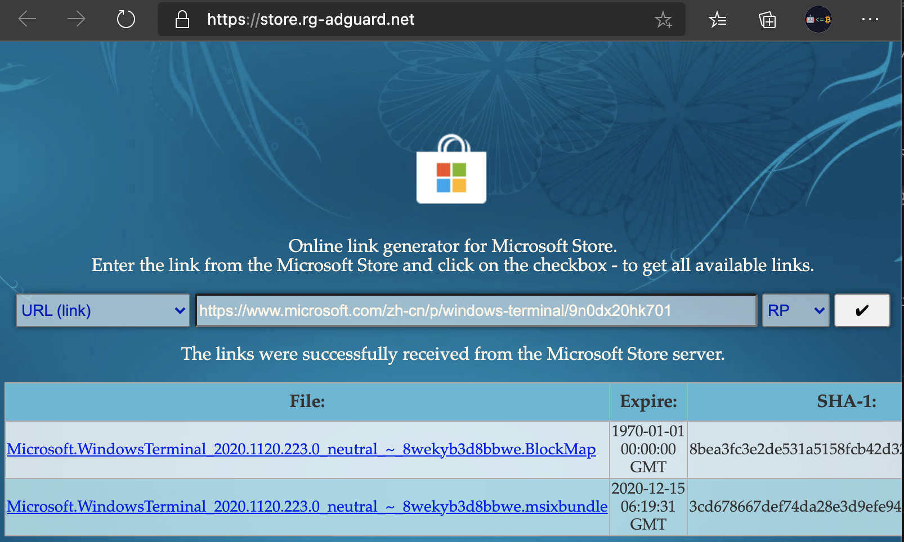

很多钱包命令行软件都没有 Windows 版本，导致必须租 VPS 进行操作。Windows 强力建议安装 WSL。

官方的介绍是这样的：

> 适用于 Linux 的 Windows 子系统可让开发人员直接在 Windows 上按原样运行 GNU/Linux 环境（包括大多数命令行工具、实用工具和应用程序），且不会产生传统虚拟机或双启动设置开销。

[官方文档](https://docs.microsoft.com/zh-cn/windows/wsl/)

安装时遇到的第一个问题是，在Windows商店下载东西太慢了。下面介绍一个途径可以快速下载安装 WSL 和 Windows terminal。

用 bing.com 搜索 `Windows Terminal`，进入 *购买 Windows Terminal* 的[链接](https://www.microsoft.com/zh-cn/p/windows-terminal/9n0dx20hk701)。复制该链接。

打开网站 https://store.rg-adguard.net/ ，选择link，粘贴上面的链接，如下图。

点下面的链接下载即可。

[ubuntu](https://www.microsoft.com/zh-cn/p/ubuntu/9nblggh4msv6) 同理搜索下载。
