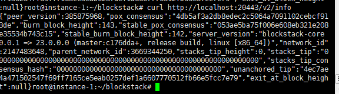

# STX 采矿挑战第一阶段教程（已结束）

【12-30 23:00 更新】

活动已经结束，可以关服务器了。参与挖矿的有 100 STX，从 484 高度开始，每actual_win 1个就多 100 STX。到 http://monitor.stxmining.xyz/mining_info 查看最后结果。邮件等着后续领奖通知就行了。

【12-27 14:30 更新】

有的朋友遇到 Error: not enough total amount in utxo set 的错误，应该是水龙头的余额不足了。

并且目前活动已经过了50%的时间，现在才加入应该来不及了。

基于以上两条原因，不建议再参加了。

---

【12-23 19:40 更新】

官方修改了规则，不按效率比排名，只要全程参与挖了30%的块就能平分。可以根据以下命令查询是否达标，没有达标的建议检查下节点是否正常运行，如果正常，继续挖到活动结束都能达标。

访问 http://monitor.stxmining.xyz/mining_info 打开浏览器的开发者工具的console页，粘贴以下指令，换掉前两行，回车运行

```javascript
let stacks_tip_height = 751 // 访问 http://krypton.blockstack.org:20443/v2/info 查询
let your_btc_address = "mvfDyooJYk5AAJkpzxXDgZkTao6hyDdz4W"
let stx_price = 0.266427

fetch("http://monitor.stxmining.xyz/mining_info", {
    "headers": {
        "accept": "text/html,application/xhtml+xml,application/xml;q=0.9,image/avif,image/webp,image/apng,*/*;q=0.8,application/signed-exchange;v=b3;q=0.9",
        "accept-language": "zh-CN,zh;q=0.9,en;q=0.8",
        "cache-control": "no-cache",
        "pragma": "no-cache",
        "upgrade-insecure-requests": "1"
    },
    "referrerPolicy": "strict-origin-when-cross-origin",
    "body": null,
    "method": "GET",
    "mode": "cors",
    "credentials": "omit"
}).then(resp => resp.json())
    .then(data => {
        var peoples = data.miner_info.length;
        console.log("当前挖矿人数:" + peoples + ",预计分得奖励" + Math.floor(stx_price * 145000 / peoples) + "刀")
        data.miner_info
            .forEach((item, _) => {
                if (item.btc_address === your_btc_address) {
                    // 快照时stack_height 484
                    let standard = (stacks_tip_height - 484) * .3
                    let your_mining = item.total_mined
                    console.log("你需要挖" + Math.floor(standard) + "块才算达标，已经挖了" + your_mining + "块")                                                
                }
            })
    });

```

会出现类似 *当前挖矿人数:607，预计分得奖励63刀。你需要挖80块才算达标，已经挖了112块* 的提示。

---

【12-22 09:00 更新】
如何确定有没有在挖，没有挖怎么办？

输入 `journalctl -u miner.service | grep 你的btc地址` 应该会有 `Received burnchain block #1300 including block_commit_op` 的结果出现。或者去[该页面](http://monitor.stxmining.xyz/mining_info )查看自己的地址 （没出过块的应该查不到），有个 "total_mined"和"miner_burned"，在涨就是正常在挖的。至于"actual_win"没有增长，一晚上才200多个块，起码400+的矿工在挖，能挖到1个都不容易。

如果发现没有挖，需要重启节点，先删除原来日志`rm -rf /var/log/journal/*`，然后`systemctl restart miner`，重启后等几秒输入`journalctl -u miner.service | grep UTXOs`，如果输出 *Miner node: starting up, UTXOs found*，就可以等着同步了。如果输出*Miner node: UTXOs not found. Switching to Follower node. Restart node when you get some UTXOs.* 无法找到BTC余额，是 bitcoind 的bug，只能继续重启，直到出现。没有以上输出的话再等一下输入`journalctl -u miner.service | grep UTXOs`查询。

---

活动开始时间是北京时间2020年12月21日22:00，持续两周，预计有100刀的 STX 奖励。（根据挖矿效率和参与人数而定）

先点击 [活动报名页面链接](https://daemontechnologies.co/minestx-challenge-zh) 报名，最好用英文页面去报名。中文页面报名得到的邮件不显示BTC地址，最后领奖可能需要联系官方解决。

需要生成地址，具体生成方式参考[该视频](https://www.youtube.com/watch?v=82b8PGoQYpI)。如果在本机生成遇到困难，可以先看后面，在服务器上去生成。或者设置npm镜像，参考[该文章](https://segmentfault.com/a/1190000027083723)。或者加我微信 script-money 帮忙生成。

有两个测试网 krypton 和 xenon ，目前一阶段活动是 krypton，使用的软件版本是 24.0.0.0-xenon，自己看文档的大佬别挖错了。

有两种挖矿方式，租 VPS 或者 运行挖矿机器人。

## 租 VPS

我使用的VPS厂商是vultr，可以用 [该邀请链接](https://www.vultr.com/?ref=8744080-6G) 注册，有为期一个月 $100 的免费额度可用。

vultr 基本的界面操作在 [「akash节点部署视频流程」](https://www.bilibili.com/video/BV1Zz4y1k7FF/)里有，小白可以看看。

服务器配置至少选择 $20/mo 2核4G的。因为有 $100 免费额度，选更高配也行。
地区建议选dallas，距离官方的节点最近。

~~如果选择4G内存需要设置8GB的swap，否则可能运行节点程序会内存不足秒退。设置swap参考 [该文章](https://www.digitalocean.com/community/tutorials/how-to-add-swap-space-on-ubuntu-20-04)~~

我租用的是 Ubuntu 20.10 x64，默认是root用户，无需sudo。若自建用户，后面的指令遇到 no permission，在指令前加 `sudo` 运行。例如 `sudo apt update`

连上服务器后，先更新系统并安装 unzip 包

```shell
apt update
apt upgrade -y
apt install unzip -y
```

输入 `curl -sS -X POST https://stacks-node-api.krypton.blockstack.org/extended/v1/faucets/btc?address=YOURBTCADDRESS` 领测试的BTC，YOURBTCADDRESS 换成文章开头生成地址里面的btcAddress。（出现`{"error":"[object Object]`"则重新运行一次）

创建一个名为 blockstack 文件夹 进去后下载节点包并解压

```shell
mkdir blockstack
cd blockstack
wget https://github.com/blockstack/stacks-blockchain/releases/download/v24.0.0.0-xenon/linux-x64.zip
unzip linux-x64.zip
```

在 blockstack 文件夹下创建挖矿配置文件 miner-config.toml，内容参考下面，注意第5行的 seed = "" 要在引号内加上文章开头生成的地址里面的privateKey。

```shell
[node]
rpc_bind = "0.0.0.0:20443"
p2p_bind = "0.0.0.0:20444"
bootstrap_node = "048dd4f26101715853533dee005f0915375854fd5be73405f679c1917a5d4d16aaaf3c4c0d7a9c132a36b8c5fe1287f07dad8c910174d789eb24bdfb5ae26f5f27@krypton.blockstack.org:20444"
seed = "" # Enter your private key here!
miner = true

[burnchain]
chain = "bitcoin"
mode = "krypton"
peer_host = "bitcoind.krypton.blockstack.org"
rpc_port = 18443
peer_port = 18444
burn_fee_cap = 20000

[[mstx_balance]]
address = "STB44HYPYAT2BB2QE513NSP81HTMYWBJP02HPGK6"
amount = 10000000000000000

[[mstx_balance]]
address = "ST11NJTTKGVT6D1HY4NJRVQWMQM7TVAR091EJ8P2Y"
amount = 10000000000000000

[[mstx_balance]]
address = "ST1HB1T8WRNBYB0Y3T7WXZS38NKKPTBR3EG9EPJKR"
amount = 10000000000000000

[[mstx_balance]]
address = "STRYYQQ9M8KAF4NS7WNZQYY59X93XEKR31JP64CP"
amount = 10000000000000000
```

直接复制粘贴运行以下指令来配置镜像守护，注意ExecStart的执行路径指向你下载的stacks-node和miner-config的路径，例如你的用户根目录是/home/ubuntu，就改为`ExecStart=/home/ubuntu/blockstack/stacks-node start --config=/home/ubuntu/blockstack/miner-config.toml`

```shell
sudo echo '
[Unit]
Description=stack miner server
After=network.target

[Service]
Type=simple
Restart=always
ExecStart=/root/blockstack/stacks-node start --config=/root/blockstack/miner-config.toml

[Install]
WantedBy=multi-user.target
' > /etc/systemd/system/miner.service
systemctl enable miner
```

配置 journald 并重新加载

```bash
sed -i 's/#Storage=auto/Storage=persistent/g' /etc/systemd/journald.conf
journalctl --vacuum-size=500M
systemctl restart systemd-journald
```

输入 `systemctl start miner` 启动节点

等几秒输入`journalctl -u miner.service | grep UTXOs`，如果输出 *Miner node: starting up, UTXOs found*，就可以等着同步了。如果输出*Miner node: UTXOs not found. Switching to Follower node. Restart node when you get some UTXOs.* 无法找到BTC余额，是 bitcoind 的bug，只能继续重启，直到出现。没有以上输出的话再等一下输入`journalctl -u miner.service | grep UTXOs`查询。

输入 `curl http://localhost:20443/v2/info` 查看本地节点运行状态。如果是下面这样说明节点运行成功了，在同步区块。你就可以断开与VPS的连接了。



~~隔几分钟看看状态，一开始 burn_block_height 会增加，stacks_tip_height 是0。但如果 burn_block_height 已经300了，stacks_tip_height 还是0的话，可能挖到分叉链上了，需要输入 `systemctl restart miner` 重启节点重新同步。~~

输入 `curl http://krypton.blockstack.org:20443/v2/info` 查看官方的节点运行状态。burn_block_height 和 stacks_tip_height 和官方的一样（或者多1个块），说明同步完成，会自动开始挖矿了。

stacks_tip_height 超出很多也可能是挖到了分叉链，需重启。

查看是否正常在挖矿的方法：
`journalctl -u miner.service | grep 输入你的btc地址` 。如果出现类似 `including block_commit_op - mv8Vudk9SQNjxabG7fmvGqqTUe77WKspYA (7888dfc3aba1b3226bca19b625c10192bfd0c2bdfd6abc4e1f984cb5b350946e)`
的消息说明是你有成功参与共识，出现*winning*字样就是挖到了块。没有结果可能是没有同步好。如果同步好了还没有结果，可能挖分叉了，重启重新同步。

官方原话：现在初步方案是只要参与30%以上的时间会拿到一个基础奖励，如果运气好能出块会有额外奖励。只要能坚持挖上5天左右都会有奖励的。

遇到其他问题可以下面评论区看看，有疑问欢迎留言。

或者查询 [stx-mining-faq](https://stacks101.com/stx-mining-faq/#running-stacks-node)，或者进官方discord去搜索。

## 运行挖矿机器人

官方文档是介绍挖矿机器人的，我非常不建议用 Windows 电脑去运行，一是因为不能24小时在线影响挖矿效率，二是国内网络太坑，下载同步东西都慢，而且极易挖到分叉链上。如果非要用，我简单说一下遇到一些坑。

可以先参考 [无代理环境下载 WSL 安装包]() 下载 WSL 的包，并根据微软官方的文档安装 WSL2的ubuntu

可能需要参考 [配置apt镜像](https://mirrors.tuna.tsinghua.edu.cn/help/ubuntu/) 不然 `apt update` 很慢

WSL运行起来后，参考 [wsl安装nodejs 14](https://computingforgeeks.com/install-node-js-14-on-ubuntu-debian-linux/)，安装nodejs和npm

如果 `sudo npm install -g yarn` 有权限问题，可参考 [该文章](https://cmatskas.com/resolve-npm-access-denied-errors/) 重新设置npm的路径

可能需要 [配置yrm](https://blog.csdn.net/qq_42094345/article/details/109307308)，不然下载npm的包很慢

yarn正常后，可以参考 [官方录制的视频](https://www.youtube.com/watch?v=FXifFx0Akzc&t=49s) 继续后面的操作即可。