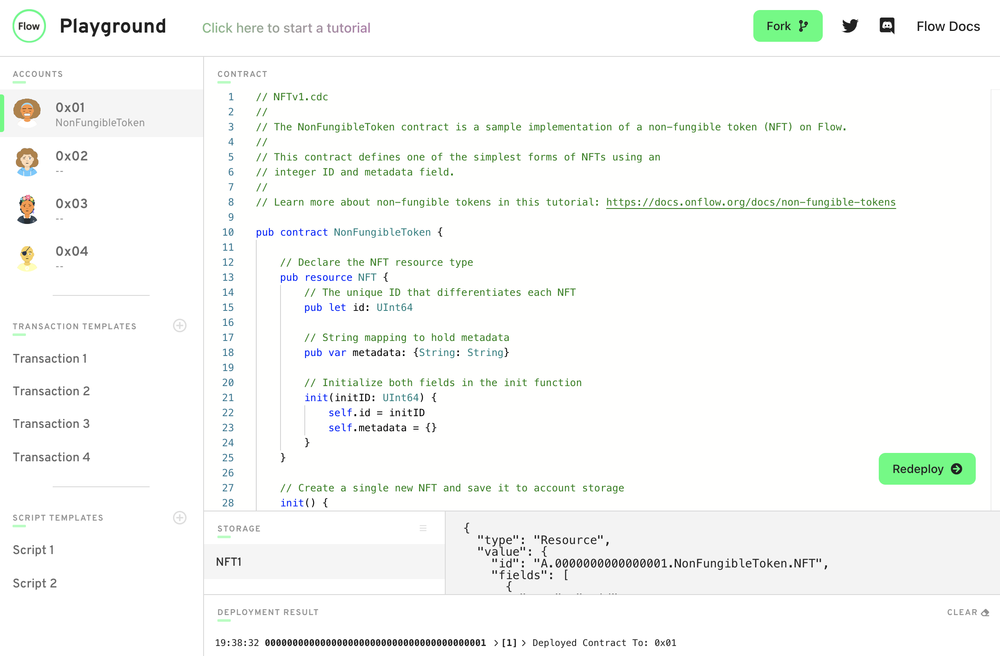
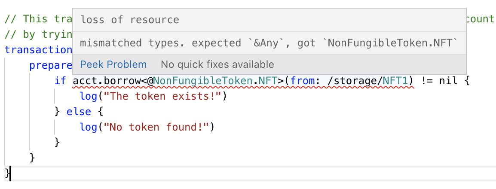

## flow 和 Cadence 简介

flow（福洛链）是一个公链项目，由曾做加密猫的Dapper团队开发，主网已经上线，目前和NBA、三星、育碧等知名公司有合作产品，很快就会上 coinbase、币安等大交易所。

它的合约编程语言叫 Cadence，相当于以太坊的 Solidity，是一个 **面向资源** 的编程语言，为智能合约编程引入了新功能，可帮助开发人员确保其代码安全，可靠，清晰且易于使用。

在 Solidity 中，用户资产是作为一条记录存在合约账户中的，如果要列出该用户的所有资产，就要扫描可能的代币合约。

而在 Cadence 中，所有权并没有集中在一个单一的智能合约的存储中。相反，每个账户都拥有和存储自己的资产，资产可以在账户之间自由转移。

这样的设计让数字资产更符合现实世界的资产。用户将自己的货币和资产存在自己账户中，根据需要进行处理。要实现合成资产、NFT打包交易等都非常容易，且易于理解。

而其他公链不管用什么流行的编程语言，虽然开发者对语法很熟悉，但必须理解一些合约设计范式才能写出安全高效的智能合约。这对开发者并不友好。

flow 的开发者[入门教程](https://docs.onflow.org/cadence/tutorial/01-first-steps/)，介绍了调用函数、代币、NFT、交易市场、合成资产、投票合约的开发。并且如下图有一个 Playground 网页应用来模拟合约和发送交易。



## 合约

我以 NFT 部分举例来说一下面向资源编程是怎么回事。

> NFTv1.cdc 

```
pub contract NonFungibleToken {

    // 定义 NFT 资源类型
    pub resource NFT {
        // 每个 NFT 有独立的id值，类型是UInt64
        pub let id: UInt64

        // 每个 NFT 有个字典类型用于存储元数据，例如{'url':'https://xxxxx'}
        pub var metadata: {String: String}

        // 构造函数
        init(initID: UInt64) {
            self.id = initID
            self.metadata = {}
        }
    }

    // 创建一个新的 NFT 并存放在账户中
    init() {
        self.account.save<@NFT>(<-create NFT(initID: 1), to: /storage/NFT1)
    }
}
```

该段代码定义了一个名为 NonFungibleToken 公开的合约类型，一个名为 NFT 的公开资源类型（类似于 Class 类）。有一个 init() 的方法在部署合约时运行。

在init()方法中 `self.account.save<@NFT>(<-create NFT(initID: 1), to: /storage/NFT1)` ，有三个特别的写法，分别是 @ 、 <-、/storage/。

资源标示符@：当字段、参数或返回值是资源类型时，需要使用这个符号。

移动操作符<-：当一个资源在赋值、参数或返回值中使用时，它将被移动到一个新的位置，而旧的位置将失效。这确保了资源在同一时间只存在于一个位置。

/storage/: 合约会被划分三个区域storage, private 和 public。不同区域有不同权限。资源是放在storage区域（可以类比理解为文件夹）

综上所示，上面的代码意思是，**创建一个id为1，类型是名为NFT的资源，并保存在当前合约账户的/storage/下，标记为NFT1**。

然后部署该合约。

## 交易

> Transaction1.cdc

```
import NonFungibleToken from 0x01

// 发送交易，用尝试借出来检查确定 NFT 是否存在 
transaction {
    prepare(acct: AuthAccount) {
        if acct.borrow<&NonFungibleToken.NFT>(from: /storage/NFT1) != nil {
            log("The token exists!")
        } else {
            log("No token found!")
        }
    }
}
```

上面的 NonFungibleToken 合约是由账户0x01部署的，所以第一行写`import NonFungibleToken from 0x01`。

执行交易定义了三个阶段 prepare、execute和post。该代码的检查在prepare中运行。

NonFungibleToken.NFT 前的 & 表示是被复制的，也就是值类型。对属性修改并不会影响其他 NFT。

上面的代码意思是，**如果是部署合约已经获得NFT1的0x01账户签名发送了这笔交易，应该会输出 The token exists!，其他人由于没有NFT1，签名发送该交易就会输出 No token found!**

官方文档后续部分还有介绍如何对NFT进行交易、组合成一组NFT、mint新的NFT，推荐看[官方文档](https://onflow.readme.io/docs/non-fungible-tokens)。

## 总结

本文对 flow 的 Cadence 做简单介绍，以我自己的感受，有以下几个特点：

1. 面向资源的模式非常符合区块链资产的心智模型，但和 Solidity 差很多，不能照抄以太坊上成熟产品的逻辑。但也有更多产品创新的可能性。
2. 对 NFT类的项目开发简直太友好了。
3. 虽然语法糖略多需要熟悉，但配合代码提示（已经有 vscode 插件），让合约编写反而更简单了，不容易遇到莫名其妙的坑。



强烈推荐有兴趣的程序员去尝试一下 Cadence。

---
常用链接：

[Flow GitHub](https://github.com/onflow)

[Flow official website](https://www.onflow.org/)

[Technical documentation](https://docs.onflow.org/)

[Flow Playground](https://www.onflow.org/play)

[Flow Discord](https://discord.com/invite/flow)