## 简介

[NBATopShot](https://www.nbatopshot.com/r/Crypto_Goya) 是 NBA、NBPA 和 Dapper Labs 联手打造的区块链收集游戏，把 NBA 比赛中令人叹为的 **精彩瞬间** 变成永远拥有的数字收藏品。使用的公链是 [flow](https://www.onflow.org/) 而不是以太坊。2020年10月底开启的公测。游戏有以下主要玩法：

### 开瞬间包

花钱购买瞬间包，产出随机的精彩瞬间。瞬间包限时发售，有不同的系列和等级。一个包里有多个瞬间。

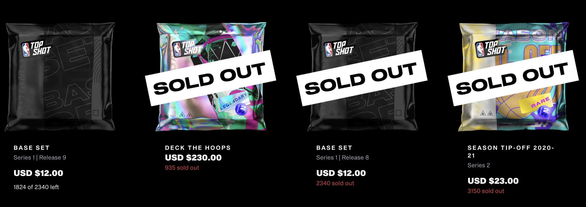

common级数量在1000-4000个不等。rare的200-750个不等。legendary的49-79个不等。

同一个瞬间可能有不同的稀有度，会出现在不同的包里。

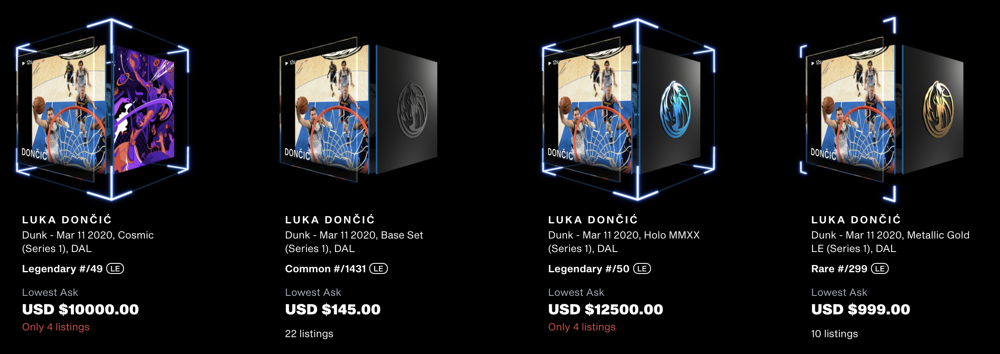

### 交易

精彩瞬间可以直接挂单买卖，没有gas费，如果售卖成功，有5%的固定交易费。

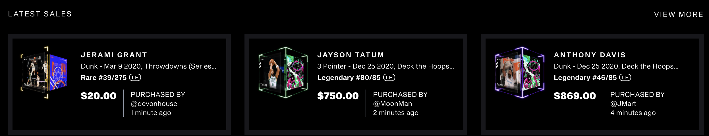

### 挑战赛

参加限时活动，收集一套指定精彩瞬间，奖励一个独有瞬间。

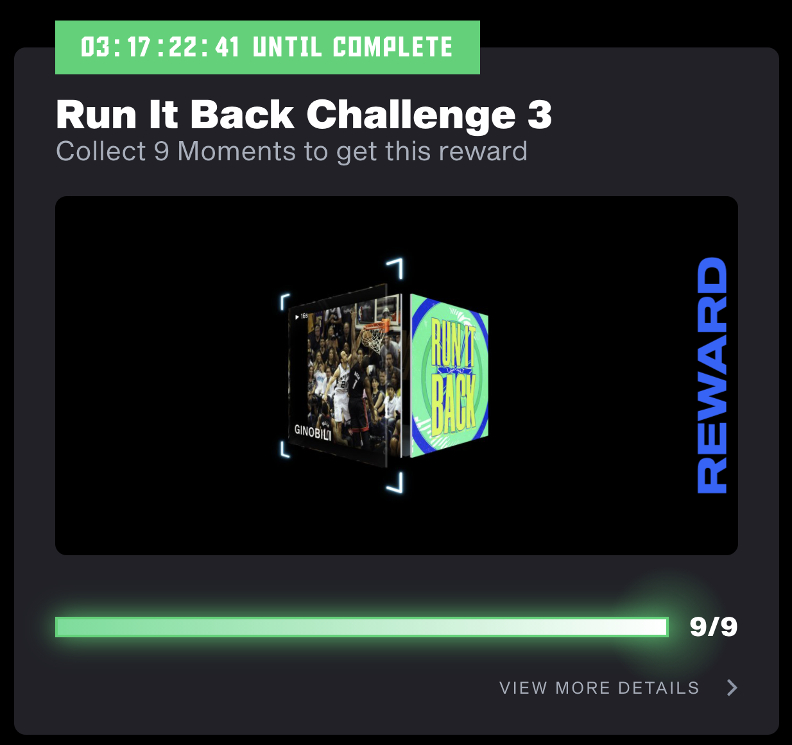

### 解锁等级

完成成就任务，提升等级。

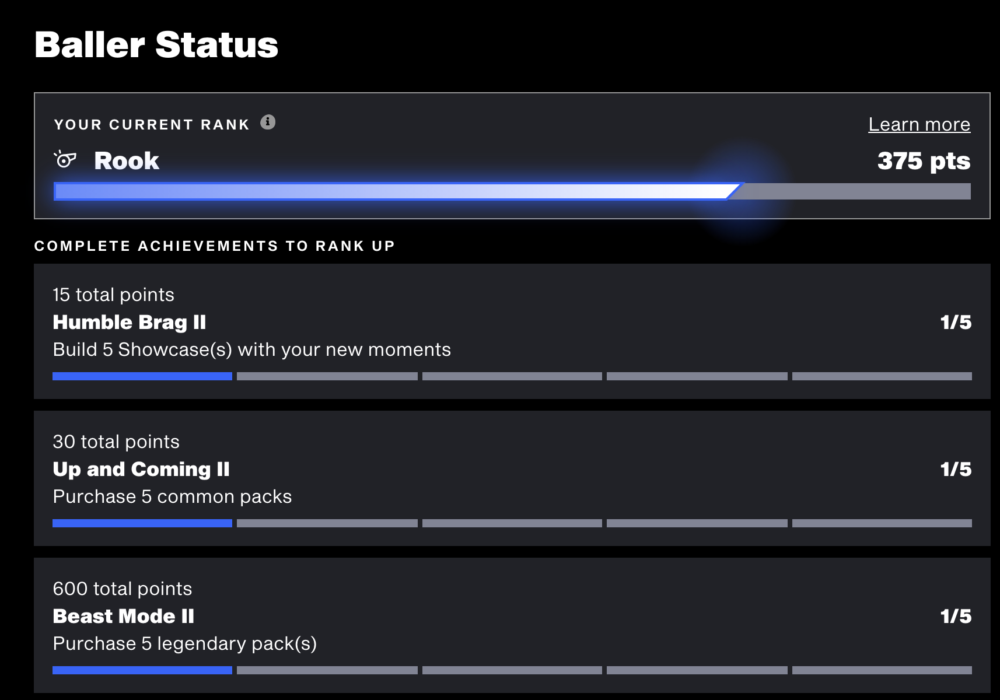

### 其他玩法

分享，设置showtime，社区活动等

## 数据

### 流水

[crytoslam](https://www.cryptoslam.io/) 的数据，和其他热门区块链游戏比较:

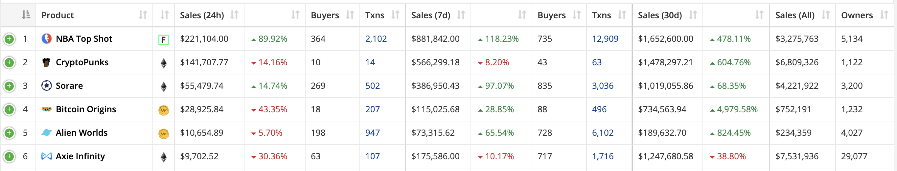

### 总体用户数

* 写文当天有legendary瞬间包售卖，每单限量抢一包，有500多个地址抢到了，还有很多人没抢到。再看了下当时 discord 在线有 600人+，其中 20+ 是开发，标签为*top100*的社区成员有38人在线。所以推算活跃玩家有1000左右
* 持有NTF资产的地址有 5134。买瞬间有12刀的入门门槛不算高，考虑有送礼物的和多开的，实际参与过的玩家预计4500+。
* 官方推特粉丝 19.9k
* 中国社区微信群人数 133

### 官方卖瞬间收入

公测至今卖掉的瞬间包，都在官网上可以查到。还有部分瞬间包查询不到了，可能是内测时发售的。

* legendary包 单价230刀 共5141包
* rare 单价59刀 共5457包
* rare 单价29刀 共6750包
* rare 单价24刀 共8382包
* rare 单价23刀 共3150包
* 基础 单价12刀 共10672包
* common 单价9刀 共9700包

合计 **199万** 刀

### 官方手续费收入

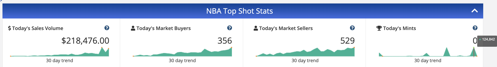

写文当天交易活跃，日成交额22万，5%的手续费就是 1w 刀左右。

算上历史成交，估算约 20w刀 的手续费收入肯定是有的。

### 最贵瞬间

詹皇最受欢迎，共有11个精彩瞬间。

他在第一个legendary包中的扣篮，今天卖到了26543刀。

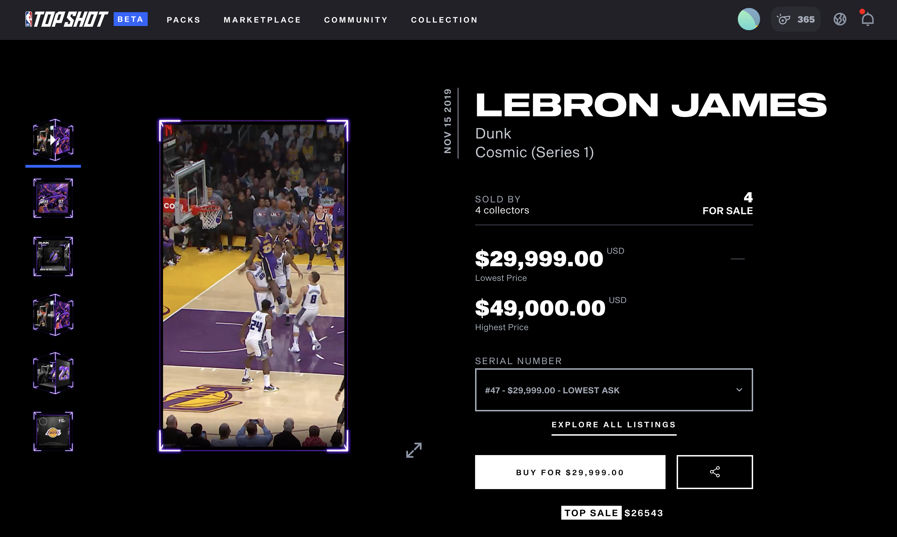

当初230刀的包，开到拿半年就是100倍回报。

其他legendary瞬间历史成交很多在5000+，也是20倍回报。

### 当日legendary瞬间包数据

写文当天有legendary包售卖935包，一次限购1包，我熬夜抢到了1包。最后统计500多人抢到了。

这个系列有13个legendary瞬间，每个有85个，

最低成交价统计：最低 199，最高 1500，平均 589。

而目前市价如下：
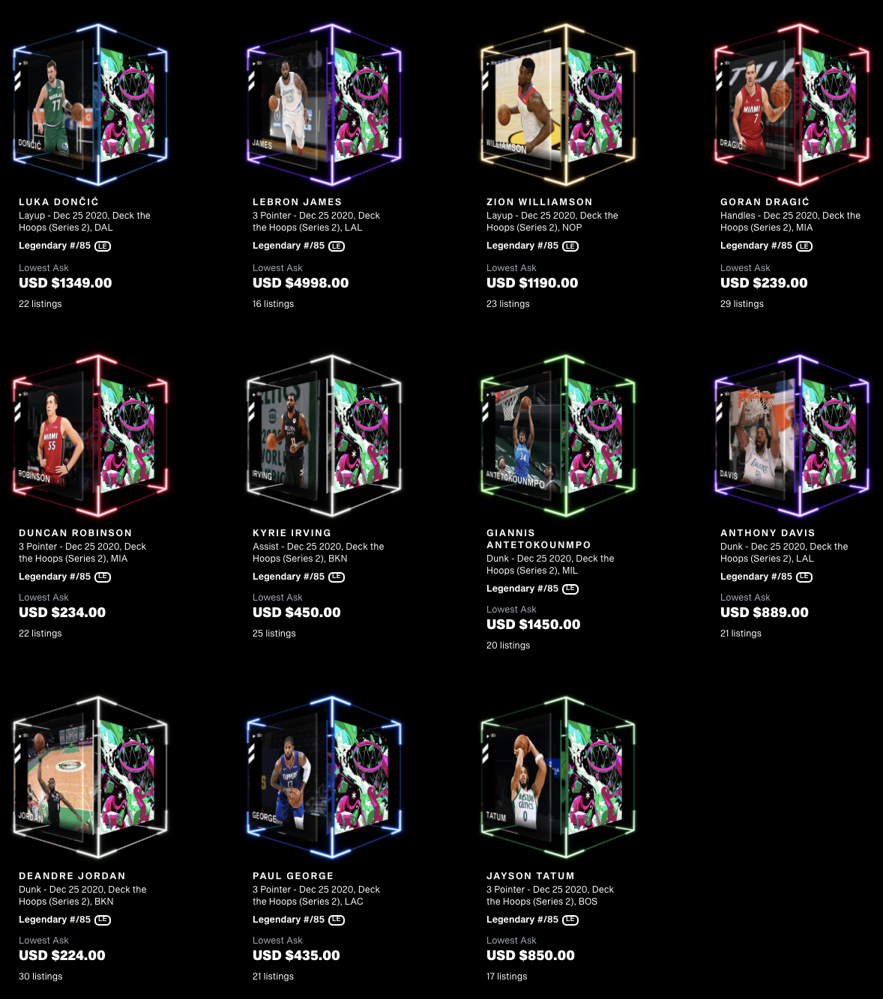

因为瞬间包里还有3个rare和6个common，也能卖一些钱。只要抢到，**非酋不亏，正常翻倍，欧皇大赚**。

### 历史legendary瞬间统计

我把能查到的6个legendary包里的legendary瞬间都看了一遍，统计价格取 **最新成交价和市场价较小值**

#### cosmic

发售日好像是6月底，共31个legendary瞬间。最低 340，最高 26543，平均 2174，中位数 650。最贵的4个是 26543（詹皇）6999（字母哥）4500（锡安）5175（东契奇），都是当红球星。

#### 2020 nba final

10月26日发布，共12个，其中有一个是收集其他的挑战奖励。
最低 174，最高 5400，平均 925，中位数 352。最高的是5400（詹皇），868（挑战赛奖励）

#### LACE 'EM UP (SERIES 1)

第三批legendary瞬间，一只球队1个，有四个是挑战奖励

最低 90，最高 1234，平均 345，中位数 227。最高的是1234（利拉德），四个挑战奖励分别为 857、868、825、750

#### Holo MMXX（SERIES 1）

内测包，共15个。

最低 359，最高 4500，平均 1157，中位数 499。最高的是东契奇。

#### From The Top（SERIRES 1）

内测包，共8个。由詹皇、罗斯、韦斯特布鲁克和库里组成。

最低500，最高12800，平均3200，中位数1500。最高的是詹皇。

### 烧钱体验挑战赛

由于充钱充多了 + 想体验下挑战赛 + 我常看NBA还是在姚麦时期，所以花钱买了一套 Run it Back 里面的球星，有诺维斯基、纳什、邓肯、帕克等人。

10个瞬间，花了我700刀，有的20多，有的100多。而原包价格是59刀一包，每包2个rare。

rare包抢到也不会亏。

## 分析预测

### 如何赚钱

#### 押注人气球星

不管是common还是legendary，都比较好高价格出手。比如詹皇、东契奇、字母哥、锡安、库里等人的瞬间就比较贵。

#### 为挑战赛准备

挑战赛会要求收集一些瞬间，可以先预测并买一些。最好还是囤单个基本面比较好的。

#### 高卖低买

总有人开到就随便低价出手，找到明显低于价值的瞬间，转手高价卖出。这需要对球星基本面比较敏锐。

#### 坐庄

如图，这人一天把罗斯的这个上篮瞬间几百刀的全部秒了，挂了1399，估计要大干一场。

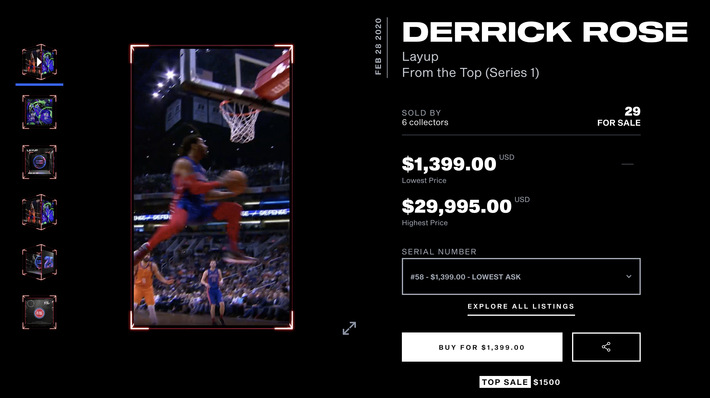

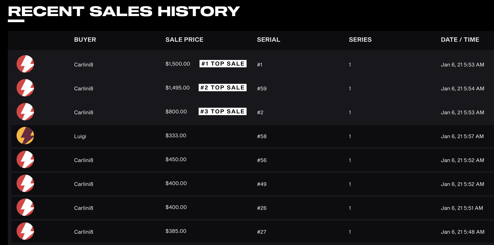

其他一些例子，自己点开看看。
[1](https://www.nbatopshot.com/listings/p2p/320cae53-d585-4e74-8a66-404fa3543c19+ba054aff-1c4a-4d9e-b367-f0d5168b0fb5)
[2](https://www.nbatopshot.com/listings/p2p/3a0ae6ce-f22e-4d98-b1fe-906f859df983+5d195b74-fbfd-4041-be0a-16185ce703f0)
[3](https://www.nbatopshot.com/listings/p2p/3a0ae6ce-f22e-4d98-b1fe-906f859df983+43da501e-a739-4063-a471-18945a03d224)
[4](https://www.nbatopshot.com/listings/p2p/3a0ae6ce-f22e-4d98-b1fe-906f859df983+c32b29d6-48c9-4e0f-afe1-e28f712fa503)
[5](https://www.nbatopshot.com/listings/p2p/3a0ae6ce-f22e-4d98-b1fe-906f859df983+7fa85231-d92d-4df1-a631-2e85b48a4c11)
[6](https://www.nbatopshot.com/listings/p2p/320cae53-d585-4e74-8a66-404fa3543c19+ba054aff-1c4a-4d9e-b367-f0d5168b0fb5)
[7](https://www.nbatopshot.com/listings/p2p/a494c64e-9e93-418c-8934-f331ee47a39b+6750704f-3ac0-411e-ae52-807306b3d8d3)
[8](https://www.nbatopshot.com/listings/p2p/814c5183-596f-41d7-9135-c6b29faa9c6d+d012e87f-7aec-4f5d-969b-2af03890ab4f)
[9](https://www.nbatopshot.com/listings/p2p/a494c64e-9e93-418c-8934-f331ee47a39b+6750704f-3ac0-411e-ae52-807306b3d8d3)

#### 自动化抢包

最稳的方式。类似传统黑产开多台电脑用定时脚本抢。抢到就是赚到。群友都担心以后抢不过科学家。

#### 调合约

我仔细研究了相关合约，似乎抽到哪些瞬间的随机数并不在链上。买包的合约只是个 message。

而且目前的关联的账号是由网站管理，无法导出私钥，没法调合约签名交易。

目前看这个方法可能性不大。

### 未来预测

#### 发币去中心化

可能性不大。一来太赚钱了，二来要和 NBA 合作，需要线下运营。

#### 老用户空投

很有可能。dapper团队搞 flow 筹了很多钱，空投预期是最好吸引用户的手段。

#### 用户数持续增长

很大可能。本身NBA潜在受众极广。加上21年可能是NTF爆发年，flow也快上交易所了。能吸引链圈和NBA圈的玩家。

#### 流动性挖矿

有可能。以太坊上的NTF流动性挖矿玩的人都还不多，而 flow 上线后如果有相关defi推出，就可能会有流动性挖矿。

#### 第三方平台打包交易

很有可能。flow 已经和 opensea 合作了，应该能在 opensea 见到。

### 风险提示

给想玩的朋友给一个提醒：处理提现很慢，通常要几周。充值走coinbase的网关，btc、eth、bch、dai、usdc都行。

[邀请链接](https://www.nbatopshot.com/r/Crypto_Goya)
