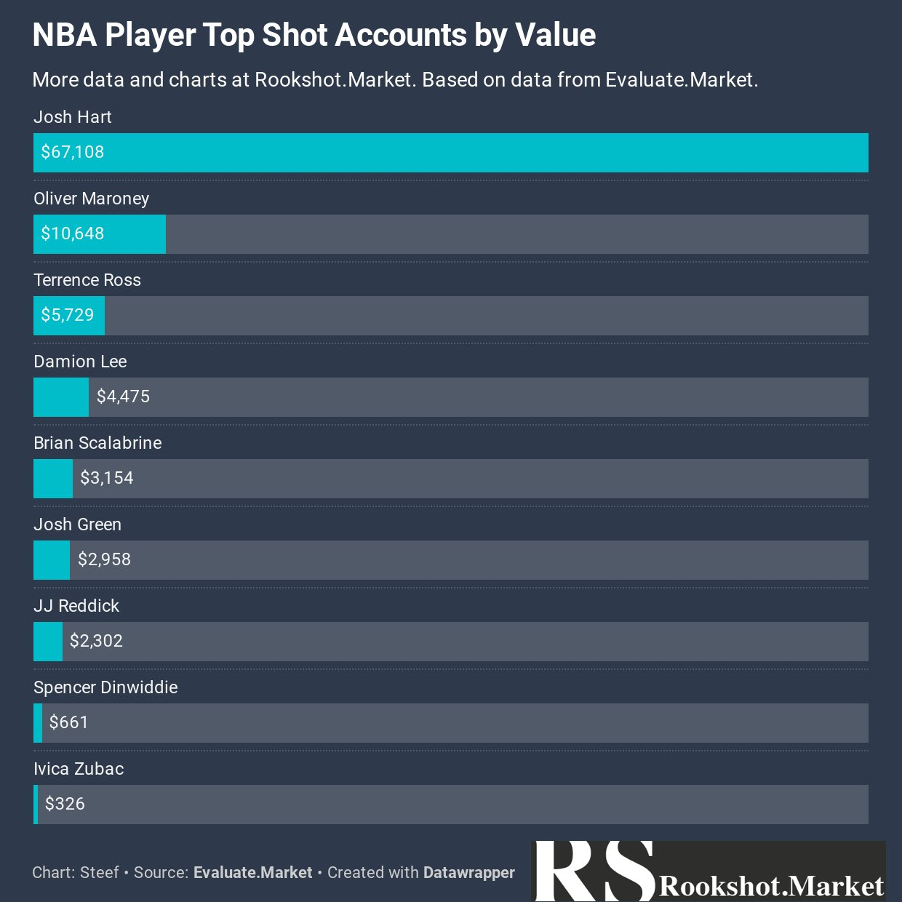

NBATopShot 吸引了大量玩家自发参与生态建设。我自己也在社区宣传，吸引了不少国内玩家，还爬过数据做了一些表格给群友。下面介绍一些我常关注的非官方网站、社区、分析师和名人。

## 网站

* *[cryptoslam](https://www.cryptoslam.io/)* NFT综合信息网，不仅包含NBATopShot，还有其他区块链游戏信息。对于 NBATopShot 玩家来说，最常用功能是 **查看整体市场走势** ，和 **查找mint的moment信息**（特别是已经挖出来但没流通的）。
* *[evaluate.market](https://evaluate.market/)* 常用功能有 **查看单个moment的价格走势** 和账户估值。用户体验好，我最常用的网站。
* *[momentranks](https://momentranks.com/)* 新上线不久，用了机器学习算法，数据每4分钟更新一次，估值最为精确。有小号的卡但不知道卖多少可以参考该网站的数据。常用功能是 **查看估值**。
* *[intangible.market](https://intangible.market/Home.php)* 最早的一个查信息的网站，对早期玩家帮助很大。目前有更好的替代品，不再使用。

## 热门社区

* *[NFT/Crypto](https://discord.gg/aSdF9pfb6T)* 国外玩NFT的巨鲸都在里面，有独立的NBATopShot频道。
* *[evaluate.market](https://discord.gg/9n5RgJxJks)* 上面evaluate.market网站的discord的频道。
* *[Shot Solution](https://discord.gg/6BM2NA6MXp)* 活跃度不错，经常有抽奖。
  
## 分析师

 The First Mint是一个播客，发推的频率快，信息也有价值。其创始人@TheReelPhiID还经常出没Clubhouse谈论TopShot相关内容。

 chugsnbugs发了一些很有用的横向对比的数据可视化。

 SteefTS 发了不少价格相关的数据可视化。他的网站 Rootshot.Market 主要研究新秀的数据。

 Greg Murry 发了很多 challenge 完成人数的数据可视化。

YouTube上还有些不错的视频主，就不一一列了。

## 名人

有不少二线球星参与了游戏。如图 Josh Hart 的持仓超过了6万。他也是第一个直播开包的球星。

Terry Rozier 直播后还要喊单。

其他体育界的名人也有关注，包括534万粉丝的美国杨毅Stephen A Smith，200万粉丝 WWE 的 Pat McAfee等。小牛队的官推也有过宣传。

## 总结

目前 NbaTopShot 虽然在国内玩的人少，国外已经火了，吸引了大量圈外人士参与，生态还会继续发展，直播的球星越来越多。正式版推出后玩家数量超过100万是板上钉钉的事情。国内因为授权和防火墙问题，只有币圈的玩家在玩，后面也会慢慢发展起来。
