## 什么是挑战赛（challenges）？

打开首页，导航栏选择 *COLLECTION*，左边的 *CHALLENGES* 就是挑战赛。*Active Challenges* 是当前可以参加的挑战。
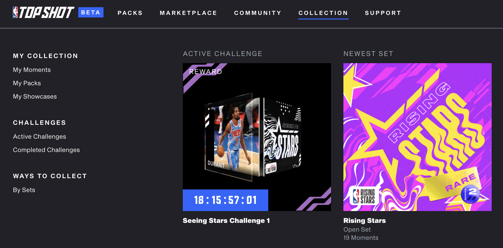

要完成挑战赛，你必须至少获得每个所需moment(精彩瞬间)中的一个，坚持到计时器结束，就会得到这个专属奖励。

如图是我的账号的 Seeing stars 第1期挑战，目前只有 3 个。如果筹齐所需 12 个，就能在左上角的倒计时（18天15小时后）收到奖励的 Kevin Durant。
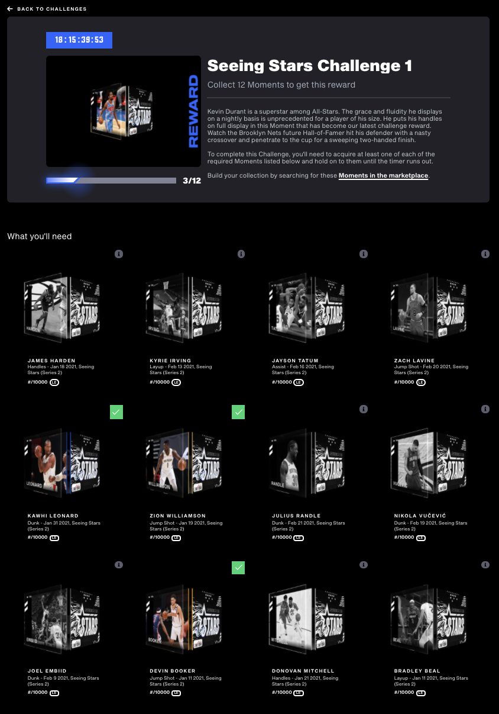

## Gift 挑战赛

Gift 是之前奖励老玩家送的包，另外 OKEX 的 Flow 上所活动和 blocto 老用户都有送。每个moment有8888LE，一共 5 个，有 45% 左右还在包里没有流通，应该是官方留着做活动用。最终完成奖励的 Derrick Rose 有 3484 个。完成率为 `3484/(8888*(1-45%)) = 71%`
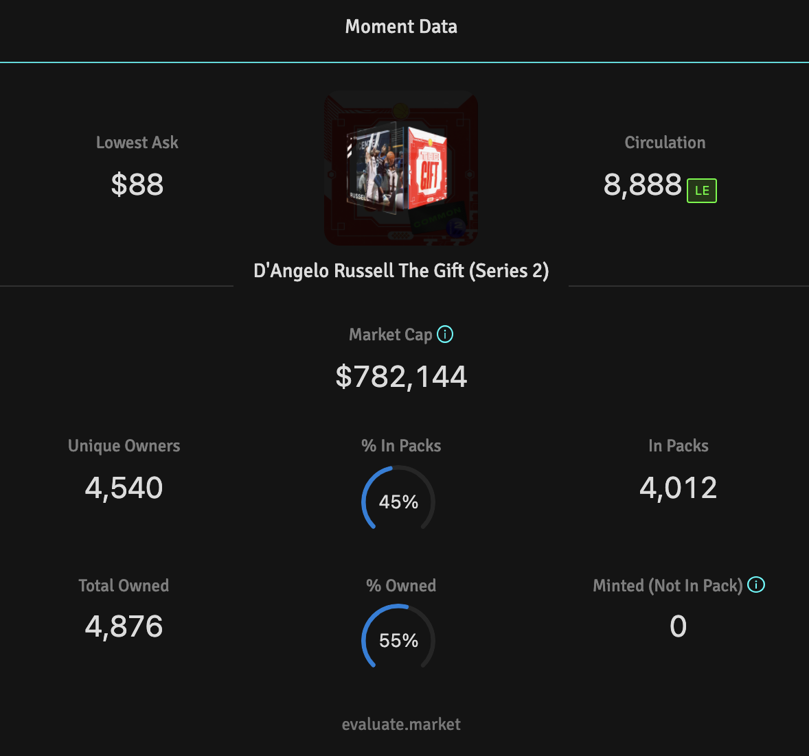

由下面统计图可以看出，3月2日 挑战赛结束快照的时候，集一套 5 个 Gift 需要 $2250 左右，3月3日 加上奖励的 Derrick Rose 能卖到 $2400 左右，随后价格就崩了。到写文当天 3月11日 的统计，整套 Gift 加上 Derrick Rose 只需要 $870。
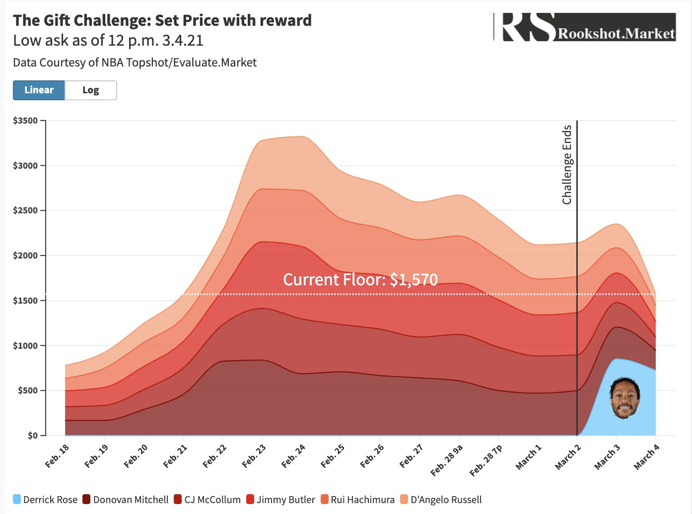

先说个概念———**市值**，`市值=价格*总量`，价格是地板价，不计算小号、球衣号等。比如下面表格的 Derrick Rose，有 3484 个，单价是 $305，市值就是 `3484*305=1062620`

一个球员有多个moment，**同球员市值占比** 是指该moment相对该球员所有moment市值的平均值的占比。接近100%说明这个moment价格已经合理了。

从表格中的 *同球员市值占比* 可以看出 Derrick Rose 的moment已经跌到了 $305 的合理价格（同球员市值占比为101.44%）。
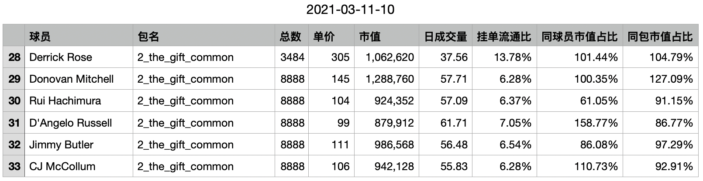

## Cool Cats 2 挑战赛

Cool Cats 2 完成挑战共 10 个（ 5 个 base + 5 个 10000LE 的 coolcats ）。流通量 90%。最终完成的奖励 Anthony Davis 是 7098，完成率不到 80%。

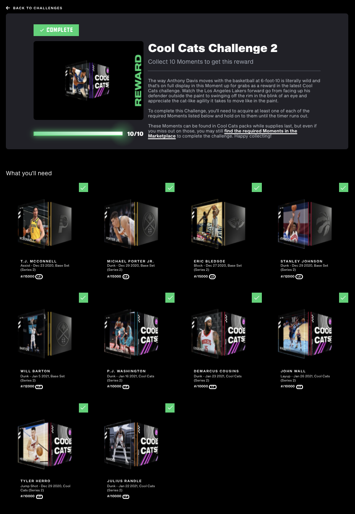

如图所示，挑战结束前，所有moment加起来需 $3300 左右，随后一路下跌，除了第一天筹齐的（2月20日）有短暂的利润期，后面再买的基本都是血亏。
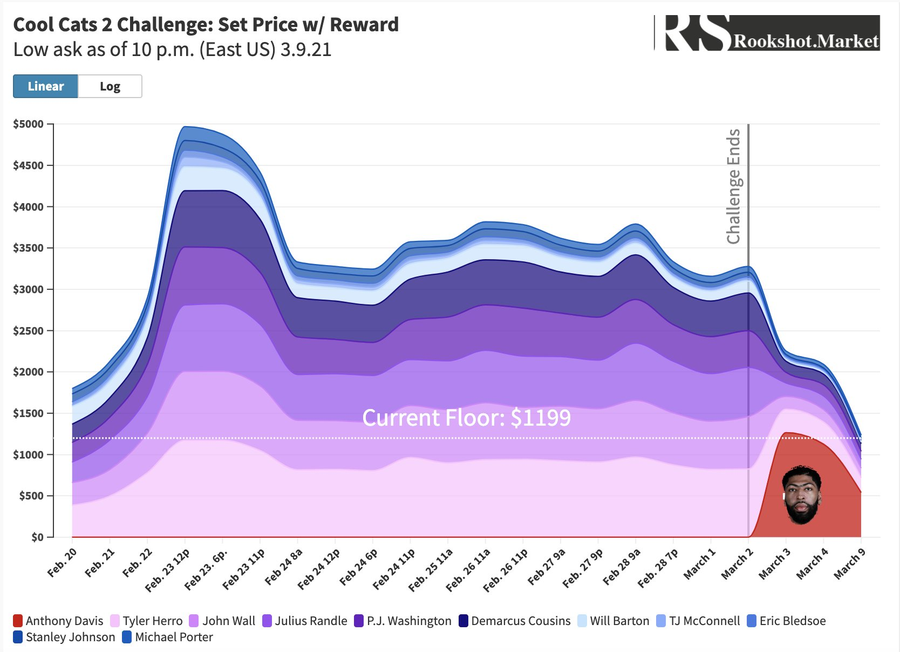

从下面表格可以看出奖励的 Anthony Davis 的moment已经跌到了 $450（同球员市值占比为 166.03%）。因为 coolcats 系列还有个终极挑战，集齐30个给 LaMelo Ball，预计会有 3000 多个，估计价格在 $4000，所以该 Anthony Davis 还有效用，相对他的其他moment贵了 66.03%。
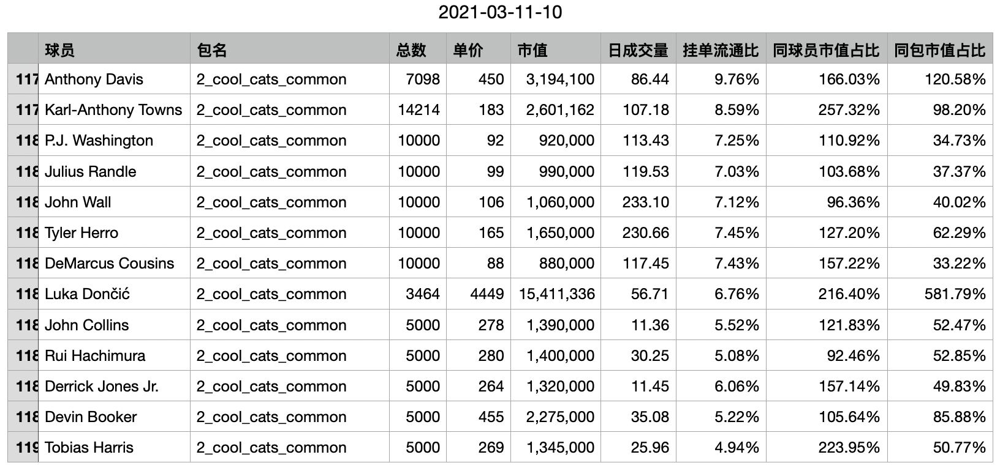

给出一个假设推论，如果没有额外效用，**挑战后moment的市值会趋近到同球员其他moment市值平均值**。后面计算的溢价以该假设为基础。

## Seeing stars 挑战赛1

Seeing stars 是 2021 年的全明星，单个moment有 10000 个，流通率约 90%。第一期的挑战奖励是 Kevin Durant，按完成率 75% 计算，估计会有 7000 多个。Durant 有一个普通的 7500LE 是 $740 左右，可以作为参考价。

如下表所示，筹第1套 Seeing stars 要花 $1267 的溢价才能完成。（溢价=单价-单价/同球员市值占比）
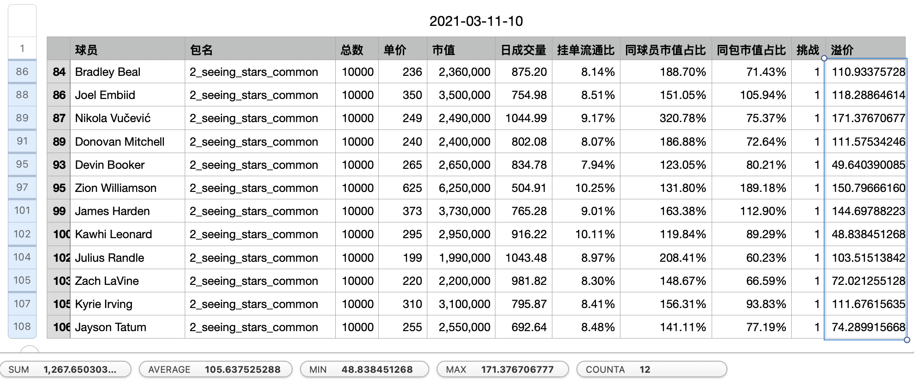

不考虑 20 天后 NBATopShot 的“宏观经济”（如用户涌入造成整体上涨、不断出新包造成整体下跌）的变化，以及卖出的 5% 手续费，当前价格去买会亏 $527。

## Seeing stars 挑战赛2

另外 12 个球星会在第二批挑战里，挑战奖励是 LeBron James，他的 7500LE 价格是 $1400 可以作为参考价。

如下表所示，筹第2套 Seeing stars 要花 $1538 的溢价才能完成。同样不考虑 40 天后宏观经济变化和手续费，当前价格去买 Seeing stars 会亏 $138。

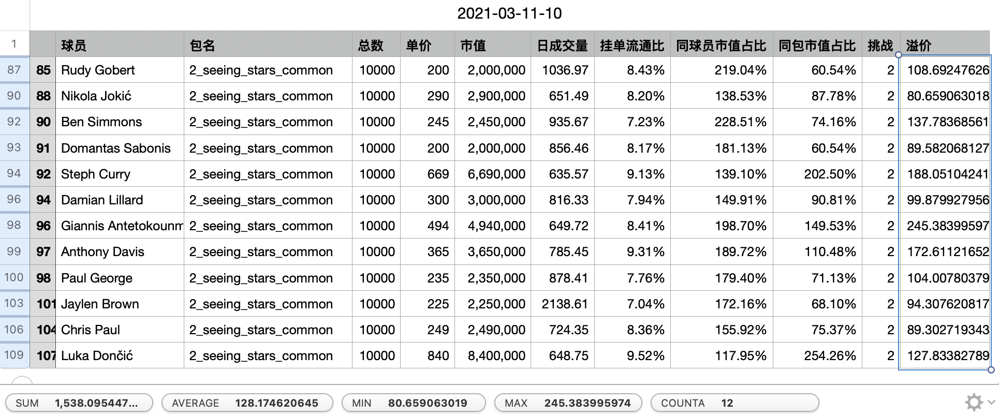

## Rising stars 挑战赛1

Rising stars 单个moment有 2021 个。第1期给 Anthony Edwards 的隔人暴扣，横向对比他的另外两个moment，最终预计会在 $1500 左右。从表格看只需要 $688 的溢价，是有一定利润空间的。

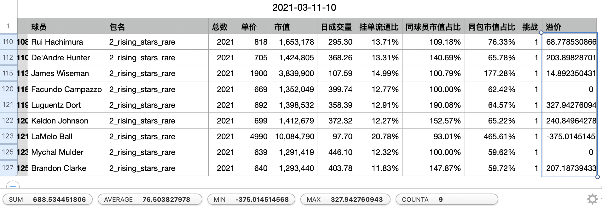

## Rising stars 挑战赛2

第2期给 Zion Williamson，横向对比他的其余moment，不考虑“宏观经济”的变化，最终预计会在 $2500 左右。从表格看所需的moment溢价是 -292，主要来源于 Ja Morant 和 RJ Barrett 的 Rising stars 过于便宜，低于同球员其他moment的平均值。

预计目前凑第二套的 Rising stars 可以获利 $2800。

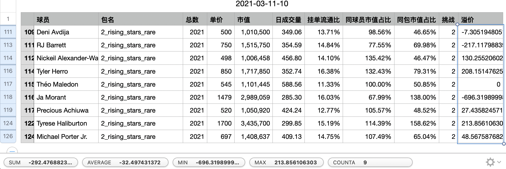

## 行动建议

1. 如果要完成挑战，Seeing stars 的第一套可以放弃，第二套可以考虑筹。 Rising stars 的两套都可以筹。

2. 可以买入相对便宜的球星等高价卖掉：有 LaMelo Ball、RJ Barrett 和 Ja Morant。Seeing stars 第2期 的 Luka Dončić 也可以买，是获取LeBron James奖励的关键，相对来说也不是很贵（同球员市值占比117.95%）。
