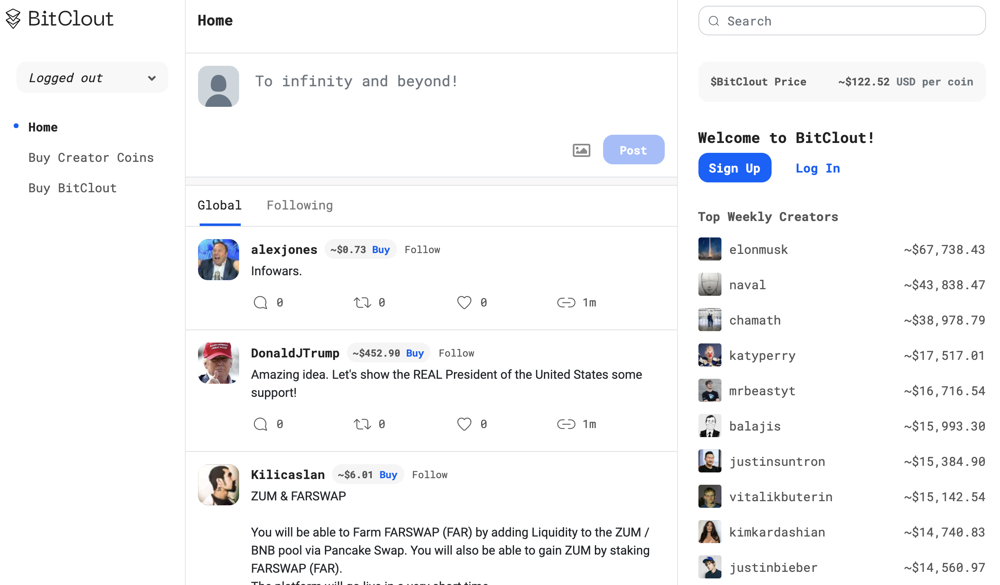
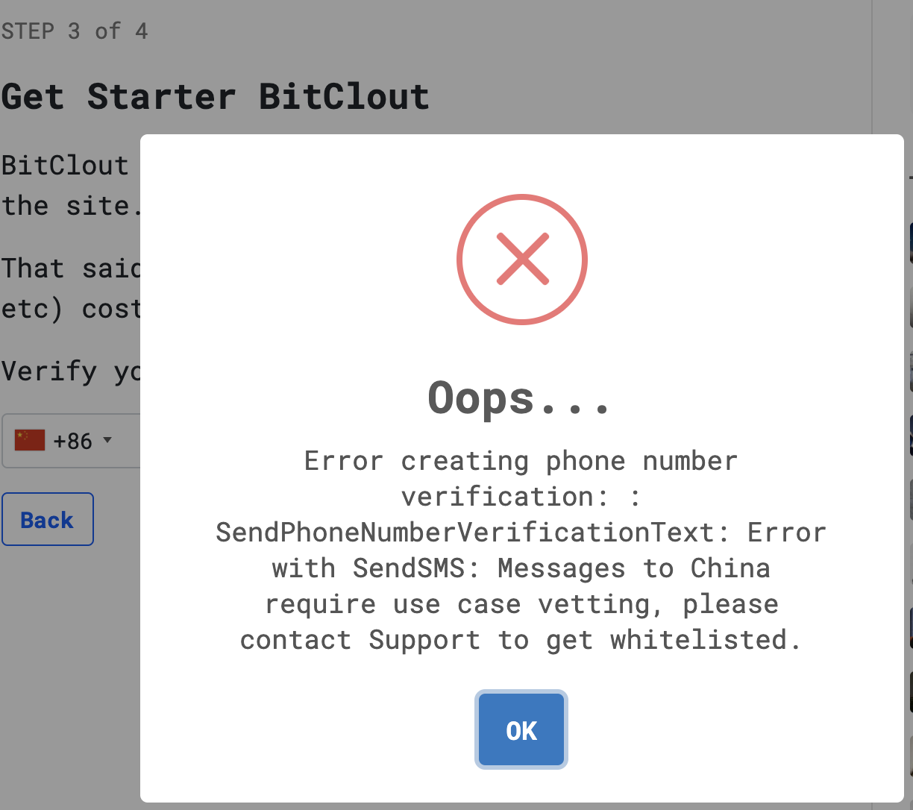
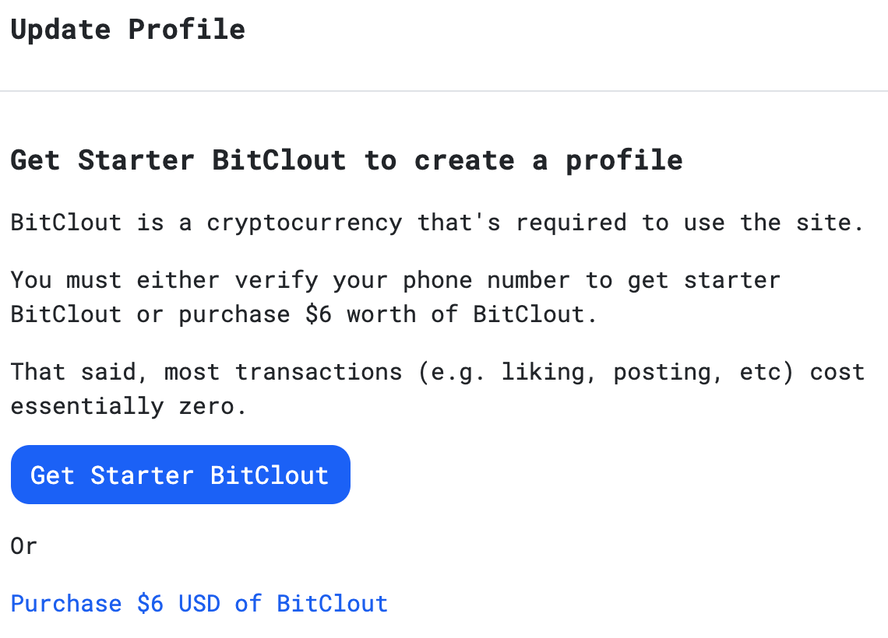
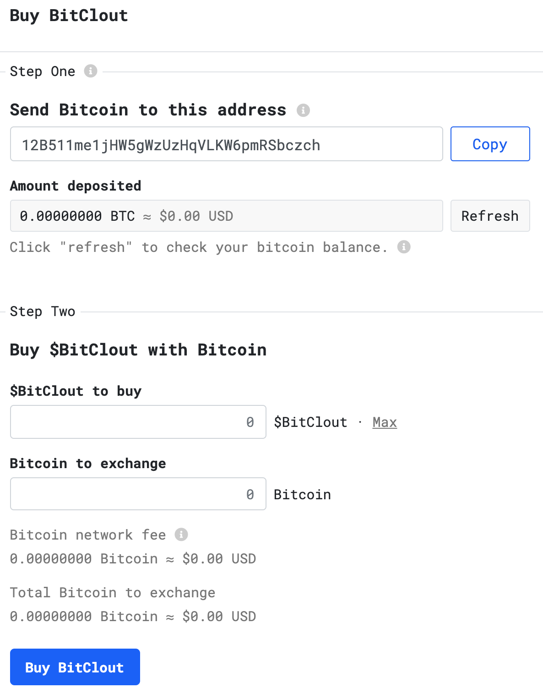
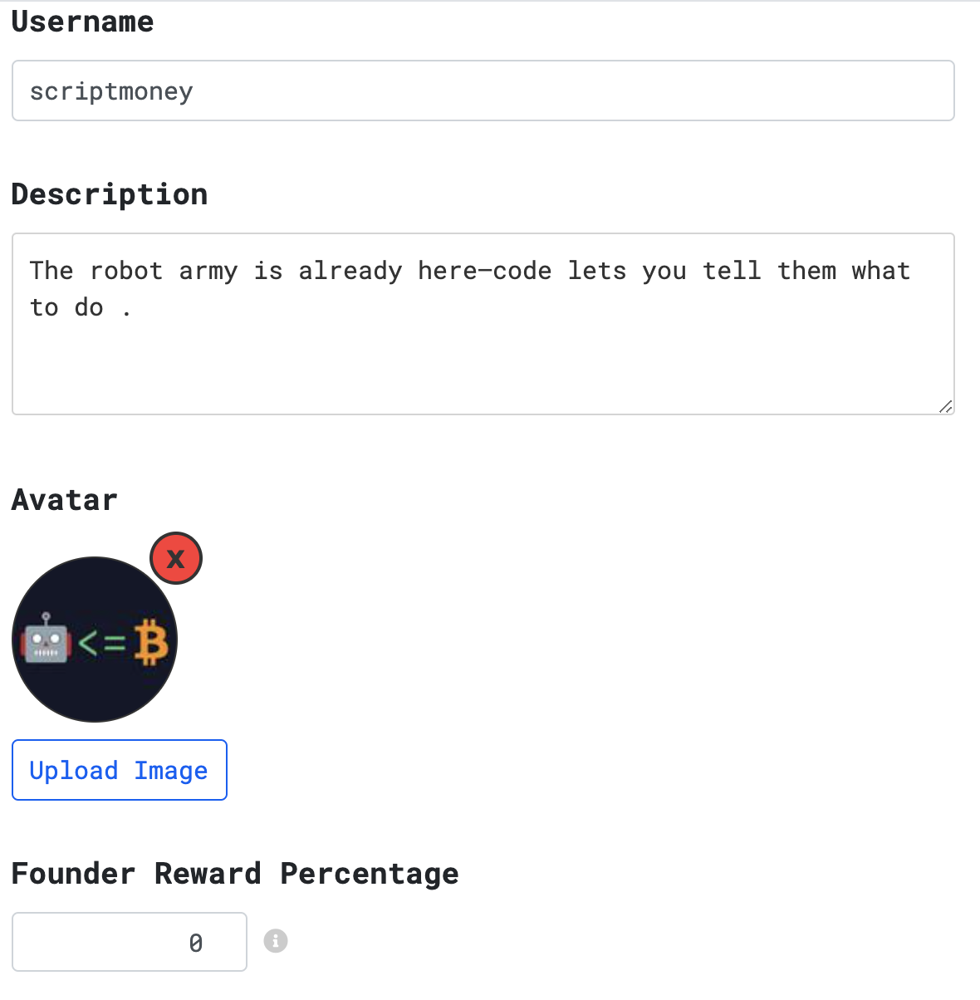
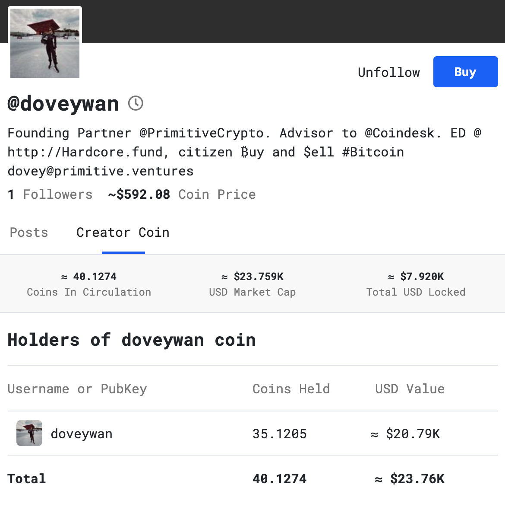
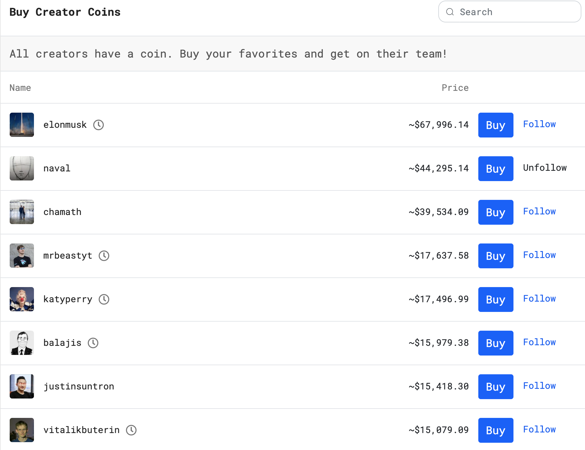
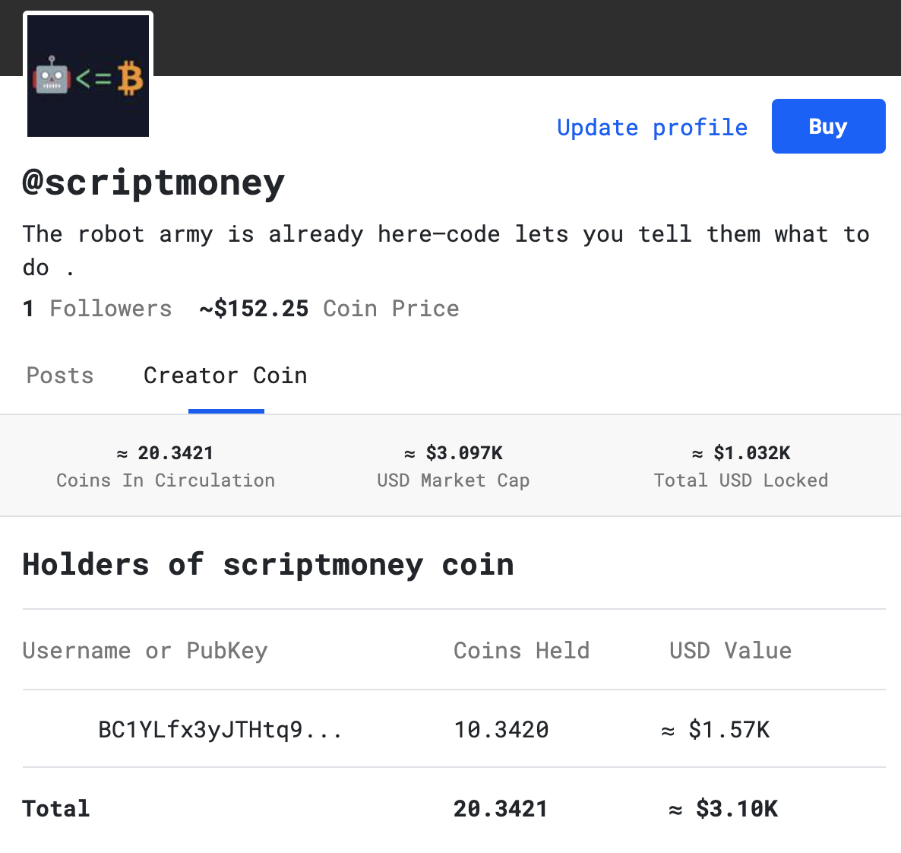

## 什么是 BitClout

BitClout 是一种新型的社交网络，它可以让你用真金白银来炒作名人和帖子，它有自己区块链，架构与比特币类似，但支持复杂的社交网络数据，如帖子、资料、关注、赞助等，吞吐量和规模都大大提升。和比特币一样，BitClout 是一个完全开源的项目，背后没有公司——只有币和代码。目前已经有完整可用的产品。

[英文白皮书链接](https://bitcloutwhitepaper.com/)

## 新手入门

访问 [https://bitclout.com/](https://bitclout.com/)，选择右边的 **Sign Up**

> 如果提示需要密码，使用 [https://bitclout.com/?password=825bbae8589b65720731d867f436471e18683c6a3192a20140105ee1733bb7cc](https://bitclout.com/?password=825bbae8589b65720731d867f436471e18683c6a3192a20140105ee1733bb7cc) 访问

第一步保存助记词（登陆和注销都需要，务必保存好）。

第二步验证助记词。

第三步验证手机号，国内+86开头手机无法注册，会弹出以下提示，可用点 *skip* 跳过。

第四步绑定邮箱，以获取通知，也可以跳过。

随后会让创建个人信息，由于手机号无法验证，只能选择购买 $6 的BitClout来激活。

直接把比特币打到该收款地址（可以从FTX交易所提币没有矿工费），确认到账后就能购买 BitClout 了。

如果购买了 $6 的 BitClout，就可以设置个人信息。有一个 *Founder Reward Percentage* 的选项，默认是10。意思是
购买该名人的币，会有一定比例直接发送到该名人的地址作为*founder reward* 。如果为10，你购买 1 某名人币，该名人可以获得 0.1，你获得 0.9。

项目启动时，选了 15000 位有影响力的推主冷启动，这些推主默认就会有一定数量自己的名人币，无需购买，而重新注册的号必须从0开始。
币价的计算方式是
`.003 * creator_coins_in_circulation^2`
。以下图的 doveywan 为例，流通 40.1274 doveywan coin ，按 BitClout 计价是 `0.003*40.1274^2= 4.83(BitClout)`。写文章的时候，BitClout的价格为 $122.64 。所以如图所示 doveywan coin 价格 `4.83 * $122.64 ≈ $592`。

BitClout 的价格是每卖出100万个BitClout，BitClout的价格就会翻倍。长期来看，BitClout的发行量在1000万到1900万之间。

注意 @doveywan 旁有个时钟图标，说明 doveywan 还没有验证自己的推特，也可以说她还没有使用该平台。

目前 Top10 里，只有 naval、chamath 和 孙宇晨 验证了自己的账号。好笑的是，孙割一开始不在启动名单，是自己注册验证，并买了大量的 BitClout 然后买自己的名人币，抬到了 Top10。

如果卖出名人币换 BitClout，该名人币的流通量会减少，单价也会下跌。机制类似 AMM。

目前还没有 BitClout 换 Bitcoin 的官方渠道，充了值就拿不回来了，除非场外售卖。由于 @binance 和 @coinbase 都验证了各自的账号，未来应该会上交易所。

## 如何获利

贴一段白皮书的原话：

> 当你让人们有能力去猜测一个人的声誉时，会发生什么？我们还不能确定，但其中一个已经出现的功能就是我们所说的 "购买和转发"。通常情况下，转发一个人不会给你任何好处。如果这个人因为你的推波助澜而成为超级明星，那么几年后他们能记住你的名字就已经很幸运了。相比之下，有了BitClout，你可以购买某人的币，然后转发他们，这就使得如果他们爆红，你不仅在经济上可以顺势而为，而且还可以获得吹嘘的权利。想象一下，能够说 "我很早就转发了她"和能够说"我在她的币0.5美元的时候买了她的币，现在已经500美元了------顺便说一句，我已经做了几百次了，我可以证明这一点，因为我的记录在区块链上。"这两者之间的区别。后者显然是一个非常不同的游戏。而且，这不仅仅是一个名人的游戏。如果你认识一个很有影响力的人，或者你认识的人知道 某人，你可以买一个币，然后发给别人，让别人购买并转发。于是，激励机制就深入了许多层。

所以看好某名人的人气，随着平台发展更多人涌入，低价买入高价卖可以获利。

另外如果项目火起来，就会有更多资金买入 BitClout，推高其价格，屯 BitClout 获利。

作为名人也可以对其名人币赋能，造成币价上涨，比如举办股东见面会、按持币优先级处理私信、发白金内容、发赞助内容、和第一的人共进午餐、作为货币购买周边等，当然这要看名人自己的意愿了。

注意平台目前有很多虚假账户，购买时一定要确认下其 BitClout ID 和推特ID是否能对应起来。

如果想支持我，认准唯一ID [https://bitclout.com/u/scriptmoney](https://bitclout.com/u/scriptmoney) 购买 scriptmoney coin 即可。

BitClout中文社区

